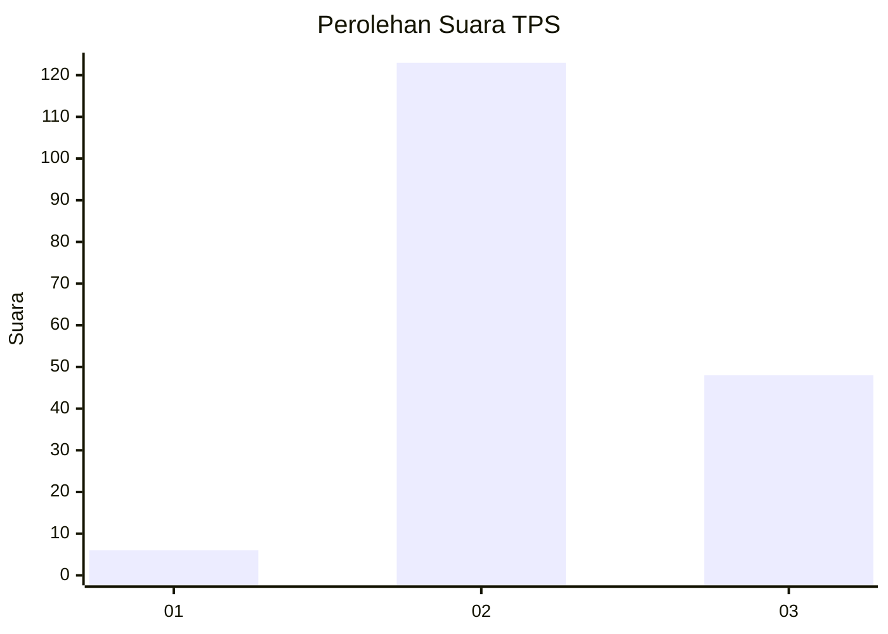
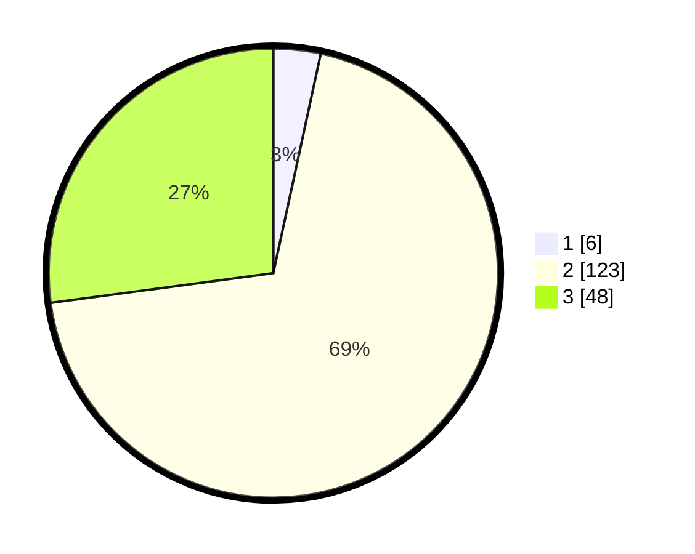

# Hasil

## Grafik

## Tabel

| No. | Nama Paslon    | Suara | Suara (raw) | Persentase |
|:--- |:-------------- | -----:| -----------:| ----------:|
| 1   | ANIES MUHAIMIN | 6     | [6][p-1]    | 3,39       |
| 2   | PRABOWO GIBRAN | 123   | [123][p-2]  | 69,49      |
| 3   | GANJAR MAHFUD  | 48    | [48][p-3]   | 27,12      |

[p-1]: https://github.com/gigit-pemilu/pemilu-2024-51-bali/blob/main/pilpres/hitung-suara/sub/51-bali/sub/08-buleleng/sub/04-banjar/sub/2015-temukus/sub/013-tps/sub/paslon-1.txt
[p-2]: https://github.com/gigit-pemilu/pemilu-2024-51-bali/blob/main/pilpres/hitung-suara/sub/51-bali/sub/08-buleleng/sub/04-banjar/sub/2015-temukus/sub/013-tps/sub/paslon-2.txt
[p-3]: https://github.com/gigit-pemilu/pemilu-2024-51-bali/blob/main/pilpres/hitung-suara/sub/51-bali/sub/08-buleleng/sub/04-banjar/sub/2015-temukus/sub/013-tps/sub/paslon-3.txt

## Foto C Plano

https://sirekap-obj-formc.kpu.go.id/b6a0/pemilu/ppwp/51/08/04/20/15/5108042015013-20240217-160752--fba1d3e1-abdb-4350-b11a-7414ae345ed0.jpg

https://sirekap-obj-formc.kpu.go.id/b6a0/pemilu/ppwp/51/08/04/20/15/5108042015013-20240217-160806--0d395843-28b2-4c35-8bfe-867684161c24.jpg

https://sirekap-obj-formc.kpu.go.id/b6a0/pemilu/ppwp/51/08/04/20/15/5108042015013-20240217-160814--a3cea0e6-a423-4b32-bbc1-6ec18512cf28.jpg

## Metadata

| Key        | Value               |
| ---------- | ------------------- |
| Time Stamp | 2024-02-24 22:31:28 |

