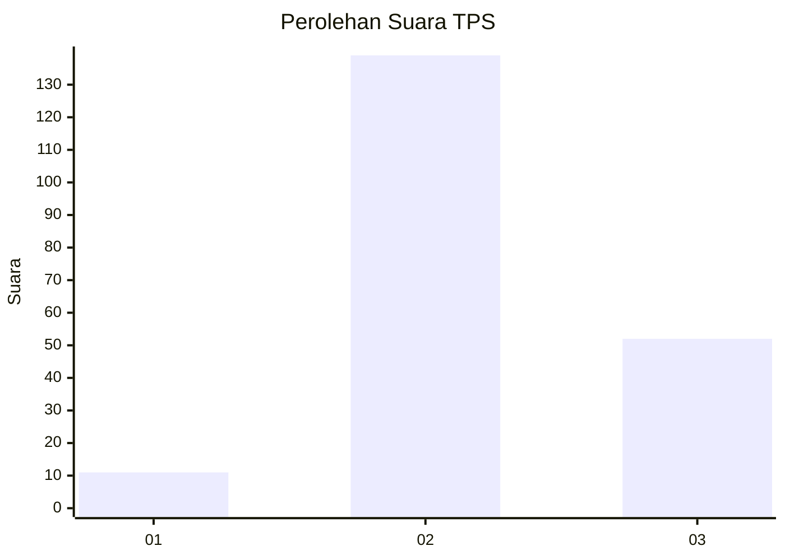
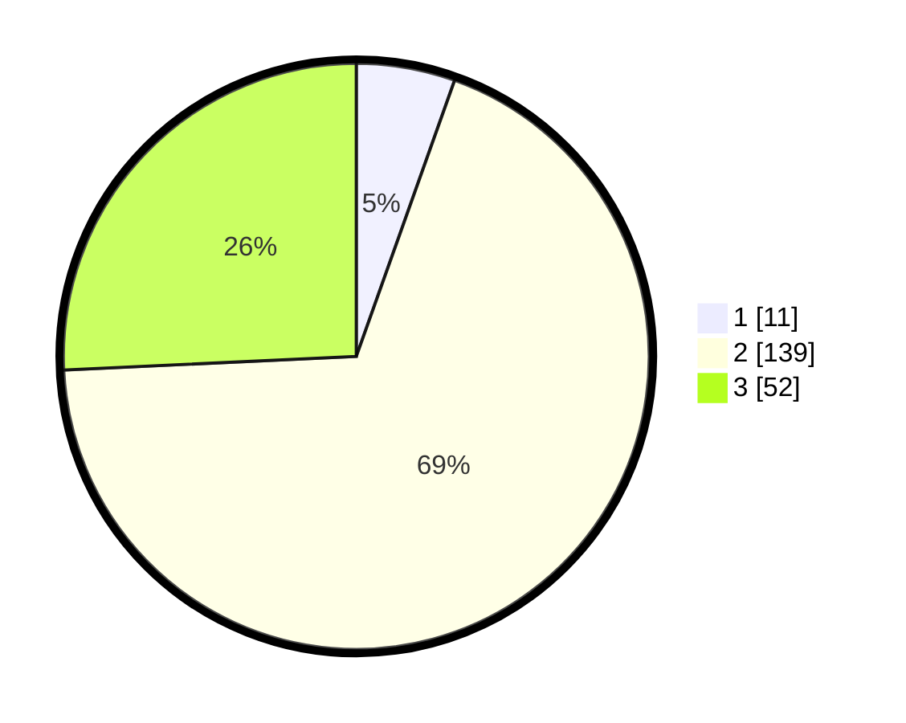

# Hasil

## Grafik

## Tabel

| No. | Nama Paslon    | Suara | Suara (raw) | Persentase |
|:--- |:-------------- | -----:| -----------:| ----------:|
| 1   | ANIES MUHAIMIN | 11    | [11][p-1]   | 5,45       |
| 2   | PRABOWO GIBRAN | 139   | [139][p-2]  | 68,81      |
| 3   | GANJAR MAHFUD  | 52    | [52][p-3]   | 25,74      |

[p-1]: https://github.com/gigit-pemilu/pemilu-2024-51-bali/blob/main/pilpres/hitung-suara/sub/51-bali/sub/08-buleleng/sub/04-banjar/sub/2015-temukus/sub/014-tps/sub/paslon-1.txt
[p-2]: https://github.com/gigit-pemilu/pemilu-2024-51-bali/blob/main/pilpres/hitung-suara/sub/51-bali/sub/08-buleleng/sub/04-banjar/sub/2015-temukus/sub/014-tps/sub/paslon-2.txt
[p-3]: https://github.com/gigit-pemilu/pemilu-2024-51-bali/blob/main/pilpres/hitung-suara/sub/51-bali/sub/08-buleleng/sub/04-banjar/sub/2015-temukus/sub/014-tps/sub/paslon-3.txt

## Foto C Plano

https://sirekap-obj-formc.kpu.go.id/f5d9/pemilu/ppwp/51/08/04/20/15/5108042015014-20240214-222635--32874066-6f3a-4809-ac50-41b4831a1923.jpg

https://sirekap-obj-formc.kpu.go.id/f5d9/pemilu/ppwp/51/08/04/20/15/5108042015014-20240214-222856--d15276cd-3d58-4282-bbf6-cbb14bafdeee.jpg

https://sirekap-obj-formc.kpu.go.id/f5d9/pemilu/ppwp/51/08/04/20/15/5108042015014-20240214-223043--1164e5f3-ed42-4dfa-af24-23dda422d387.jpg

## Metadata

| Key        | Value               |
| ---------- | ------------------- |
| Time Stamp | 2024-02-24 22:31:28 |

