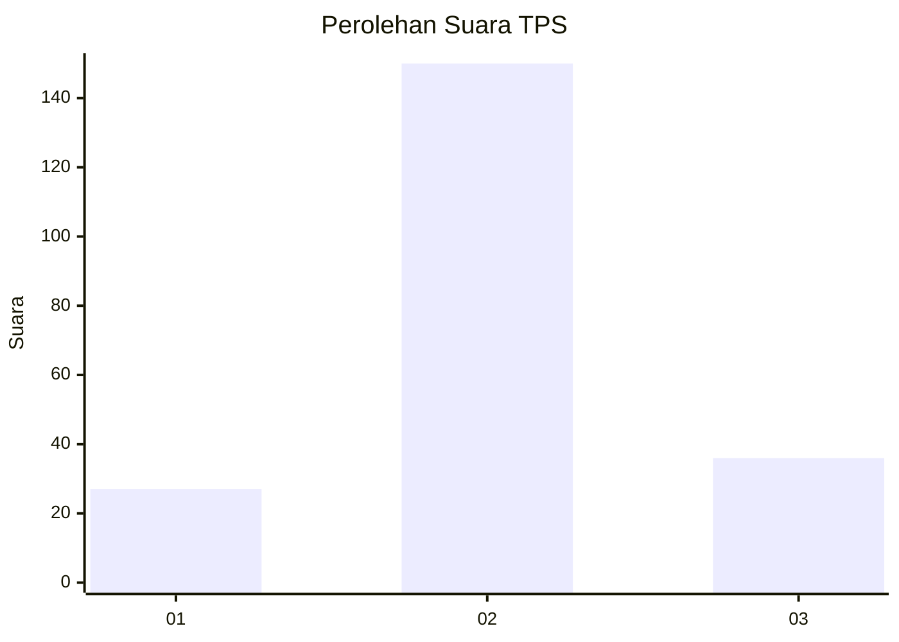
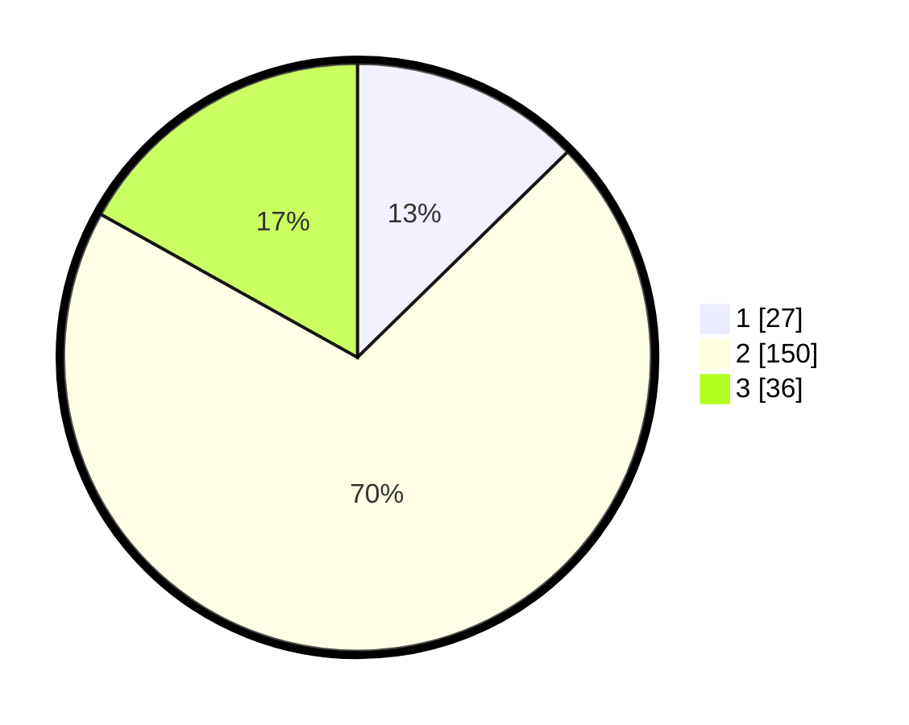

# Hasil

## Grafik

## Tabel

| No. | Nama Paslon    | Suara | Suara (raw) | Persentase |
|:--- |:-------------- | -----:| -----------:| ----------:|
| 1   | ANIES MUHAIMIN | 27    | [27][p-1]   | 12,68      |
| 2   | PRABOWO GIBRAN | 150   | [150][p-2]  | 70,42      |
| 3   | GANJAR MAHFUD  | 36    | [36][p-3]   | 16,90      |

[p-1]: https://github.com/gigit-pemilu/pemilu-2024-51-bali/blob/main/pilpres/hitung-suara/sub/51-bali/sub/08-buleleng/sub/04-banjar/sub/2015-temukus/sub/019-tps/sub/paslon-1.txt
[p-2]: https://github.com/gigit-pemilu/pemilu-2024-51-bali/blob/main/pilpres/hitung-suara/sub/51-bali/sub/08-buleleng/sub/04-banjar/sub/2015-temukus/sub/019-tps/sub/paslon-2.txt
[p-3]: https://github.com/gigit-pemilu/pemilu-2024-51-bali/blob/main/pilpres/hitung-suara/sub/51-bali/sub/08-buleleng/sub/04-banjar/sub/2015-temukus/sub/019-tps/sub/paslon-3.txt

## Foto C Plano

https://sirekap-obj-formc.kpu.go.id/a25b/pemilu/ppwp/51/08/04/20/15/5108042015019-20240214-204438--b80ea2b1-4f6e-44fe-b2ac-2c3f4455be54.jpg

https://sirekap-obj-formc.kpu.go.id/a25b/pemilu/ppwp/51/08/04/20/15/5108042015019-20240214-221453--7039aff6-6764-4d68-b0ff-aa098c0cdc86.jpg

https://sirekap-obj-formc.kpu.go.id/a25b/pemilu/ppwp/51/08/04/20/15/5108042015019-20240214-204728--7720fc99-6f14-4322-96c6-e64d5b8a3ef4.jpg

## Metadata

| Key        | Value               |
| ---------- | ------------------- |
| Time Stamp | 2024-02-24 22:31:28 |

