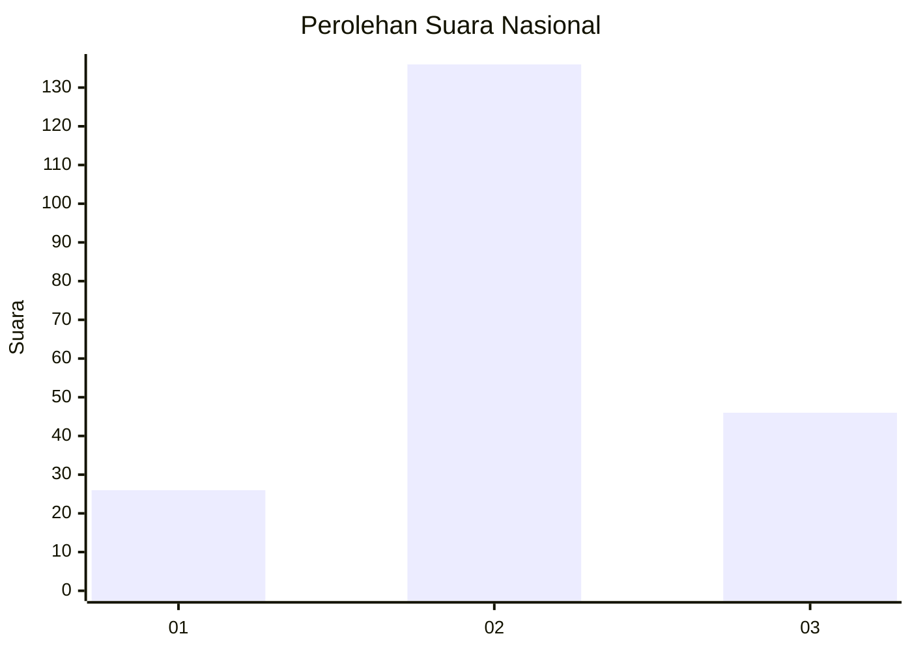
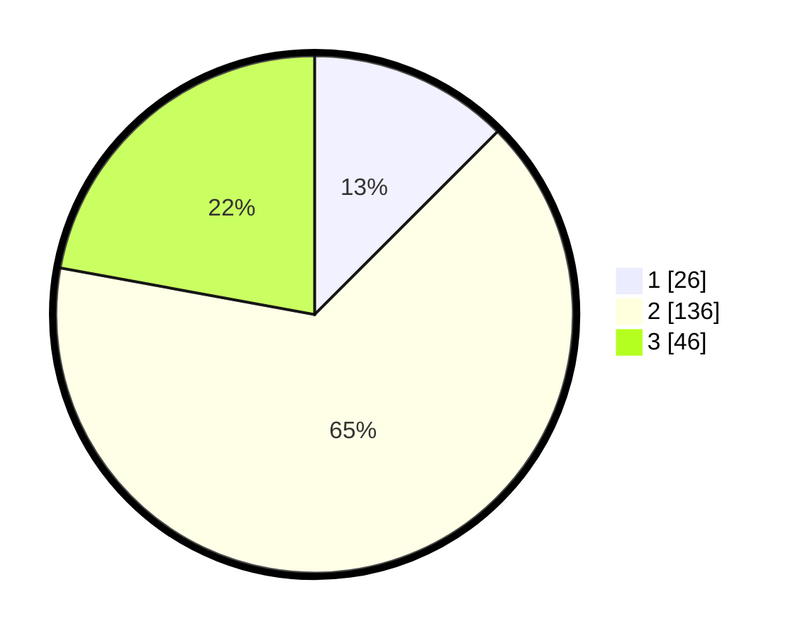

# Hasil

## Grafik

## Tabel

| No. | Nama Paslon    | Suara | Suara (raw) | Persentase |
|:--- |:-------------- | -----:| -----------:| ----------:|
| 1   | ANIES MUHAIMIN | 26    | [26][p-1]   | 12,50      |
| 2   | PRABOWO GIBRAN | 136   | [136][p-2]  | 65,38      |
| 3   | GANJAR MAHFUD  | 46    | [46][p-3]   | 22,12      |

[p-1]: https://github.com/gigit-pemilu/pemilu-2024/blob/main/pilpres/hitung-suara/sub/51-bali/sub/08-buleleng/sub/04-banjar/sub/2015-temukus/sub/020-tps/sub/paslon-1.txt
[p-2]: https://github.com/gigit-pemilu/pemilu-2024/blob/main/pilpres/hitung-suara/sub/51-bali/sub/08-buleleng/sub/04-banjar/sub/2015-temukus/sub/020-tps/sub/paslon-2.txt
[p-3]: https://github.com/gigit-pemilu/pemilu-2024/blob/main/pilpres/hitung-suara/sub/51-bali/sub/08-buleleng/sub/04-banjar/sub/2015-temukus/sub/020-tps/sub/paslon-3.txt

## Foto C Plano

https://sirekap-obj-formc.kpu.go.id/1416/pemilu/ppwp/51/08/04/20/15/5108042015020-20240215-001915--bb28fe79-1187-4f9c-9c93-d3ab0c76e661.jpg

https://sirekap-obj-formc.kpu.go.id/1416/pemilu/ppwp/51/08/04/20/15/5108042015020-20240215-002000--515d0a51-a2f5-45a0-b1b6-c5548f8738f4.jpg

https://sirekap-obj-formc.kpu.go.id/1416/pemilu/ppwp/51/08/04/20/15/5108042015020-20240215-002050--c42de78f-1dac-42c9-a305-42577f4e63f2.jpg

## Metadata

| Key        | Value               |
| ---------- | ------------------- |
| Time Stamp | 2024-02-24 22:31:28 |

