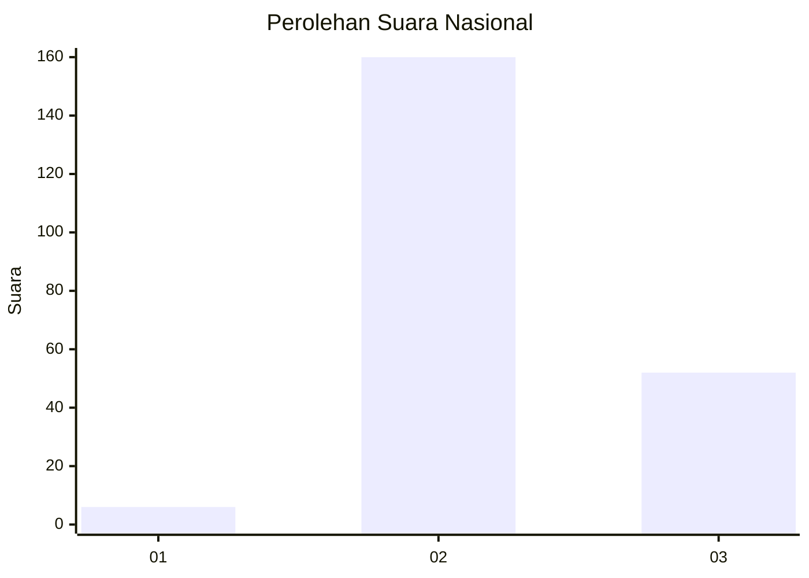
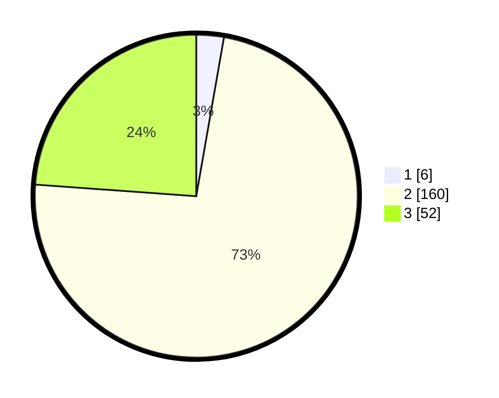

# Hasil

## Grafik

## Tabel

| No. | Nama Paslon    | Suara | Suara (raw) | Persentase |
|:--- |:-------------- | -----:| -----------:| ----------:|
| 1   | ANIES MUHAIMIN | 6     | [6][p-1]    | 2,75       |
| 2   | PRABOWO GIBRAN | 160   | [160][p-2]  | 73,39      |
| 3   | GANJAR MAHFUD  | 52    | [52][p-3]   | 23,85      |

[p-1]: https://github.com/gigit-pemilu/pemilu-2024/blob/main/pilpres/hitung-suara/sub/51-bali/sub/08-buleleng/sub/04-banjar/sub/2016-tigawasa/sub/002-tps/sub/paslon-1.txt
[p-2]: https://github.com/gigit-pemilu/pemilu-2024/blob/main/pilpres/hitung-suara/sub/51-bali/sub/08-buleleng/sub/04-banjar/sub/2016-tigawasa/sub/002-tps/sub/paslon-2.txt
[p-3]: https://github.com/gigit-pemilu/pemilu-2024/blob/main/pilpres/hitung-suara/sub/51-bali/sub/08-buleleng/sub/04-banjar/sub/2016-tigawasa/sub/002-tps/sub/paslon-3.txt

## Foto C Plano

https://sirekap-obj-formc.kpu.go.id/4210/pemilu/ppwp/51/08/04/20/16/5108042016002-20240214-195804--27c63bc7-a674-40d6-928f-5f055db9977f.jpg

https://sirekap-obj-formc.kpu.go.id/4210/pemilu/ppwp/51/08/04/20/16/5108042016002-20240214-184717--37e925fb-877a-44b9-a3d8-d367534f3662.jpg

https://sirekap-obj-formc.kpu.go.id/4210/pemilu/ppwp/51/08/04/20/16/5108042016002-20240214-184644--06dd73e9-2153-47df-aea6-5cdf8434b818.jpg

## Metadata

| Key        | Value               |
| ---------- | ------------------- |
| Time Stamp | 2024-02-24 22:31:28 |

