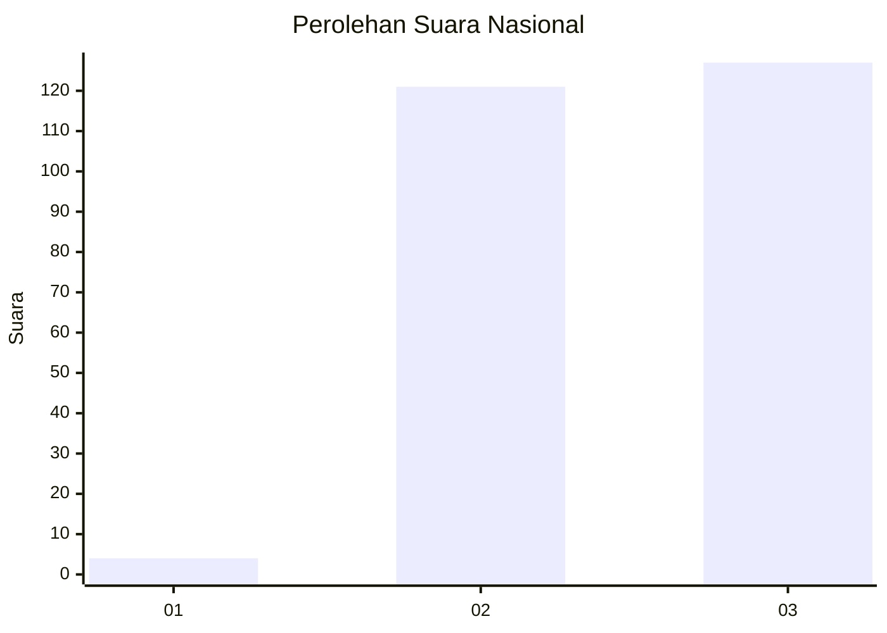
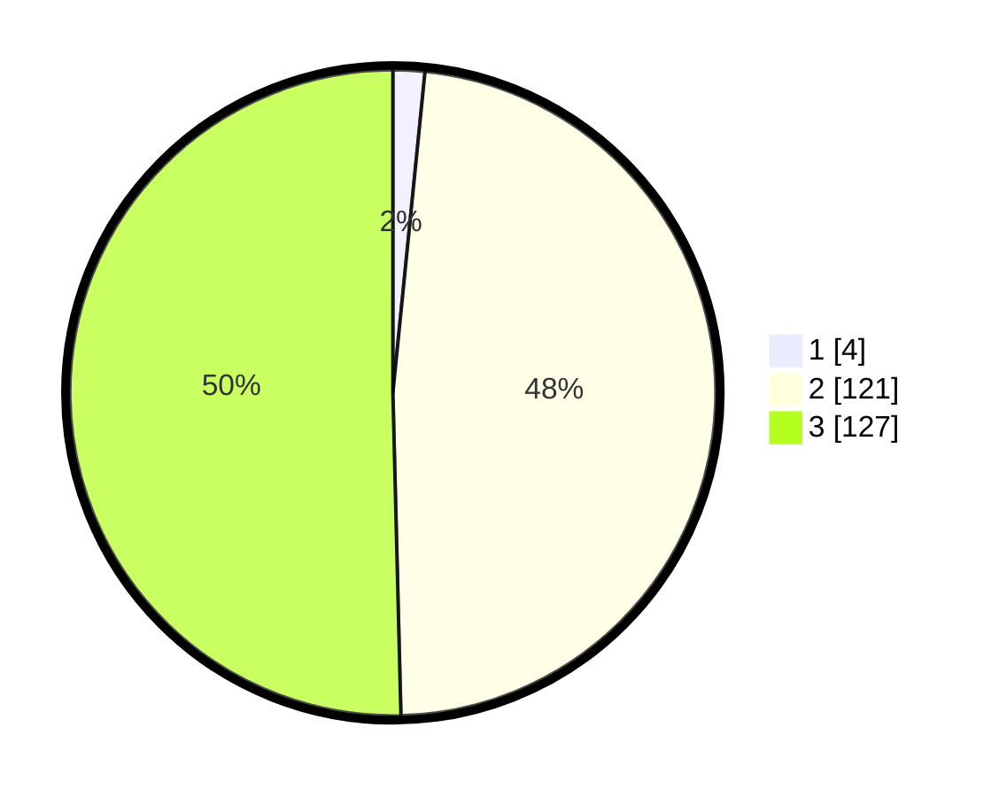

# Hasil

## Grafik

## Tabel

| No. | Nama Paslon    | Suara | Suara (raw) | Persentase |
|:--- |:-------------- | -----:| -----------:| ----------:|
| 1   | ANIES MUHAIMIN | 4     | [4][p-1]    | 1,59       |
| 2   | PRABOWO GIBRAN | 121   | [121][p-2]  | 48,02      |
| 3   | GANJAR MAHFUD  | 127   | [127][p-3]  | 50,40      |

[p-1]: https://github.com/gigit-pemilu/pemilu-2024/blob/main/pilpres/hitung-suara/sub/51-bali/sub/08-buleleng/sub/04-banjar/sub/2016-tigawasa/sub/010-tps/sub/paslon-1.txt
[p-2]: https://github.com/gigit-pemilu/pemilu-2024/blob/main/pilpres/hitung-suara/sub/51-bali/sub/08-buleleng/sub/04-banjar/sub/2016-tigawasa/sub/010-tps/sub/paslon-2.txt
[p-3]: https://github.com/gigit-pemilu/pemilu-2024/blob/main/pilpres/hitung-suara/sub/51-bali/sub/08-buleleng/sub/04-banjar/sub/2016-tigawasa/sub/010-tps/sub/paslon-3.txt

## Foto C Plano

https://sirekap-obj-formc.kpu.go.id/bac9/pemilu/ppwp/51/08/04/20/16/5108042016010-20240214-202735--2bc4a713-d04c-45a0-bb6a-cf1cf32930b8.jpg

https://sirekap-obj-formc.kpu.go.id/bac9/pemilu/ppwp/51/08/04/20/16/5108042016010-20240214-202921--48f4e7cb-2185-4721-9b57-a29118bc6dad.jpg

https://sirekap-obj-formc.kpu.go.id/bac9/pemilu/ppwp/51/08/04/20/16/5108042016010-20240214-203113--45caf41d-7472-48b1-988a-da50f08c6c65.jpg

## Metadata

| Key        | Value               |
| ---------- | ------------------- |
| Time Stamp | 2024-02-24 22:31:28 |

