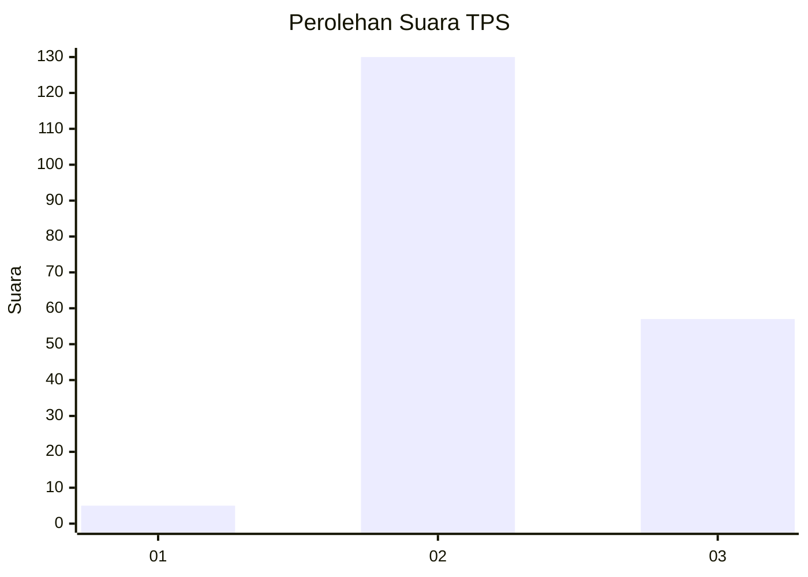

# Hasil

## Grafik

## Tabel

| No. | Nama Paslon    | Suara | Suara (raw) | Persentase |
|:--- |:-------------- | -----:| -----------:| ----------:|
| 1   | ANIES MUHAIMIN | 5     | [5][p-1]    | 2,60       |
| 2   | PRABOWO GIBRAN | 130   | [130][p-2]  | 67,71      |
| 3   | GANJAR MAHFUD  | 57    | [57][p-3]   | 29,69      |

[p-1]: https://github.com/gigit-pemilu/pemilu-2024-51-bali/blob/main/pilpres/hitung-suara/sub/51-bali/sub/08-buleleng/sub/04-banjar/sub/2016-tigawasa/sub/011-tps/sub/paslon-1.txt
[p-2]: https://github.com/gigit-pemilu/pemilu-2024-51-bali/blob/main/pilpres/hitung-suara/sub/51-bali/sub/08-buleleng/sub/04-banjar/sub/2016-tigawasa/sub/011-tps/sub/paslon-2.txt
[p-3]: https://github.com/gigit-pemilu/pemilu-2024-51-bali/blob/main/pilpres/hitung-suara/sub/51-bali/sub/08-buleleng/sub/04-banjar/sub/2016-tigawasa/sub/011-tps/sub/paslon-3.txt

## Foto C Plano

https://sirekap-obj-formc.kpu.go.id/445a/pemilu/ppwp/51/08/04/20/16/5108042016011-20240215-002958--94976500-0905-4a71-8911-725aaeabdeac.jpg

https://sirekap-obj-formc.kpu.go.id/445a/pemilu/ppwp/51/08/04/20/16/5108042016011-20240215-011440--360daaf0-3b1e-4e0a-b55b-18c29e8ca051.jpg

https://sirekap-obj-formc.kpu.go.id/445a/pemilu/ppwp/51/08/04/20/16/5108042016011-20240215-011225--0cb883c4-434f-4c02-98c9-4dee14f457fb.jpg

## Metadata

| Key        | Value               |
| ---------- | ------------------- |
| Time Stamp | 2024-02-24 22:31:28 |

