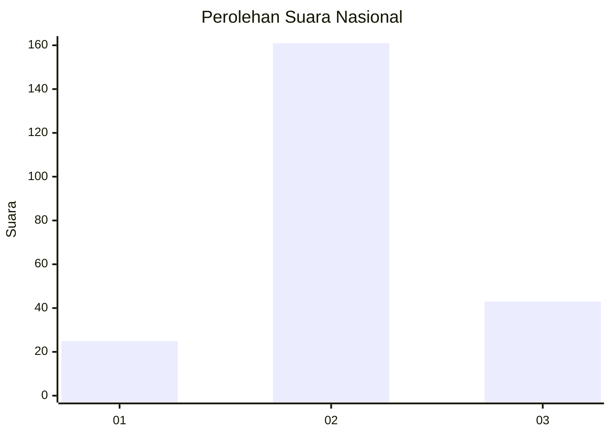
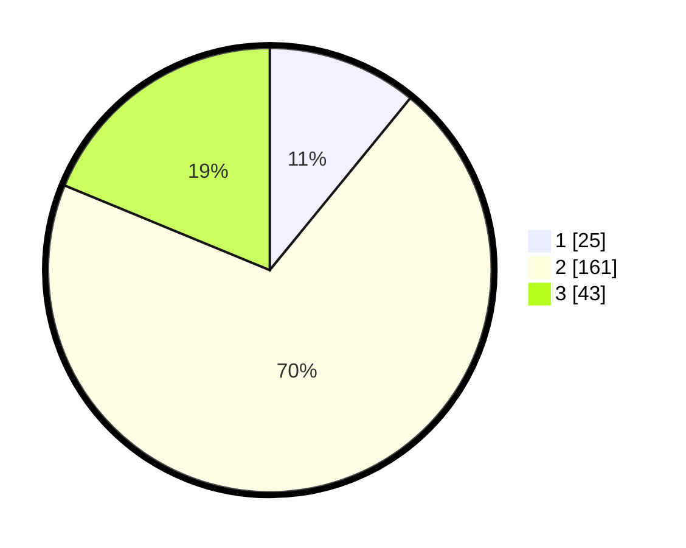

# Hasil

## Grafik

## Tabel

| No. | Nama Paslon    | Suara | Suara (raw) | Persentase |
|:--- |:-------------- | -----:| -----------:| ----------:|
| 1   | ANIES MUHAIMIN | 25    | [25][p-1]   | 10,92      |
| 2   | PRABOWO GIBRAN | 161   | [161][p-2]  | 70,31      |
| 3   | GANJAR MAHFUD  | 43    | [43][p-3]   | 18,78      |

[p-1]: https://github.com/gigit-pemilu/pemilu-2024/blob/main/pilpres/hitung-suara/sub/51-bali/sub/08-buleleng/sub/04-banjar/sub/2017-kaliasem/sub/001-tps/sub/paslon-1.txt
[p-2]: https://github.com/gigit-pemilu/pemilu-2024/blob/main/pilpres/hitung-suara/sub/51-bali/sub/08-buleleng/sub/04-banjar/sub/2017-kaliasem/sub/001-tps/sub/paslon-2.txt
[p-3]: https://github.com/gigit-pemilu/pemilu-2024/blob/main/pilpres/hitung-suara/sub/51-bali/sub/08-buleleng/sub/04-banjar/sub/2017-kaliasem/sub/001-tps/sub/paslon-3.txt

## Foto C Plano

https://sirekap-obj-formc.kpu.go.id/7f35/pemilu/ppwp/51/08/04/20/17/5108042017001-20240215-011357--ba8a213a-6681-4202-974c-b919859d3f91.jpg

https://sirekap-obj-formc.kpu.go.id/7f35/pemilu/ppwp/51/08/04/20/17/5108042017001-20240215-011804--01fa3cd6-5c33-4402-982f-346a2a226b2a.jpg

https://sirekap-obj-formc.kpu.go.id/7f35/pemilu/ppwp/51/08/04/20/17/5108042017001-20240215-011929--de05f9c9-900a-4b21-85fa-404610e00d96.jpg

## Metadata

| Key        | Value               |
| ---------- | ------------------- |
| Time Stamp | 2024-02-25 12:00:00 |

