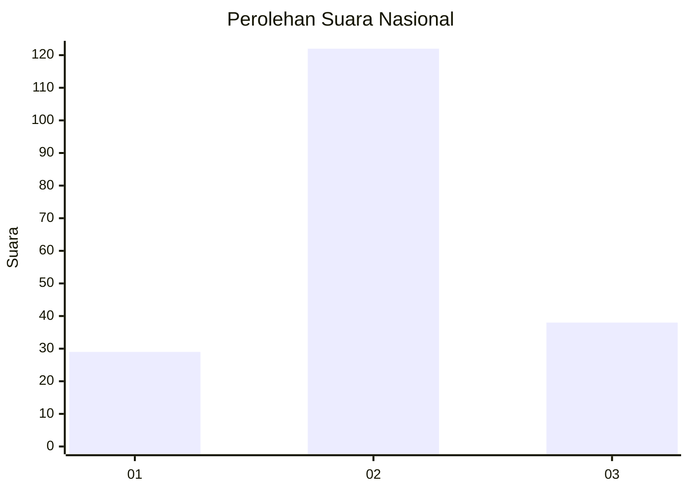
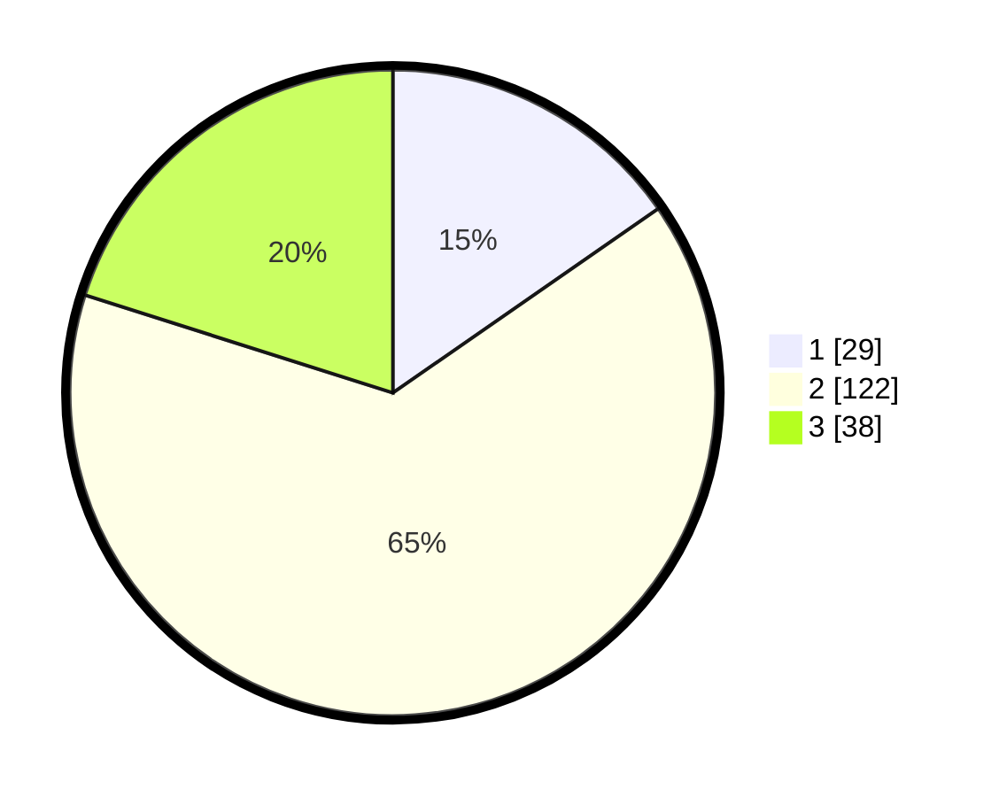

# Hasil

## Grafik

## Tabel

| No. | Nama Paslon    | Suara | Suara (raw) | Persentase |
|:--- |:-------------- | -----:| -----------:| ----------:|
| 1   | ANIES MUHAIMIN | 29    | [29][p-1]   | 15,34      |
| 2   | PRABOWO GIBRAN | 122   | [122][p-2]  | 64,55      |
| 3   | GANJAR MAHFUD  | 38    | [38][p-3]   | 20,11      |

[p-1]: https://github.com/gigit-pemilu/pemilu-2024/blob/main/pilpres/hitung-suara/sub/51-bali/sub/08-buleleng/sub/04-banjar/sub/2017-kaliasem/sub/003-tps/sub/paslon-1.txt
[p-2]: https://github.com/gigit-pemilu/pemilu-2024/blob/main/pilpres/hitung-suara/sub/51-bali/sub/08-buleleng/sub/04-banjar/sub/2017-kaliasem/sub/003-tps/sub/paslon-2.txt
[p-3]: https://github.com/gigit-pemilu/pemilu-2024/blob/main/pilpres/hitung-suara/sub/51-bali/sub/08-buleleng/sub/04-banjar/sub/2017-kaliasem/sub/003-tps/sub/paslon-3.txt

## Foto C Plano

https://sirekap-obj-formc.kpu.go.id/8c2b/pemilu/ppwp/51/08/04/20/17/5108042017003-20240214-211734--317a4f1f-6a07-43e1-9979-48232583731d.jpg

https://sirekap-obj-formc.kpu.go.id/8c2b/pemilu/ppwp/51/08/04/20/17/5108042017003-20240214-211749--c81e8e5a-b150-443a-9cf0-4eeaba3c9827.jpg

https://sirekap-obj-formc.kpu.go.id/8c2b/pemilu/ppwp/51/08/04/20/17/5108042017003-20240214-211804--c98ea014-861d-4718-b668-b248e2c097c7.jpg

## Metadata

| Key        | Value               |
| ---------- | ------------------- |
| Time Stamp | 2024-02-15 03:06:03 |

## DATA PEMILIH TETAP

Jumlah pemilih dalam DPT: **242**.
 * L: **118**.
 * P: **124**.

## DATA PENGGUNA HAK PILIH

Jumlah pengguna hak pilih dalam DPT: **185**.
 * L: **86**.
 * P: **99**.

Jumlah pengguna hak pilih dalam DPTb: **0**.
 * L: **0**.
 * P: **0**.

Jumlah pengguna hak pilih dalam DPK: **7**.
 * L: **3**.
 * P: **4**.

Jumlah pengguna hak pilih: **192**.
 * L: **89**.
 * P: **103**.

## JUMLAH SUARA SAH DAN TIDAK SAH

JUMLAH SELURUH SUARA SAH: **189**.

JUMLAH SUARA TIDAK SAH: **3**.

JUMLAH SELURUH SUARA SAH DAN SUARA TIDAK SAH: **192**.

