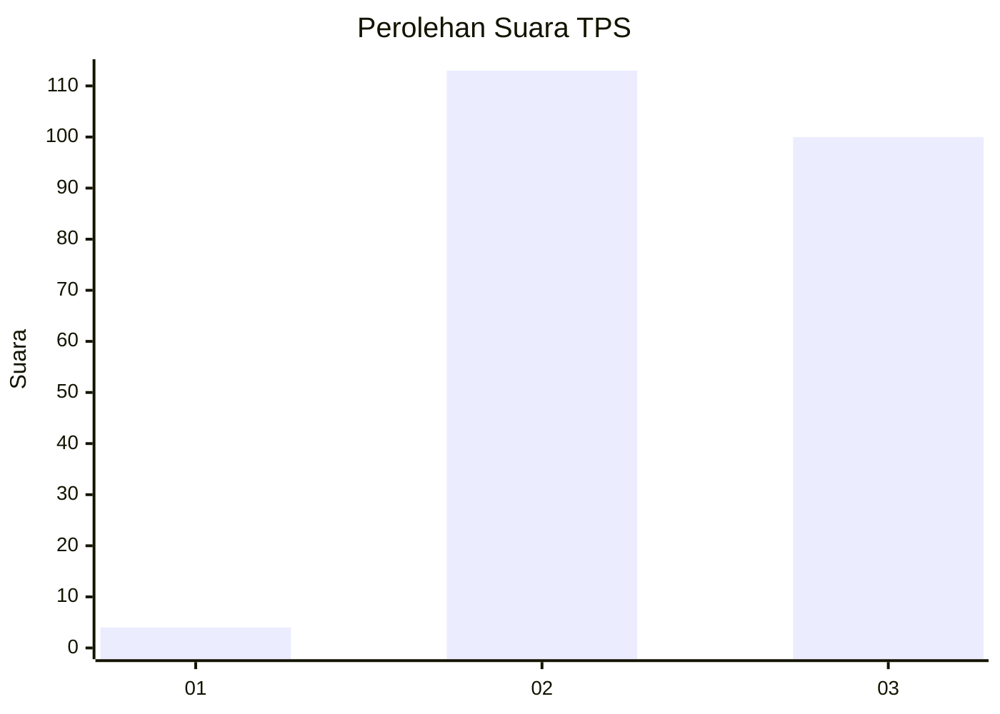
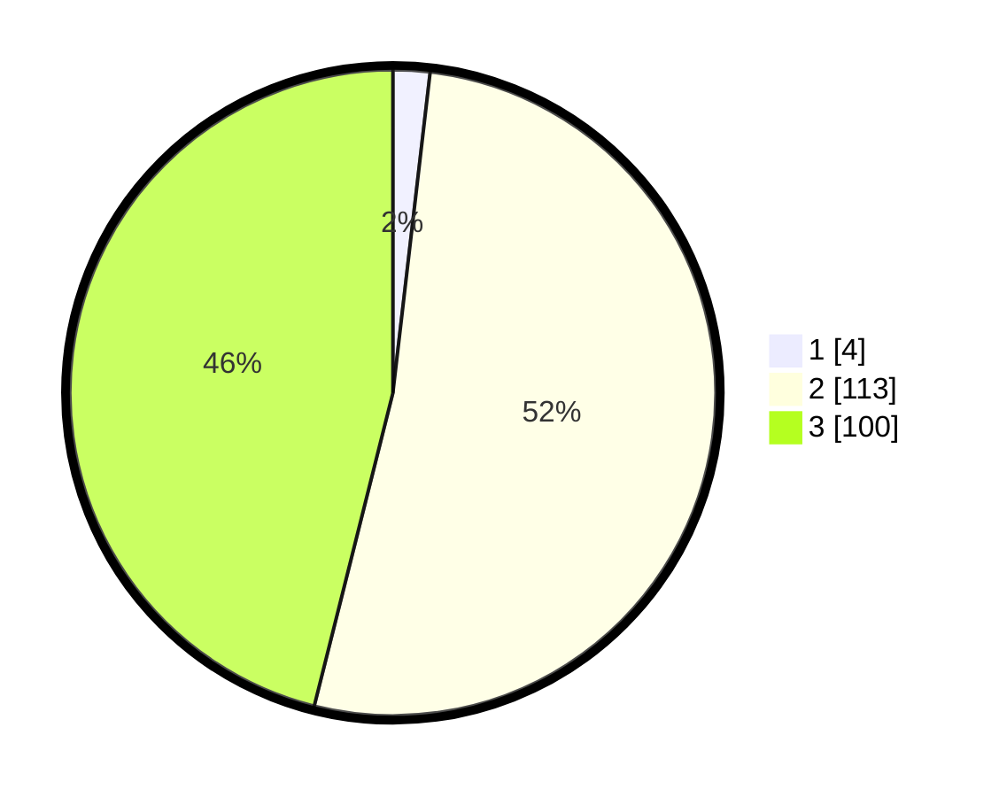

# Hasil

## Grafik

## Tabel

| No. | Nama Paslon    | Suara | Suara (raw) | Persentase |
|:--- |:-------------- | -----:| -----------:| ----------:|
| 1   | ANIES MUHAIMIN | 4     | [4][p-1]    | 1,84       |
| 2   | PRABOWO GIBRAN | 113   | [113][p-2]  | 52,07      |
| 3   | GANJAR MAHFUD  | 100   | [100][p-3]  | 46,08      |

[p-1]: https://github.com/gigit-pemilu/pemilu-2024-51-bali/blob/main/pilpres/hitung-suara/sub/51-bali/sub/08-buleleng/sub/04-banjar/sub/2017-kaliasem/sub/008-tps/sub/paslon-1.txt
[p-2]: https://github.com/gigit-pemilu/pemilu-2024-51-bali/blob/main/pilpres/hitung-suara/sub/51-bali/sub/08-buleleng/sub/04-banjar/sub/2017-kaliasem/sub/008-tps/sub/paslon-2.txt
[p-3]: https://github.com/gigit-pemilu/pemilu-2024-51-bali/blob/main/pilpres/hitung-suara/sub/51-bali/sub/08-buleleng/sub/04-banjar/sub/2017-kaliasem/sub/008-tps/sub/paslon-3.txt

## Foto C Plano

https://sirekap-obj-formc.kpu.go.id/09ce/pemilu/ppwp/51/08/04/20/17/5108042017008-20240214-185339--4f1d6155-44ef-44bd-9451-226988feb9eb.jpg

https://sirekap-obj-formc.kpu.go.id/09ce/pemilu/ppwp/51/08/04/20/17/5108042017008-20240214-232547--43cc92ef-a002-40f4-9a7a-319b7c5f058d.jpg

https://sirekap-obj-formc.kpu.go.id/09ce/pemilu/ppwp/51/08/04/20/17/5108042017008-20240214-232815--df012f7e-1688-42af-bf79-be48b052fa0b.jpg

## Metadata

| Key        | Value               |
| ---------- | ------------------- |
| Time Stamp | 2024-02-24 22:31:28 |

