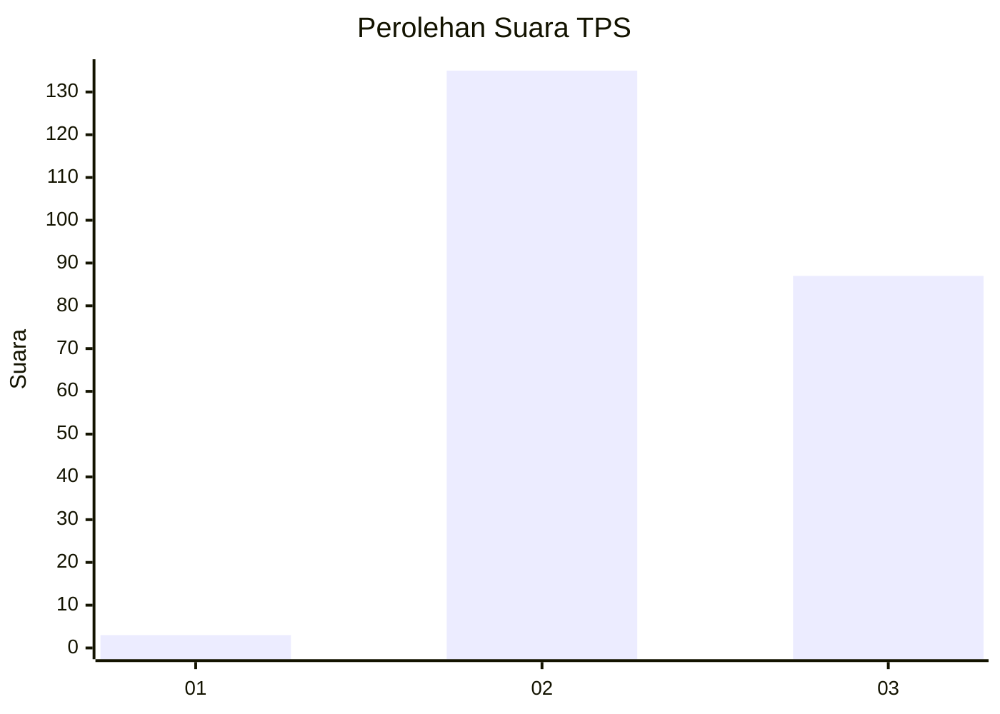
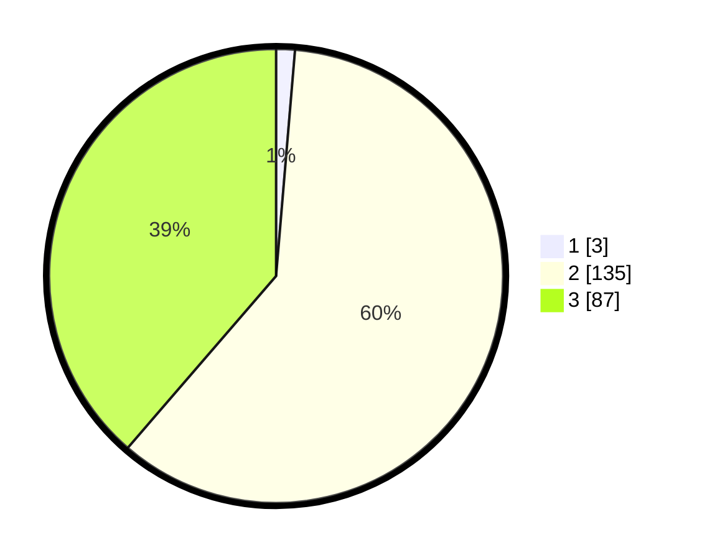

# Hasil

## Grafik

## Tabel

| No. | Nama Paslon    | Suara | Suara (raw) | Persentase |
|:--- |:-------------- | -----:| -----------:| ----------:|
| 1   | ANIES MUHAIMIN | 3     | [3][p-1]    | 1,33       |
| 2   | PRABOWO GIBRAN | 135   | [135][p-2]  | 60,00      |
| 3   | GANJAR MAHFUD  | 87    | [87][p-3]   | 38,67      |

[p-1]: https://github.com/gigit-pemilu/pemilu-2024-51-bali/blob/main/pilpres/hitung-suara/sub/51-bali/sub/08-buleleng/sub/04-banjar/sub/2017-kaliasem/sub/017-tps/sub/paslon-1.txt
[p-2]: https://github.com/gigit-pemilu/pemilu-2024-51-bali/blob/main/pilpres/hitung-suara/sub/51-bali/sub/08-buleleng/sub/04-banjar/sub/2017-kaliasem/sub/017-tps/sub/paslon-2.txt
[p-3]: https://github.com/gigit-pemilu/pemilu-2024-51-bali/blob/main/pilpres/hitung-suara/sub/51-bali/sub/08-buleleng/sub/04-banjar/sub/2017-kaliasem/sub/017-tps/sub/paslon-3.txt

## Foto C Plano

https://sirekap-obj-formc.kpu.go.id/c90e/pemilu/ppwp/51/08/04/20/17/5108042017017-20240318-111216--ac222594-67e4-47c8-9950-6591e15179ea.jpg

https://sirekap-obj-formc.kpu.go.id/c90e/pemilu/ppwp/51/08/04/20/17/5108042017017-20240215-000307--f4ac19ff-fe3a-4de7-b3c5-29981efec893.jpg

https://sirekap-obj-formc.kpu.go.id/c90e/pemilu/ppwp/51/08/04/20/17/5108042017017-20240215-000841--70b1e4ad-cb81-41c1-adb2-adbe3f36ac20.jpg

## Metadata

| Key        | Value               |
| ---------- | ------------------- |
| Time Stamp | 2024-03-18 11:30:00 |

