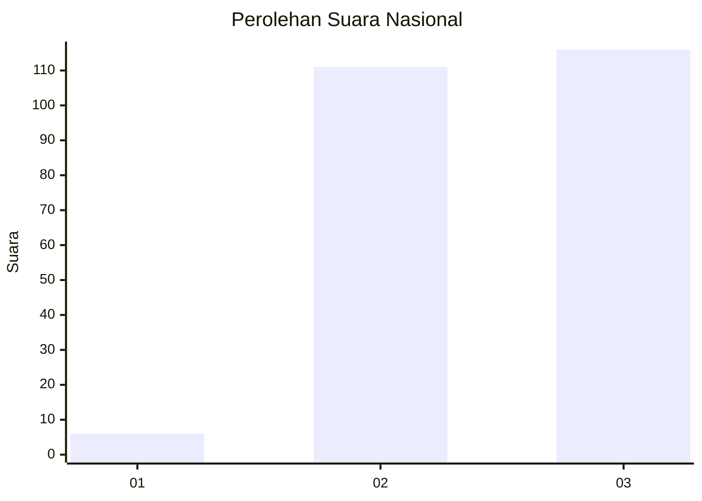
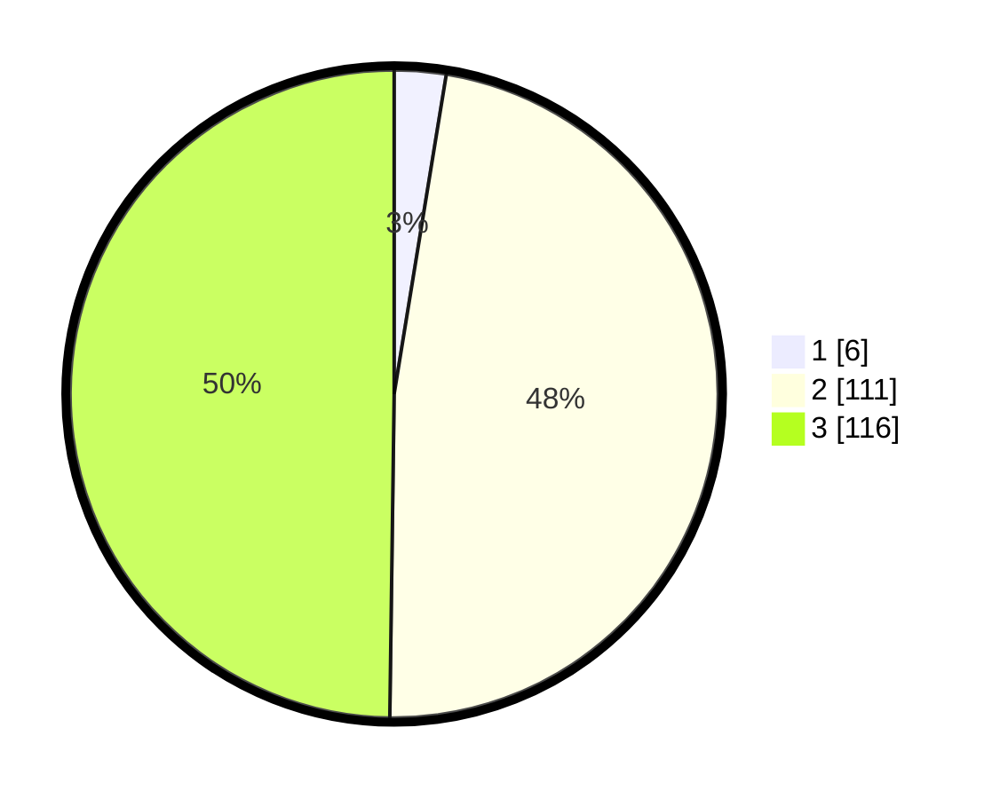

# Hasil

## Grafik

## Tabel

| No. | Nama Paslon    | Suara | Suara (raw) | Persentase |
|:--- |:-------------- | -----:| -----------:| ----------:|
| 1   | ANIES MUHAIMIN | 6     | [6][p-1]    | 2,58       |
| 2   | PRABOWO GIBRAN | 111   | [111][p-2]  | 47,64      |
| 3   | GANJAR MAHFUD  | 116   | [116][p-3]  | 49,79      |

[p-1]: https://github.com/gigit-pemilu/pemilu-2024/blob/main/pilpres/hitung-suara/sub/51-bali/sub/08-buleleng/sub/04-banjar/sub/2017-kaliasem/sub/018-tps/sub/paslon-1.txt
[p-2]: https://github.com/gigit-pemilu/pemilu-2024/blob/main/pilpres/hitung-suara/sub/51-bali/sub/08-buleleng/sub/04-banjar/sub/2017-kaliasem/sub/018-tps/sub/paslon-2.txt
[p-3]: https://github.com/gigit-pemilu/pemilu-2024/blob/main/pilpres/hitung-suara/sub/51-bali/sub/08-buleleng/sub/04-banjar/sub/2017-kaliasem/sub/018-tps/sub/paslon-3.txt

## Foto C Plano

https://sirekap-obj-formc.kpu.go.id/e96a/pemilu/ppwp/51/08/04/20/17/5108042017018-20240215-004705--dfe02c9b-61a5-4504-af7c-79b2d3ed472b.jpg

https://sirekap-obj-formc.kpu.go.id/e96a/pemilu/ppwp/51/08/04/20/17/5108042017018-20240215-010704--b560843c-6cbf-472d-80d8-08e0c5593ecd.jpg

https://sirekap-obj-formc.kpu.go.id/e96a/pemilu/ppwp/51/08/04/20/17/5108042017018-20240215-010737--48f9ee8f-57ac-4688-b7ff-0fe4da7d3f6b.jpg

## Metadata

| Key        | Value               |
| ---------- | ------------------- |
| Time Stamp | 2024-02-15 15:00:29 |

