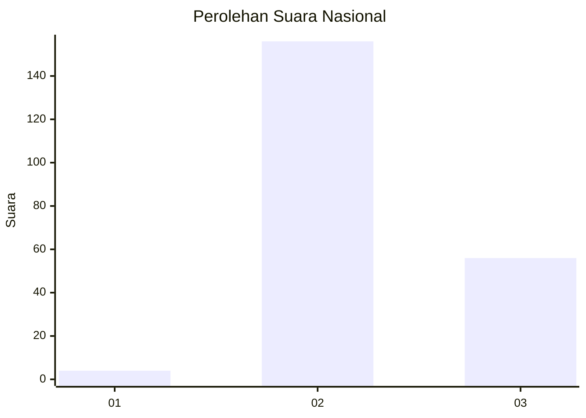
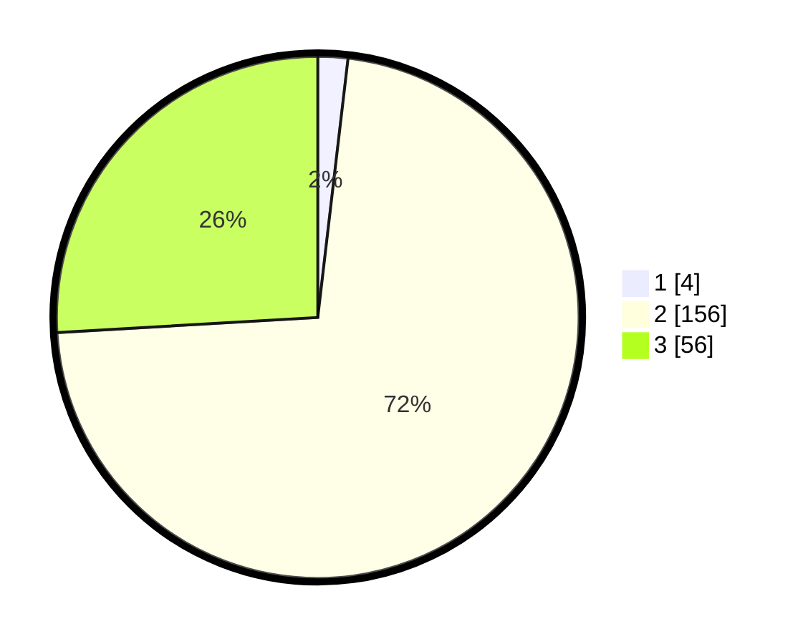

# Hasil

## Grafik

## Tabel

| No. | Nama Paslon    | Suara | Suara (raw) | Persentase |
|:--- |:-------------- | -----:| -----------:| ----------:|
| 1   | ANIES MUHAIMIN | 4     | [4][p-1]    | 1,85       |
| 2   | PRABOWO GIBRAN | 156   | [156][p-2]  | 72,22      |
| 3   | GANJAR MAHFUD  | 56    | [56][p-3]   | 25,93      |

[p-1]: https://github.com/gigit-pemilu/pemilu-2024/blob/main/pilpres/hitung-suara/sub/51-bali/sub/08-buleleng/sub/05-sukasada/sub/1009-sukasada/sub/004-tps/sub/paslon-1.txt
[p-2]: https://github.com/gigit-pemilu/pemilu-2024/blob/main/pilpres/hitung-suara/sub/51-bali/sub/08-buleleng/sub/05-sukasada/sub/1009-sukasada/sub/004-tps/sub/paslon-2.txt
[p-3]: https://github.com/gigit-pemilu/pemilu-2024/blob/main/pilpres/hitung-suara/sub/51-bali/sub/08-buleleng/sub/05-sukasada/sub/1009-sukasada/sub/004-tps/sub/paslon-3.txt

## Foto C Plano

https://sirekap-obj-formc.kpu.go.id/219c/pemilu/ppwp/51/08/05/10/09/5108051009004-20240215-010552--2f8d73e9-e01e-44d1-ba84-3fe2f464273a.jpg

https://sirekap-obj-formc.kpu.go.id/219c/pemilu/ppwp/51/08/05/10/09/5108051009004-20240215-010857--5745f6d1-6326-43c3-b74e-6485836cec71.jpg

https://sirekap-obj-formc.kpu.go.id/219c/pemilu/ppwp/51/08/05/10/09/5108051009004-20240215-011131--db6bf561-f61f-40be-8539-1a540a7a9e81.jpg

## Metadata

| Key        | Value               |
| ---------- | ------------------- |
| Time Stamp | 2024-02-24 22:31:28 |

