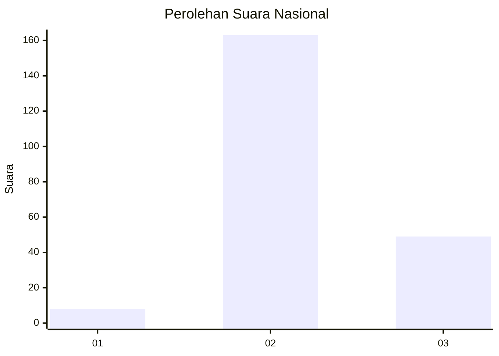
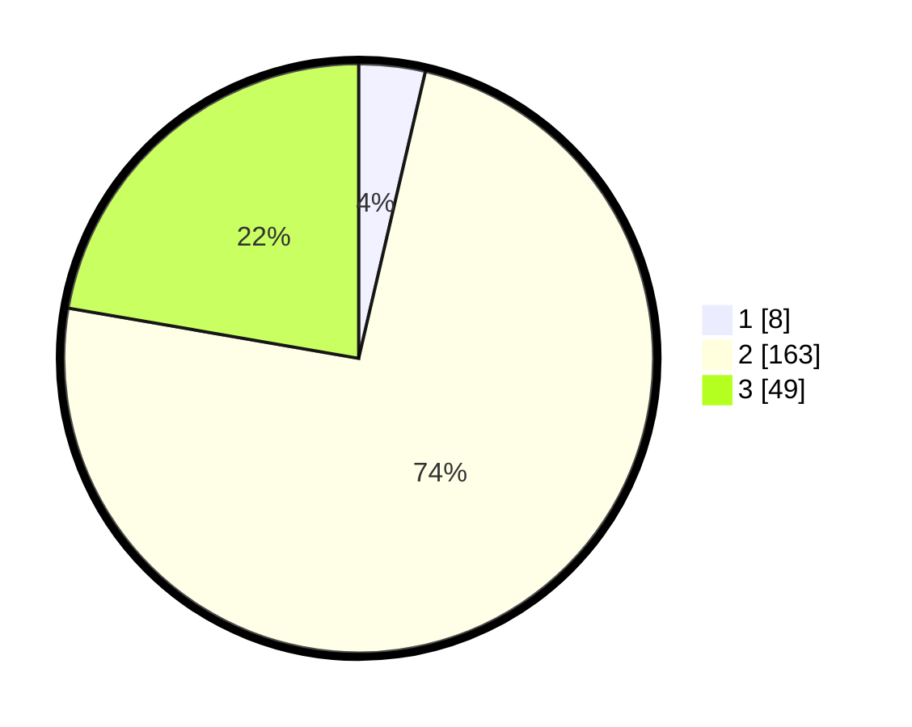

# Hasil

## Grafik

## Tabel

| No. | Nama Paslon    | Suara | Suara (raw) | Persentase |
|:--- |:-------------- | -----:| -----------:| ----------:|
| 1   | ANIES MUHAIMIN | 8     | [8][p-1]    | 3,64       |
| 2   | PRABOWO GIBRAN | 163   | [163][p-2]  | 74,09      |
| 3   | GANJAR MAHFUD  | 49    | [49][p-3]   | 22,27      |

[p-1]: https://github.com/gigit-pemilu/pemilu-2024/blob/main/pilpres/hitung-suara/sub/51-bali/sub/08-buleleng/sub/05-sukasada/sub/1009-sukasada/sub/007-tps/sub/paslon-1.txt
[p-2]: https://github.com/gigit-pemilu/pemilu-2024/blob/main/pilpres/hitung-suara/sub/51-bali/sub/08-buleleng/sub/05-sukasada/sub/1009-sukasada/sub/007-tps/sub/paslon-2.txt
[p-3]: https://github.com/gigit-pemilu/pemilu-2024/blob/main/pilpres/hitung-suara/sub/51-bali/sub/08-buleleng/sub/05-sukasada/sub/1009-sukasada/sub/007-tps/sub/paslon-3.txt

## Foto C Plano

https://sirekap-obj-formc.kpu.go.id/c352/pemilu/ppwp/51/08/05/10/09/5108051009007-20240216-015933--21aa9b72-9cbf-40d3-9276-d539bafb9b13.jpg

https://sirekap-obj-formc.kpu.go.id/c352/pemilu/ppwp/51/08/05/10/09/5108051009007-20240216-015941--a189770e-3e20-4eab-98f8-66440cd5a73f.jpg

https://sirekap-obj-formc.kpu.go.id/c352/pemilu/ppwp/51/08/05/10/09/5108051009007-20240216-015934--d94d9582-2fd8-4f23-a5a7-ebcdd38f6de7.jpg

## Metadata

| Key        | Value               |
| ---------- | ------------------- |
| Time Stamp | 2024-02-16 21:01:00 |

## DATA PEMILIH TETAP

Jumlah pemilih dalam DPT: **2584**.
 * L: **139**.
 * P: **145**.

## DATA PENGGUNA HAK PILIH

Jumlah pengguna hak pilih dalam DPT: **231**.
 * L: **115**.
 * P: **116**.

Jumlah pengguna hak pilih dalam DPTb: **0**.
 * L: **0**.
 * P: **0**.

Jumlah pengguna hak pilih dalam DPK: **0**.
 * L: **0**.
 * P: **0**.

Jumlah pengguna hak pilih: **231**.
 * L: **115**.
 * P: **116**.

## JUMLAH SUARA SAH DAN TIDAK SAH

JUMLAH SELURUH SUARA SAH: **220**.

JUMLAH SUARA TIDAK SAH: **11**.

JUMLAH SELURUH SUARA SAH DAN SUARA TIDAK SAH: **231**.

