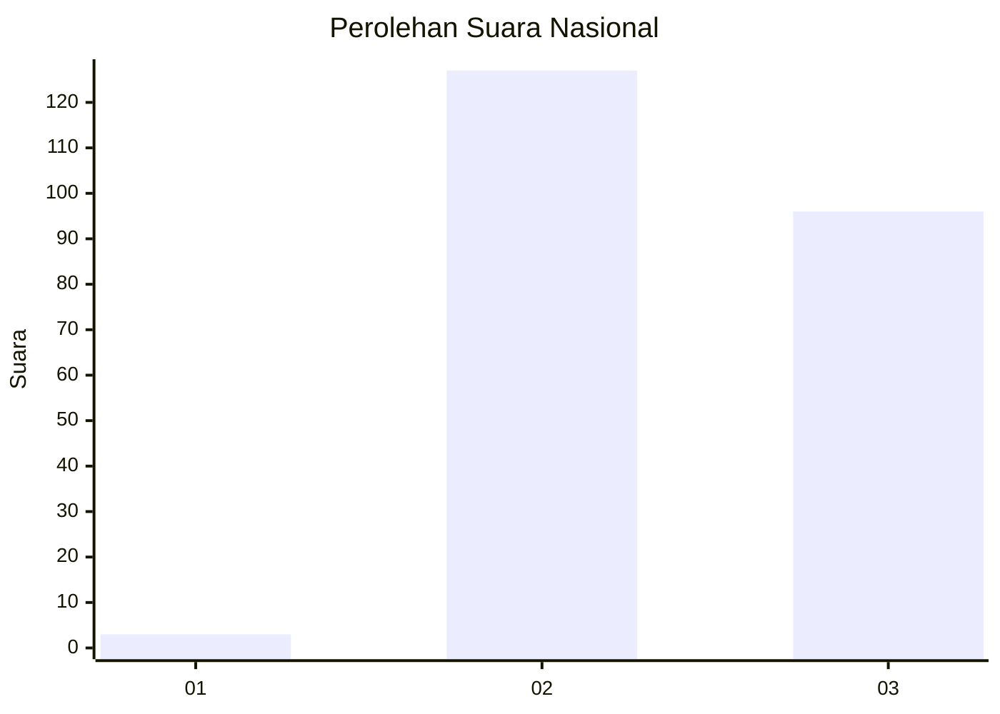
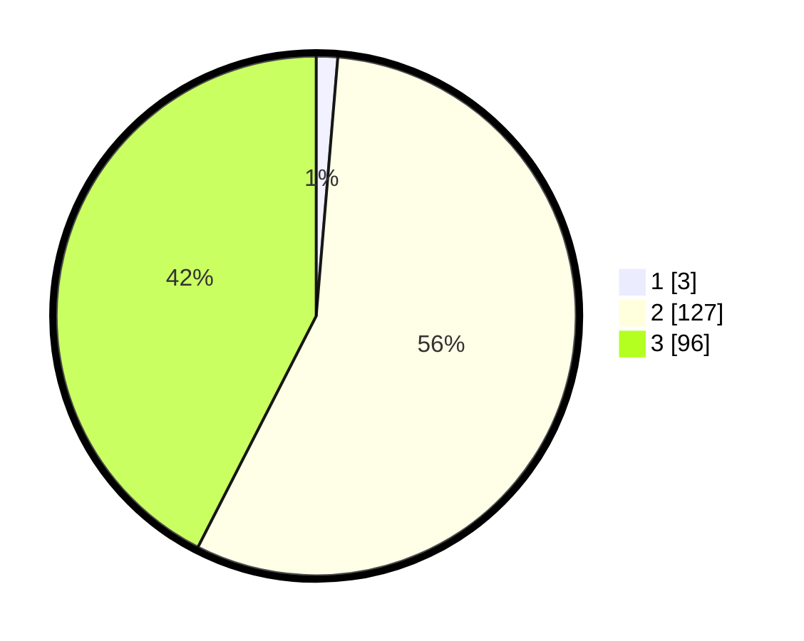

# Hasil

## Grafik

## Tabel

| No. | Nama Paslon    | Suara | Suara (raw) | Persentase |
|:--- |:-------------- | -----:| -----------:| ----------:|
| 1   | ANIES MUHAIMIN | 3     | [3][p-1]    | 1,33       |
| 2   | PRABOWO GIBRAN | 127   | [127][p-2]  | 56,19      |
| 3   | GANJAR MAHFUD  | 96    | [96][p-3]   | 42,48      |

[p-1]: https://github.com/gigit-pemilu/pemilu-2024/blob/main/pilpres/hitung-suara/sub/51-bali/sub/08-buleleng/sub/05-sukasada/sub/1009-sukasada/sub/015-tps/sub/paslon-1.txt
[p-2]: https://github.com/gigit-pemilu/pemilu-2024/blob/main/pilpres/hitung-suara/sub/51-bali/sub/08-buleleng/sub/05-sukasada/sub/1009-sukasada/sub/015-tps/sub/paslon-2.txt
[p-3]: https://github.com/gigit-pemilu/pemilu-2024/blob/main/pilpres/hitung-suara/sub/51-bali/sub/08-buleleng/sub/05-sukasada/sub/1009-sukasada/sub/015-tps/sub/paslon-3.txt

## Foto C Plano

https://sirekap-obj-formc.kpu.go.id/6365/pemilu/ppwp/51/08/05/10/09/5108051009015-20240215-003448--1dd5f4b7-73cf-4f51-b30d-2b8b869574ab.jpg

https://sirekap-obj-formc.kpu.go.id/6365/pemilu/ppwp/51/08/05/10/09/5108051009015-20240215-003555--a970babd-4015-493a-88d6-45e0fd15b21a.jpg

https://sirekap-obj-formc.kpu.go.id/6365/pemilu/ppwp/51/08/05/10/09/5108051009015-20240215-003718--fc31d40d-a9b0-43db-b171-c88148852c26.jpg

## Metadata

| Key        | Value               |
| ---------- | ------------------- |
| Time Stamp | 2024-02-25 15:00:00 |

