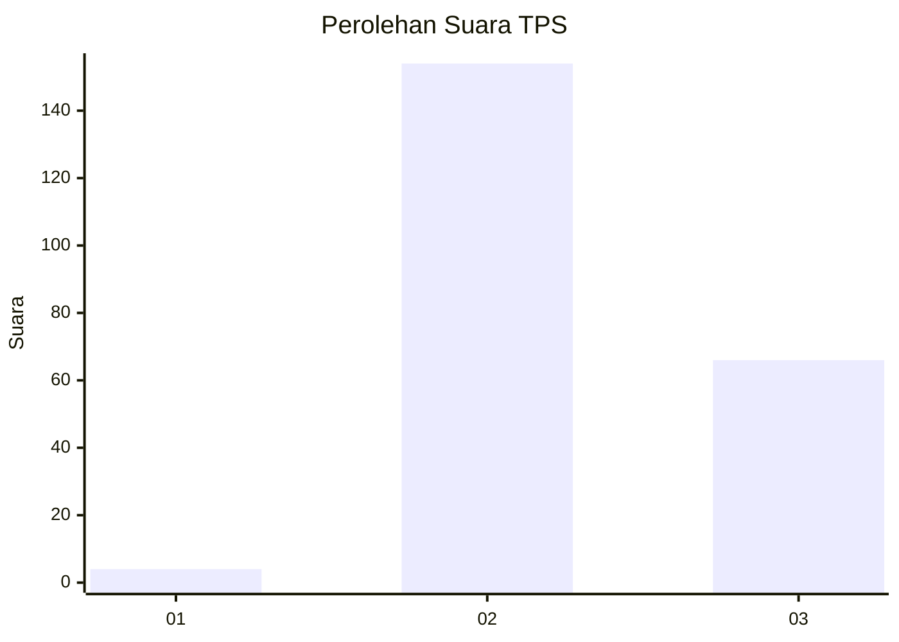

# Hasil

## Grafik

## Tabel

| No. | Nama Paslon    | Suara | Suara (raw) | Persentase |
|:--- |:-------------- | -----:| -----------:| ----------:|
| 1   | ANIES MUHAIMIN | 4     | [4][p-1]    | 1,79       |
| 2   | PRABOWO GIBRAN | 154   | [154][p-2]  | 68,75      |
| 3   | GANJAR MAHFUD  | 66    | [66][p-3]   | 29,46      |

[p-1]: https://github.com/gigit-pemilu/pemilu-2024-51-bali/blob/main/pilpres/hitung-suara/sub/51-bali/sub/08-buleleng/sub/05-sukasada/sub/1009-sukasada/sub/020-tps/sub/paslon-1.txt
[p-2]: https://github.com/gigit-pemilu/pemilu-2024-51-bali/blob/main/pilpres/hitung-suara/sub/51-bali/sub/08-buleleng/sub/05-sukasada/sub/1009-sukasada/sub/020-tps/sub/paslon-2.txt
[p-3]: https://github.com/gigit-pemilu/pemilu-2024-51-bali/blob/main/pilpres/hitung-suara/sub/51-bali/sub/08-buleleng/sub/05-sukasada/sub/1009-sukasada/sub/020-tps/sub/paslon-3.txt

## Foto C Plano

https://sirekap-obj-formc.kpu.go.id/7a49/pemilu/ppwp/51/08/05/10/09/5108051009020-20240215-001359--037bc153-bcbc-4b42-8f76-5d740bac5555.jpg

https://sirekap-obj-formc.kpu.go.id/7a49/pemilu/ppwp/51/08/05/10/09/5108051009020-20240215-025631--bc5861f2-2b47-415e-a06f-cbf1fce86f11.jpg

https://sirekap-obj-formc.kpu.go.id/7a49/pemilu/ppwp/51/08/05/10/09/5108051009020-20240215-025740--f3cac219-d921-465c-b2c8-35638d8a7324.jpg

## Metadata

| Key        | Value               |
| ---------- | ------------------- |
| Time Stamp | 2024-02-24 22:31:28 |

