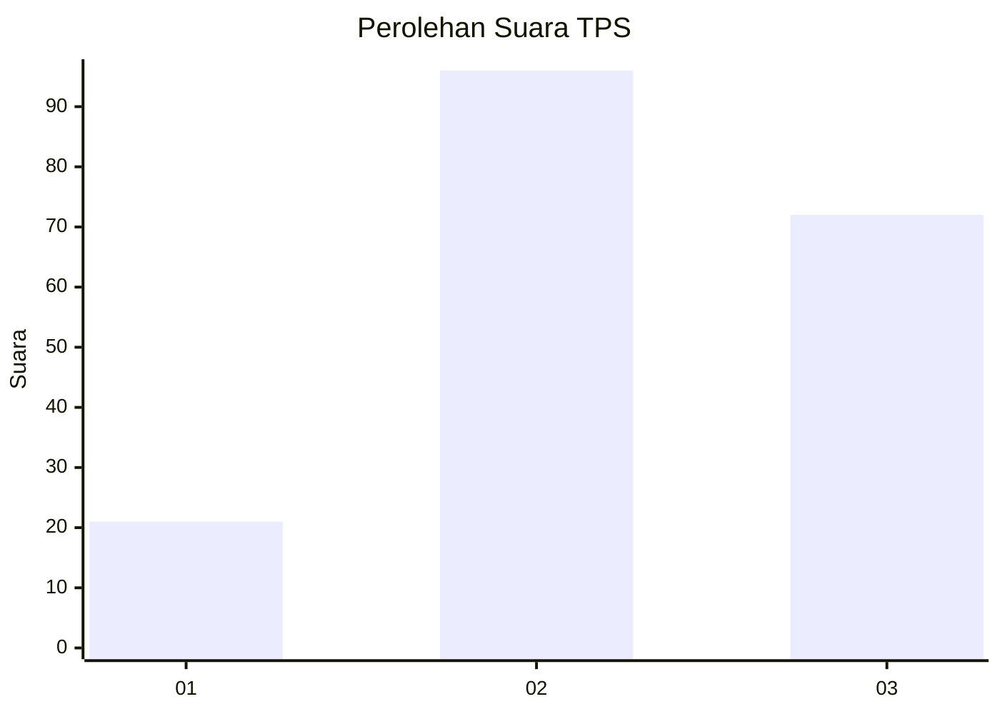
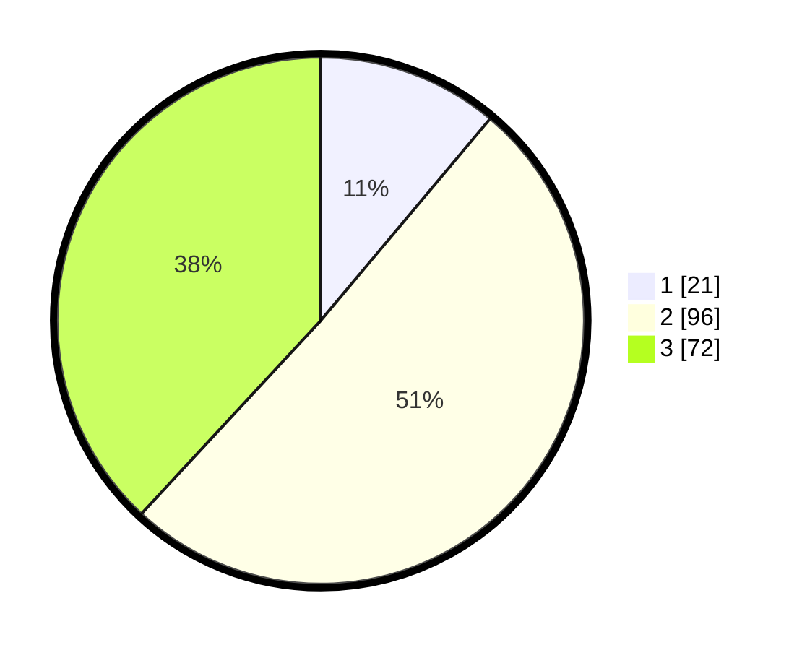

# Hasil

## Grafik

## Tabel

| No. | Nama Paslon    | Suara | Suara (raw) | Persentase |
|:--- |:-------------- | -----:| -----------:| ----------:|
| 1   | ANIES MUHAIMIN | 21    | [21][p-1]   | 11,11      |
| 2   | PRABOWO GIBRAN | 96    | [96][p-2]   | 50,79      |
| 3   | GANJAR MAHFUD  | 72    | [72][p-3]   | 38,10      |

[p-1]: https://github.com/gigit-pemilu/pemilu-2024-51-bali/blob/main/pilpres/hitung-suara/sub/51-bali/sub/08-buleleng/sub/05-sukasada/sub/2001-pancasari/sub/003-tps/sub/paslon-1.txt
[p-2]: https://github.com/gigit-pemilu/pemilu-2024-51-bali/blob/main/pilpres/hitung-suara/sub/51-bali/sub/08-buleleng/sub/05-sukasada/sub/2001-pancasari/sub/003-tps/sub/paslon-2.txt
[p-3]: https://github.com/gigit-pemilu/pemilu-2024-51-bali/blob/main/pilpres/hitung-suara/sub/51-bali/sub/08-buleleng/sub/05-sukasada/sub/2001-pancasari/sub/003-tps/sub/paslon-3.txt

## Foto C Plano

https://sirekap-obj-formc.kpu.go.id/b5f0/pemilu/ppwp/51/08/05/20/01/5108052001003-20240215-003633--b0130314-6799-43f7-8034-e14aa224080c.jpg

https://sirekap-obj-formc.kpu.go.id/b5f0/pemilu/ppwp/51/08/05/20/01/5108052001003-20240215-003701--c584f283-f002-42f5-aee7-43f51c7ece9e.jpg

https://sirekap-obj-formc.kpu.go.id/b5f0/pemilu/ppwp/51/08/05/20/01/5108052001003-20240215-003733--d883666a-fb06-40a2-9cae-abcf1fcaefff.jpg

## Metadata

| Key        | Value               |
| ---------- | ------------------- |
| Time Stamp | 2024-02-24 22:31:28 |

