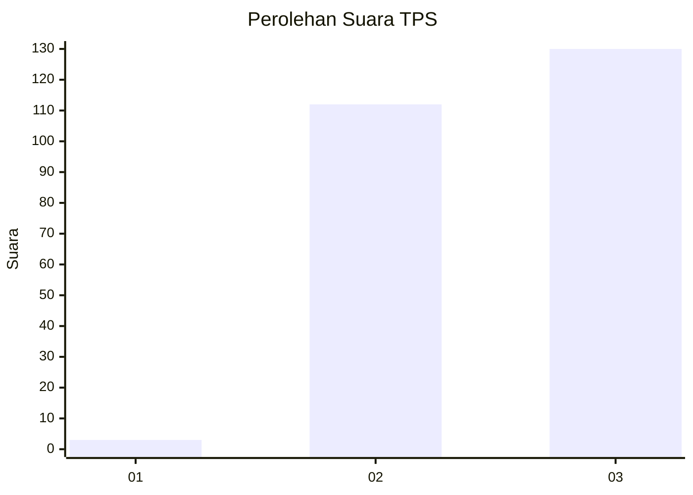
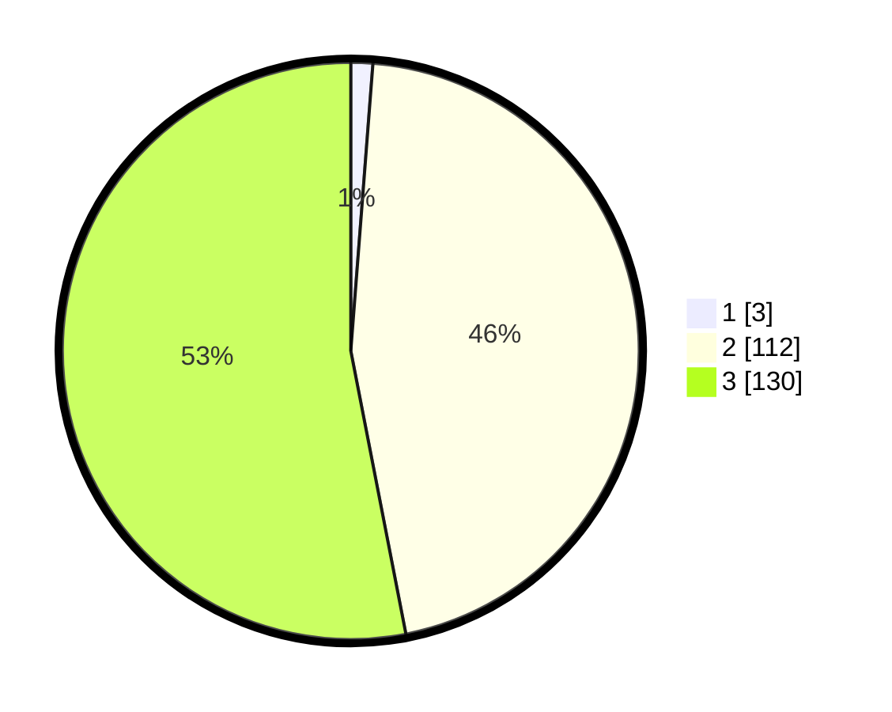

# Hasil

## Grafik

## Tabel

| No. | Nama Paslon    | Suara | Suara (raw) | Persentase |
|:--- |:-------------- | -----:| -----------:| ----------:|
| 1   | ANIES MUHAIMIN | 3     | [3][p-1]    | 1,22       |
| 2   | PRABOWO GIBRAN | 112   | [112][p-2]  | 45,71      |
| 3   | GANJAR MAHFUD  | 130   | [130][p-3]  | 53,06      |

[p-1]: https://github.com/gigit-pemilu/pemilu-2024-51-bali/blob/main/pilpres/hitung-suara/sub/51-bali/sub/08-buleleng/sub/05-sukasada/sub/2001-pancasari/sub/010-tps/sub/paslon-1.txt
[p-2]: https://github.com/gigit-pemilu/pemilu-2024-51-bali/blob/main/pilpres/hitung-suara/sub/51-bali/sub/08-buleleng/sub/05-sukasada/sub/2001-pancasari/sub/010-tps/sub/paslon-2.txt
[p-3]: https://github.com/gigit-pemilu/pemilu-2024-51-bali/blob/main/pilpres/hitung-suara/sub/51-bali/sub/08-buleleng/sub/05-sukasada/sub/2001-pancasari/sub/010-tps/sub/paslon-3.txt

## Foto C Plano

https://sirekap-obj-formc.kpu.go.id/000b/pemilu/ppwp/51/08/05/20/01/5108052001010-20240214-160117--0fc115ff-53c8-43e2-9edd-d6dfccf9c3ec.jpg

https://sirekap-obj-formc.kpu.go.id/000b/pemilu/ppwp/51/08/05/20/01/5108052001010-20240214-210916--d9cc5ced-1b31-4af6-bad7-566616b7695d.jpg

https://sirekap-obj-formc.kpu.go.id/000b/pemilu/ppwp/51/08/05/20/01/5108052001010-20240214-210921--ece502c3-7232-4c1d-aab3-493ace95c643.jpg

## Metadata

| Key        | Value               |
| ---------- | ------------------- |
| Time Stamp | 2024-02-24 22:31:28 |

