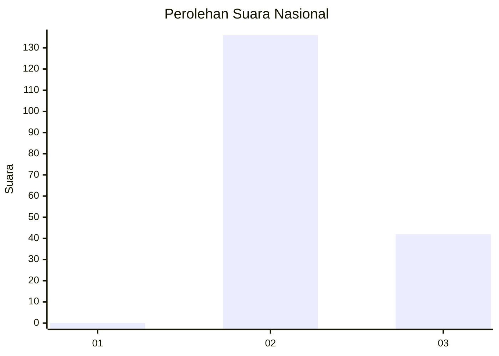
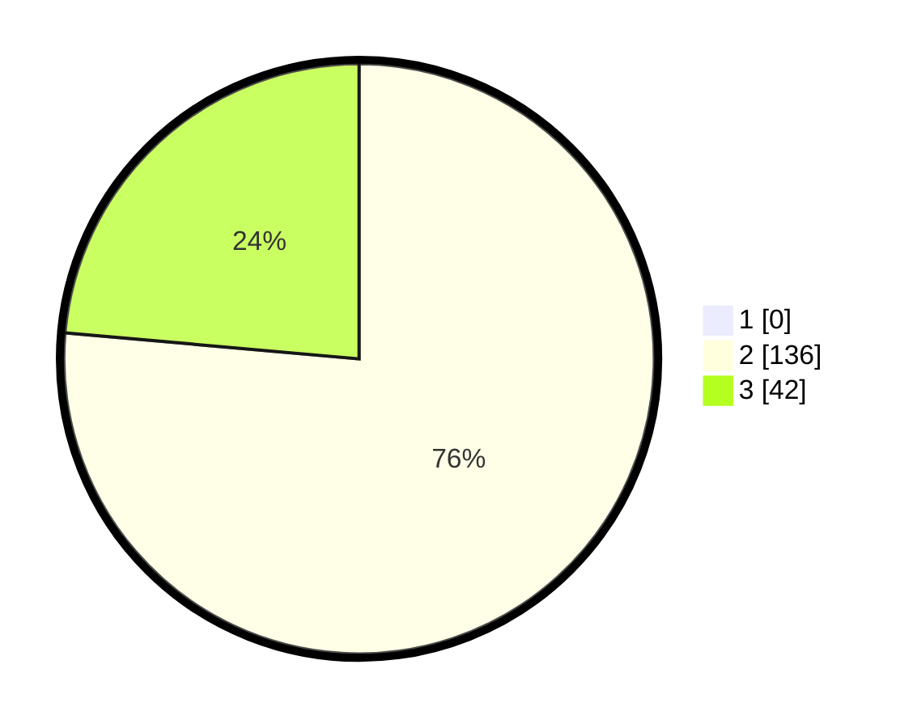

# Hasil

## Grafik

## Tabel

| No. | Nama Paslon    | Suara | Suara (raw) | Persentase |
|:--- |:-------------- | -----:| -----------:| ----------:|
| 1   | ANIES MUHAIMIN | 0     | [0][p-1]    | 0,00       |
| 2   | PRABOWO GIBRAN | 136   | [136][p-2]  | 76,40      |
| 3   | GANJAR MAHFUD  | 42    | [42][p-3]   | 23,60      |

[p-1]: https://github.com/gigit-pemilu/pemilu-2024/blob/main/pilpres/hitung-suara/sub/51-bali/sub/08-buleleng/sub/05-sukasada/sub/2002-wanagiri/sub/010-tps/sub/paslon-1.txt
[p-2]: https://github.com/gigit-pemilu/pemilu-2024/blob/main/pilpres/hitung-suara/sub/51-bali/sub/08-buleleng/sub/05-sukasada/sub/2002-wanagiri/sub/010-tps/sub/paslon-2.txt
[p-3]: https://github.com/gigit-pemilu/pemilu-2024/blob/main/pilpres/hitung-suara/sub/51-bali/sub/08-buleleng/sub/05-sukasada/sub/2002-wanagiri/sub/010-tps/sub/paslon-3.txt

## Foto C Plano

https://sirekap-obj-formc.kpu.go.id/7565/pemilu/ppwp/51/08/05/20/02/5108052002010-20240214-211653--fcfc03f6-407b-42ff-a75d-e4548fc94b4c.jpg

https://sirekap-obj-formc.kpu.go.id/7565/pemilu/ppwp/51/08/05/20/02/5108052002010-20240214-212053--dea4e113-79da-4d66-abba-55dad877582d.jpg

https://sirekap-obj-formc.kpu.go.id/7565/pemilu/ppwp/51/08/05/20/02/5108052002010-20240214-212157--d6a8141d-000c-4a4e-abfb-65a77491bf70.jpg

## Metadata

| Key        | Value               |
| ---------- | ------------------- |
| Time Stamp | 2024-02-24 22:31:28 |

