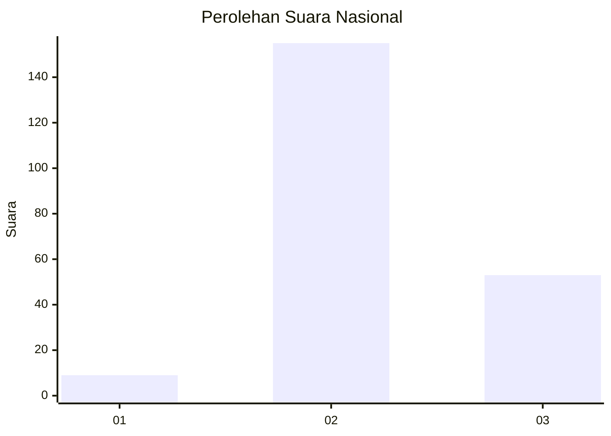
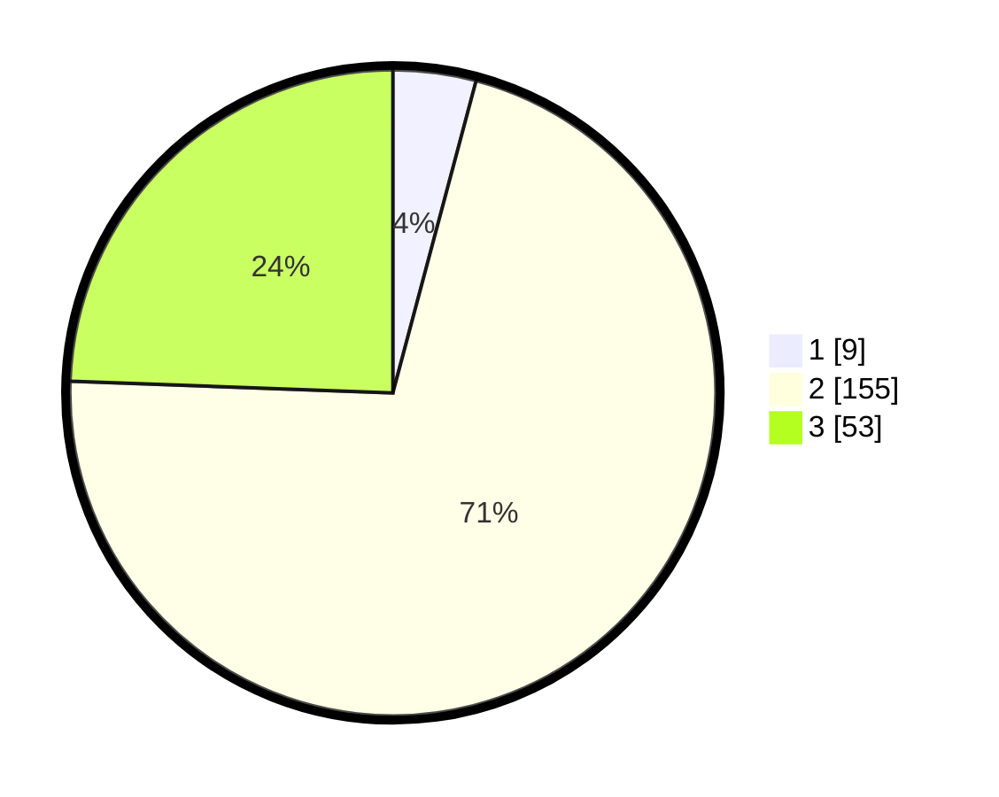

# Hasil

## Grafik

## Tabel

| No. | Nama Paslon    | Suara | Suara (raw) | Persentase |
|:--- |:-------------- | -----:| -----------:| ----------:|
| 1   | ANIES MUHAIMIN | 9     | [9][p-1]    | 4,15       |
| 2   | PRABOWO GIBRAN | 155   | [155][p-2]  | 71,43      |
| 3   | GANJAR MAHFUD  | 53    | [53][p-3]   | 24,42      |

[p-1]: https://github.com/gigit-pemilu/pemilu-2024/blob/main/pilpres/hitung-suara/sub/51-bali/sub/08-buleleng/sub/05-sukasada/sub/2003-ambengan/sub/005-tps/sub/paslon-1.txt
[p-2]: https://github.com/gigit-pemilu/pemilu-2024/blob/main/pilpres/hitung-suara/sub/51-bali/sub/08-buleleng/sub/05-sukasada/sub/2003-ambengan/sub/005-tps/sub/paslon-2.txt
[p-3]: https://github.com/gigit-pemilu/pemilu-2024/blob/main/pilpres/hitung-suara/sub/51-bali/sub/08-buleleng/sub/05-sukasada/sub/2003-ambengan/sub/005-tps/sub/paslon-3.txt

## Foto C Plano

https://sirekap-obj-formc.kpu.go.id/e139/pemilu/ppwp/51/08/05/20/03/5108052003005-20240214-141028--86564094-23a1-485b-b347-a1c6c372719a.jpg

https://sirekap-obj-formc.kpu.go.id/e139/pemilu/ppwp/51/08/05/20/03/5108052003005-20240214-141335--546fc8ca-6042-4b03-8ad8-7fd693e4d715.jpg

https://sirekap-obj-formc.kpu.go.id/e139/pemilu/ppwp/51/08/05/20/03/5108052003005-20240214-141545--151c35c1-1593-4bbe-b095-6a18533982c1.jpg

## Metadata

| Key        | Value               |
| ---------- | ------------------- |
| Time Stamp | 2024-02-14 21:46:01 |

