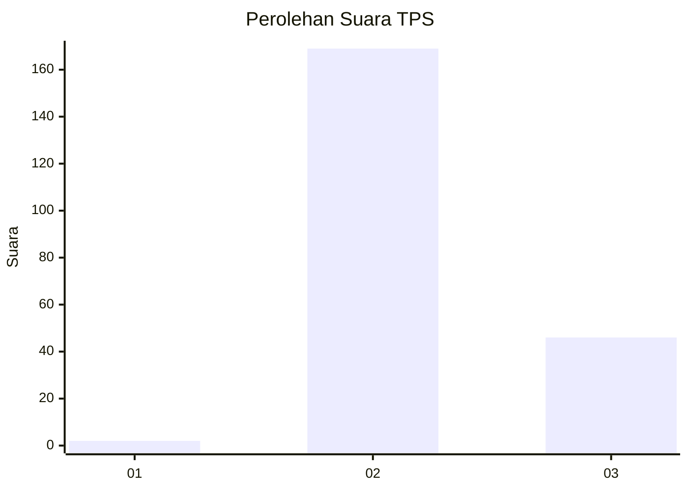
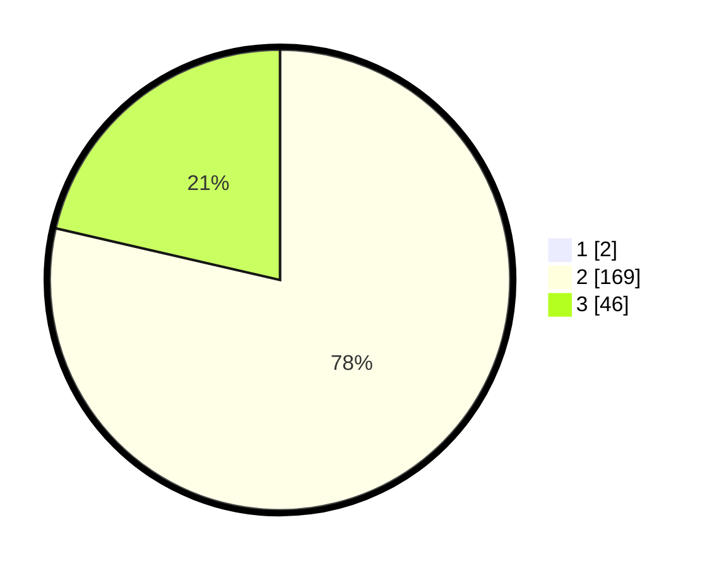

# Hasil

## Grafik

## Tabel

| No. | Nama Paslon    | Suara | Suara (raw) | Persentase |
|:--- |:-------------- | -----:| -----------:| ----------:|
| 1   | ANIES MUHAIMIN | 2     | [2][p-1]    | 0,92       |
| 2   | PRABOWO GIBRAN | 169   | [169][p-2]  | 77,88      |
| 3   | GANJAR MAHFUD  | 46    | [46][p-3]   | 21,20      |

[p-1]: https://github.com/gigit-pemilu/pemilu-2024-51-bali/blob/main/pilpres/hitung-suara/sub/51-bali/sub/08-buleleng/sub/05-sukasada/sub/2003-ambengan/sub/008-tps/sub/paslon-1.txt
[p-2]: https://github.com/gigit-pemilu/pemilu-2024-51-bali/blob/main/pilpres/hitung-suara/sub/51-bali/sub/08-buleleng/sub/05-sukasada/sub/2003-ambengan/sub/008-tps/sub/paslon-2.txt
[p-3]: https://github.com/gigit-pemilu/pemilu-2024-51-bali/blob/main/pilpres/hitung-suara/sub/51-bali/sub/08-buleleng/sub/05-sukasada/sub/2003-ambengan/sub/008-tps/sub/paslon-3.txt

## Foto C Plano

https://sirekap-obj-formc.kpu.go.id/c7c3/pemilu/ppwp/51/08/05/20/03/5108052003008-20240215-005510--0cf55bd7-4a36-4745-93e0-ce792160e9d4.jpg

https://sirekap-obj-formc.kpu.go.id/c7c3/pemilu/ppwp/51/08/05/20/03/5108052003008-20240215-004702--dfbffa2e-3cef-46a9-956c-3025fb541cdb.jpg

https://sirekap-obj-formc.kpu.go.id/c7c3/pemilu/ppwp/51/08/05/20/03/5108052003008-20240215-004752--4499e967-702a-4d4b-a898-2f8254cb2cc0.jpg

## Metadata

| Key        | Value               |
| ---------- | ------------------- |
| Time Stamp | 2024-02-24 22:31:28 |

