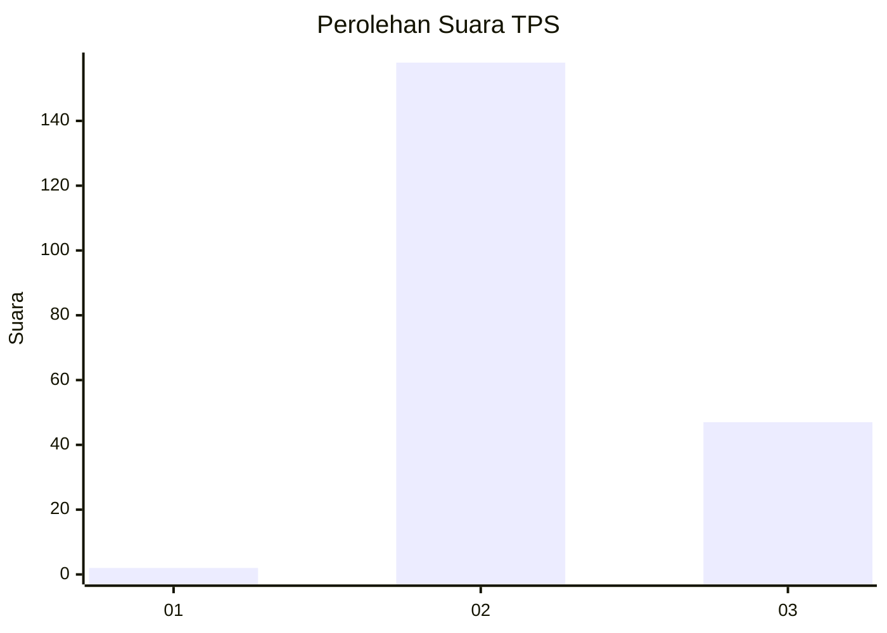
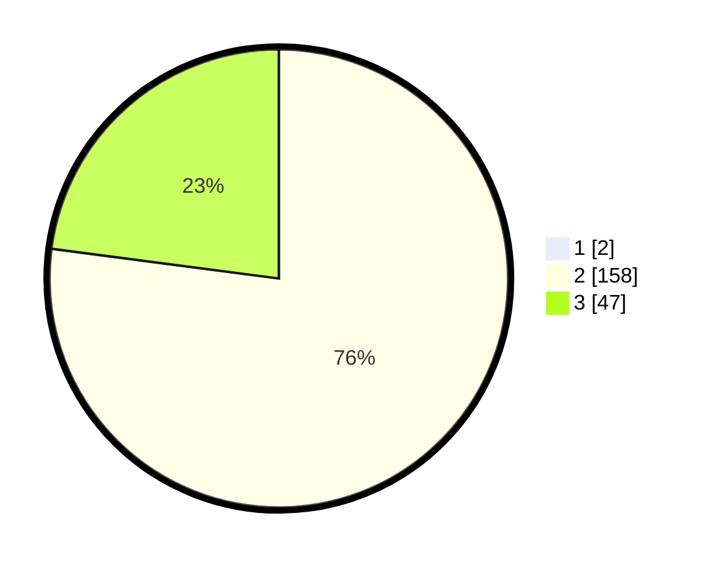

# Hasil

## Grafik

## Tabel

| No. | Nama Paslon    | Suara | Suara (raw) | Persentase |
|:--- |:-------------- | -----:| -----------:| ----------:|
| 1   | ANIES MUHAIMIN | 2     | [2][p-1]    | 0,97       |
| 2   | PRABOWO GIBRAN | 158   | [158][p-2]  | 76,33      |
| 3   | GANJAR MAHFUD  | 47    | [47][p-3]   | 22,71      |

[p-1]: https://github.com/gigit-pemilu/pemilu-2024-51-bali/blob/main/pilpres/hitung-suara/sub/51-bali/sub/08-buleleng/sub/05-sukasada/sub/2003-ambengan/sub/009-tps/sub/paslon-1.txt
[p-2]: https://github.com/gigit-pemilu/pemilu-2024-51-bali/blob/main/pilpres/hitung-suara/sub/51-bali/sub/08-buleleng/sub/05-sukasada/sub/2003-ambengan/sub/009-tps/sub/paslon-2.txt
[p-3]: https://github.com/gigit-pemilu/pemilu-2024-51-bali/blob/main/pilpres/hitung-suara/sub/51-bali/sub/08-buleleng/sub/05-sukasada/sub/2003-ambengan/sub/009-tps/sub/paslon-3.txt

## Foto C Plano

https://sirekap-obj-formc.kpu.go.id/a26c/pemilu/ppwp/51/08/05/20/03/5108052003009-20240214-231513--e976e081-0cf3-4176-8a74-bd63f942765f.jpg

https://sirekap-obj-formc.kpu.go.id/a26c/pemilu/ppwp/51/08/05/20/03/5108052003009-20240214-232003--03501545-d101-43cf-aa45-9b50be901f44.jpg

https://sirekap-obj-formc.kpu.go.id/a26c/pemilu/ppwp/51/08/05/20/03/5108052003009-20240214-232257--83e3395a-792b-4448-a8e0-91a817a0a1b0.jpg

## Metadata

| Key        | Value               |
| ---------- | ------------------- |
| Time Stamp | 2024-02-24 22:31:28 |

