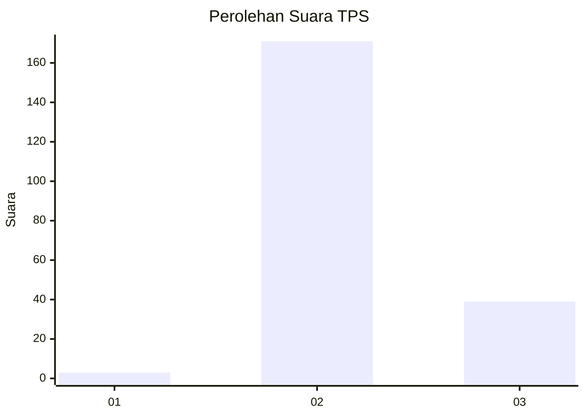
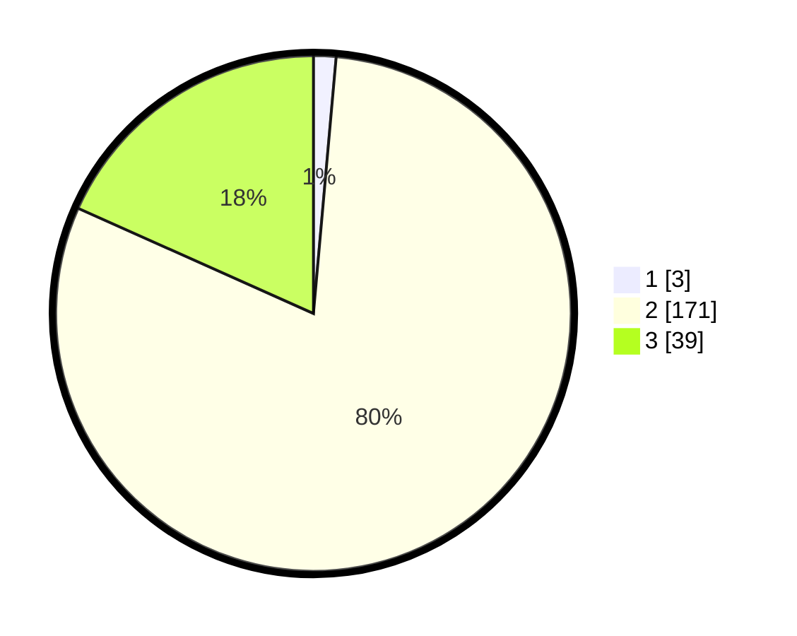

# Hasil

## Grafik

## Tabel

| No. | Nama Paslon    | Suara | Suara (raw) | Persentase |
|:--- |:-------------- | -----:| -----------:| ----------:|
| 1   | ANIES MUHAIMIN | 3     | [3][p-1]    | 1,41       |
| 2   | PRABOWO GIBRAN | 171   | [171][p-2]  | 80,28      |
| 3   | GANJAR MAHFUD  | 39    | [39][p-3]   | 18,31      |

[p-1]: https://github.com/gigit-pemilu/pemilu-2024-51-bali/blob/main/pilpres/hitung-suara/sub/51-bali/sub/08-buleleng/sub/05-sukasada/sub/2003-ambengan/sub/010-tps/sub/paslon-1.txt
[p-2]: https://github.com/gigit-pemilu/pemilu-2024-51-bali/blob/main/pilpres/hitung-suara/sub/51-bali/sub/08-buleleng/sub/05-sukasada/sub/2003-ambengan/sub/010-tps/sub/paslon-2.txt
[p-3]: https://github.com/gigit-pemilu/pemilu-2024-51-bali/blob/main/pilpres/hitung-suara/sub/51-bali/sub/08-buleleng/sub/05-sukasada/sub/2003-ambengan/sub/010-tps/sub/paslon-3.txt

## Foto C Plano

https://sirekap-obj-formc.kpu.go.id/c60a/pemilu/ppwp/51/08/05/20/03/5108052003010-20240214-232356--66998475-ff87-43f3-b6df-325985618165.jpg

https://sirekap-obj-formc.kpu.go.id/c60a/pemilu/ppwp/51/08/05/20/03/5108052003010-20240214-232550--088fef49-3075-4739-9e38-628cefa721c3.jpg

https://sirekap-obj-formc.kpu.go.id/c60a/pemilu/ppwp/51/08/05/20/03/5108052003010-20240214-232716--74a17431-4f79-4f10-8642-3c5604b04017.jpg

## Metadata

| Key        | Value               |
| ---------- | ------------------- |
| Time Stamp | 2024-02-24 22:31:28 |

