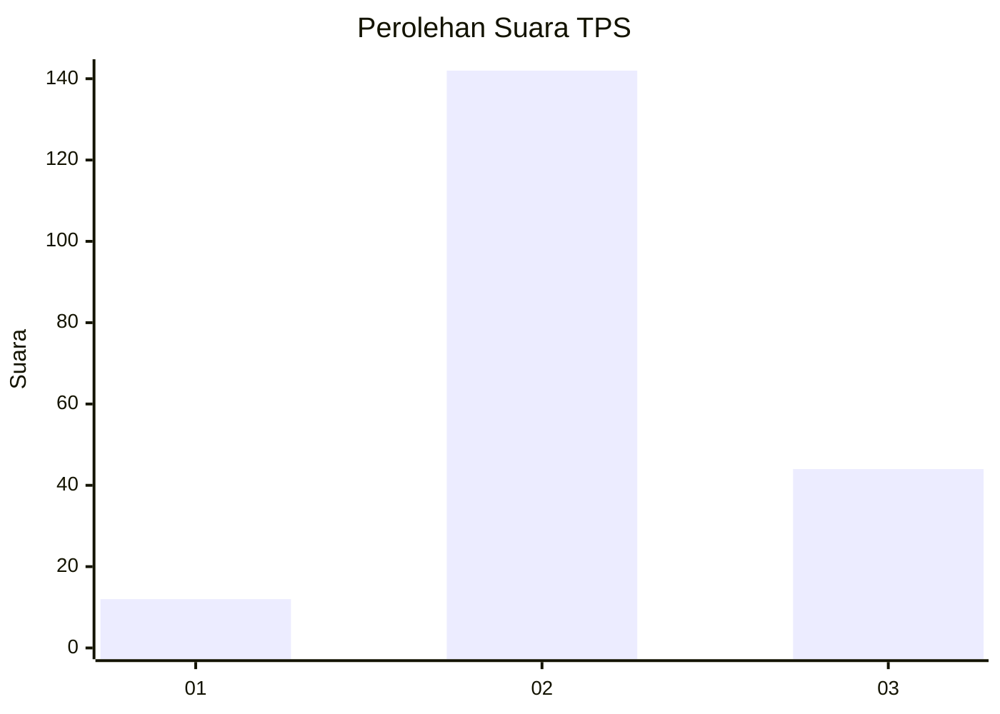
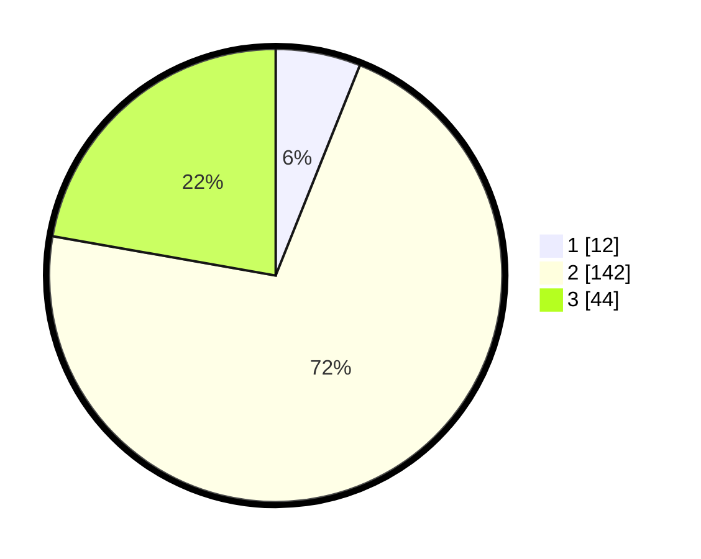

# Hasil

## Grafik

## Tabel

| No. | Nama Paslon    | Suara | Suara (raw) | Persentase |
|:--- |:-------------- | -----:| -----------:| ----------:|
| 1   | ANIES MUHAIMIN | 12    | [12][p-1]   | 6,06       |
| 2   | PRABOWO GIBRAN | 142   | [142][p-2]  | 71,72      |
| 3   | GANJAR MAHFUD  | 44    | [44][p-3]   | 22,22      |

[p-1]: https://github.com/gigit-pemilu/pemilu-2024-51-bali/blob/main/pilpres/hitung-suara/sub/51-bali/sub/08-buleleng/sub/05-sukasada/sub/2003-ambengan/sub/012-tps/sub/paslon-1.txt
[p-2]: https://github.com/gigit-pemilu/pemilu-2024-51-bali/blob/main/pilpres/hitung-suara/sub/51-bali/sub/08-buleleng/sub/05-sukasada/sub/2003-ambengan/sub/012-tps/sub/paslon-2.txt
[p-3]: https://github.com/gigit-pemilu/pemilu-2024-51-bali/blob/main/pilpres/hitung-suara/sub/51-bali/sub/08-buleleng/sub/05-sukasada/sub/2003-ambengan/sub/012-tps/sub/paslon-3.txt

## Foto C Plano

https://sirekap-obj-formc.kpu.go.id/d8a1/pemilu/ppwp/51/08/05/20/03/5108052003012-20240215-002759--60097f99-7aa4-4849-a3d5-3b76e04d2e69.jpg

https://sirekap-obj-formc.kpu.go.id/d8a1/pemilu/ppwp/51/08/05/20/03/5108052003012-20240215-003030--574269c8-16bf-4bb2-ba7d-8dc987f6001f.jpg

https://sirekap-obj-formc.kpu.go.id/d8a1/pemilu/ppwp/51/08/05/20/03/5108052003012-20240215-003142--cd3b49c4-c277-484e-9943-b13598e86293.jpg

## Metadata

| Key        | Value               |
| ---------- | ------------------- |
| Time Stamp | 2024-02-24 22:31:28 |

