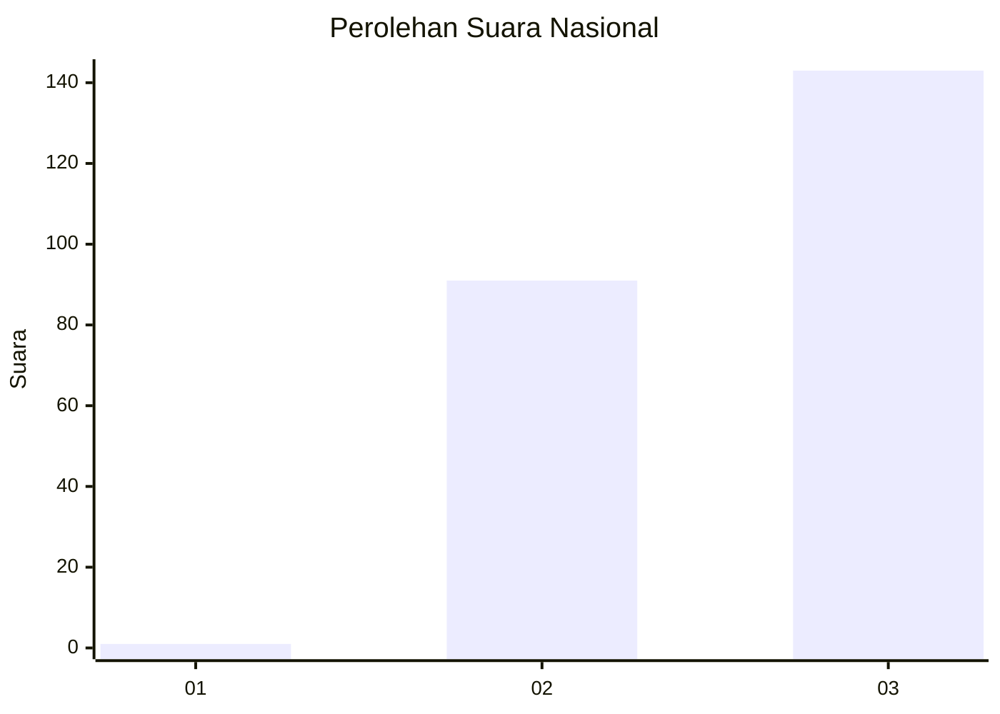
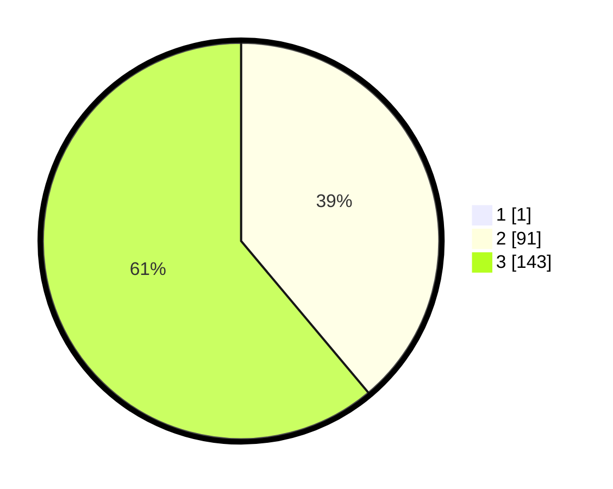

# Hasil

## Grafik

## Tabel

| No. | Nama Paslon    | Suara | Suara (raw) | Persentase |
|:--- |:-------------- | -----:| -----------:| ----------:|
| 1   | ANIES MUHAIMIN | 1     | [1][p-1]    | 0,43       |
| 2   | PRABOWO GIBRAN | 91    | [91][p-2]   | 38,72      |
| 3   | GANJAR MAHFUD  | 143   | [143][p-3]  | 60,85      |

[p-1]: https://github.com/gigit-pemilu/pemilu-2024/blob/main/pilpres/hitung-suara/sub/51-bali/sub/08-buleleng/sub/05-sukasada/sub/2004-gitgit/sub/001-tps/sub/paslon-1.txt
[p-2]: https://github.com/gigit-pemilu/pemilu-2024/blob/main/pilpres/hitung-suara/sub/51-bali/sub/08-buleleng/sub/05-sukasada/sub/2004-gitgit/sub/001-tps/sub/paslon-2.txt
[p-3]: https://github.com/gigit-pemilu/pemilu-2024/blob/main/pilpres/hitung-suara/sub/51-bali/sub/08-buleleng/sub/05-sukasada/sub/2004-gitgit/sub/001-tps/sub/paslon-3.txt

## Foto C Plano

https://sirekap-obj-formc.kpu.go.id/2d6c/pemilu/ppwp/51/08/05/20/04/5108052004001-20240214-205828--519e56a2-9c9b-44ce-9544-9b4913512338.jpg

https://sirekap-obj-formc.kpu.go.id/2d6c/pemilu/ppwp/51/08/05/20/04/5108052004001-20240214-205856--bf9f64db-e008-4583-b962-96ff0da54a1b.jpg

https://sirekap-obj-formc.kpu.go.id/2d6c/pemilu/ppwp/51/08/05/20/04/5108052004001-20240214-205915--ec20607a-3ed1-4591-82ce-8c9ff7efcf78.jpg

## Metadata

| Key        | Value               |
| ---------- | ------------------- |
| Time Stamp | 2024-02-15 05:00:24 |

