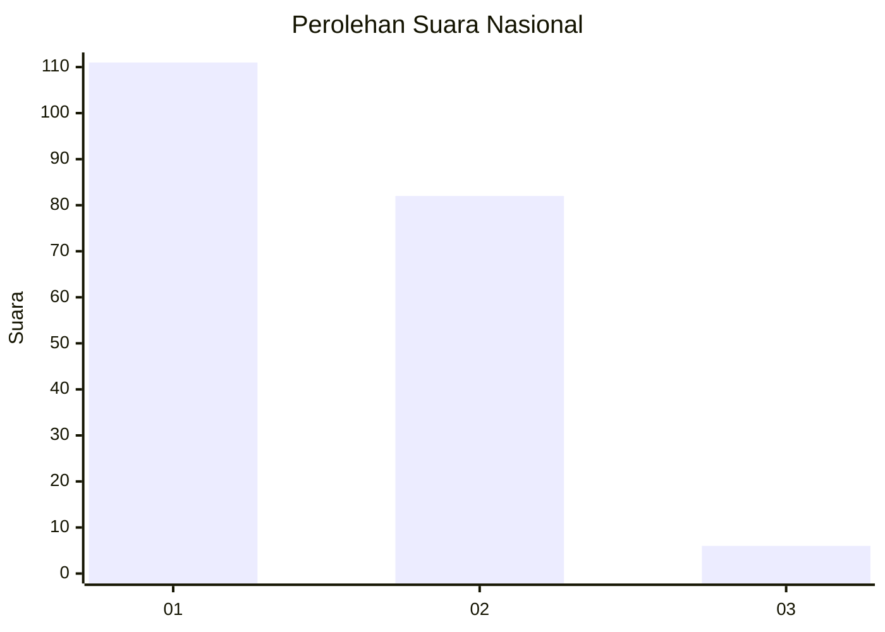
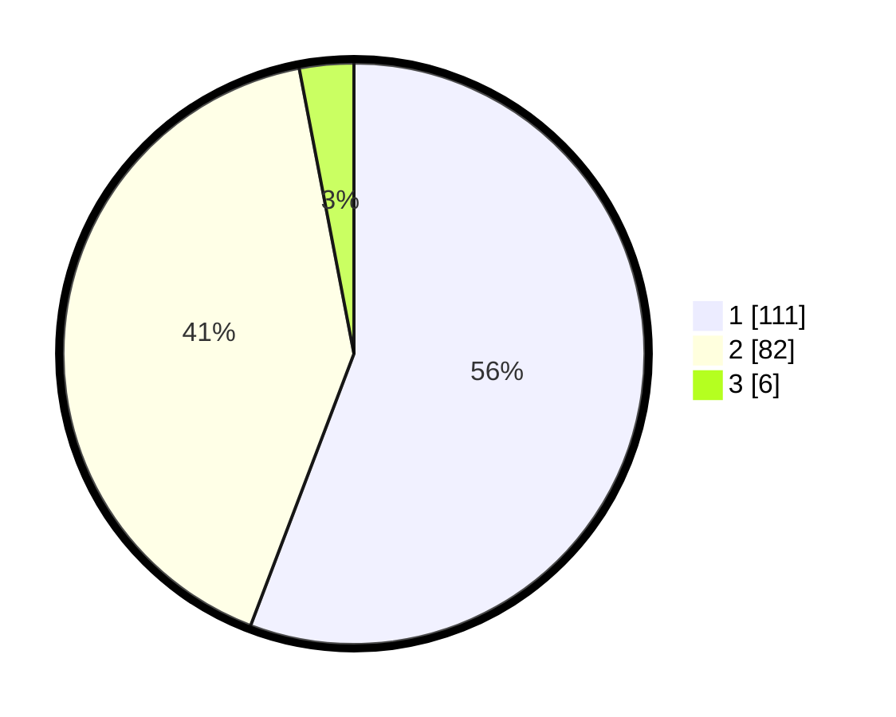

# Hasil

## Grafik

## Tabel

| No. | Nama Paslon    | Suara | Suara (raw) | Persentase |
|:--- |:-------------- | -----:| -----------:| ----------:|
| 1   | ANIES MUHAIMIN | 111   | [111][p-1]  | 55,78      |
| 2   | PRABOWO GIBRAN | 82    | [82][p-2]   | 41,21      |
| 3   | GANJAR MAHFUD  | 6     | [6][p-3]    | 3,02       |

[p-1]: https://github.com/gigit-pemilu/pemilu-2024/blob/main/pilpres/hitung-suara/sub/51-bali/sub/08-buleleng/sub/05-sukasada/sub/2005-pegayaman/sub/002-tps/sub/paslon-1.txt
[p-2]: https://github.com/gigit-pemilu/pemilu-2024/blob/main/pilpres/hitung-suara/sub/51-bali/sub/08-buleleng/sub/05-sukasada/sub/2005-pegayaman/sub/002-tps/sub/paslon-2.txt
[p-3]: https://github.com/gigit-pemilu/pemilu-2024/blob/main/pilpres/hitung-suara/sub/51-bali/sub/08-buleleng/sub/05-sukasada/sub/2005-pegayaman/sub/002-tps/sub/paslon-3.txt

## Foto C Plano

https://sirekap-obj-formc.kpu.go.id/80b7/pemilu/ppwp/51/08/05/20/05/5108052005002-20240214-204516--a8954db5-ef5a-4f93-b000-00b920f0fb4f.jpg

https://sirekap-obj-formc.kpu.go.id/80b7/pemilu/ppwp/51/08/05/20/05/5108052005002-20240214-204901--51431571-f471-4dca-b585-9ae8cb78f1a6.jpg

https://sirekap-obj-formc.kpu.go.id/80b7/pemilu/ppwp/51/08/05/20/05/5108052005002-20240215-000420--eaf4256d-7d24-4efb-a7e8-f9d26a6d5884.jpg

## Metadata

| Key        | Value               |
| ---------- | ------------------- |
| Time Stamp | 2024-02-15 20:00:44 |

## DATA PEMILIH TETAP

Jumlah pemilih dalam DPT: **283**.
 * L: **148**.
 * P: **135**.

## DATA PENGGUNA HAK PILIH

Jumlah pengguna hak pilih dalam DPT: **213**.
 * L: **111**.
 * P: **102**.

Jumlah pengguna hak pilih dalam DPTb: **0**.
 * L: **0**.
 * P: **0**.

Jumlah pengguna hak pilih dalam DPK: **2**.
 * L: **1**.
 * P: **1**.

Jumlah pengguna hak pilih: **215**.
 * L: **112**.
 * P: **103**.

## JUMLAH SUARA SAH DAN TIDAK SAH

JUMLAH SELURUH SUARA SAH: **199**.

JUMLAH SUARA TIDAK SAH: **16**.

JUMLAH SELURUH SUARA SAH DAN SUARA TIDAK SAH: **215**.

