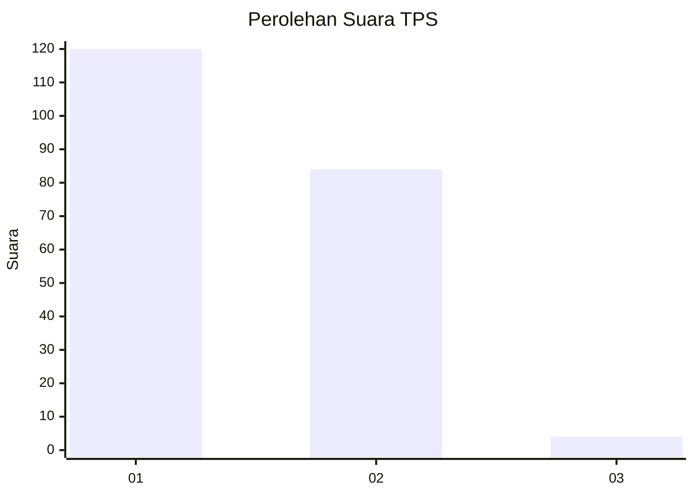
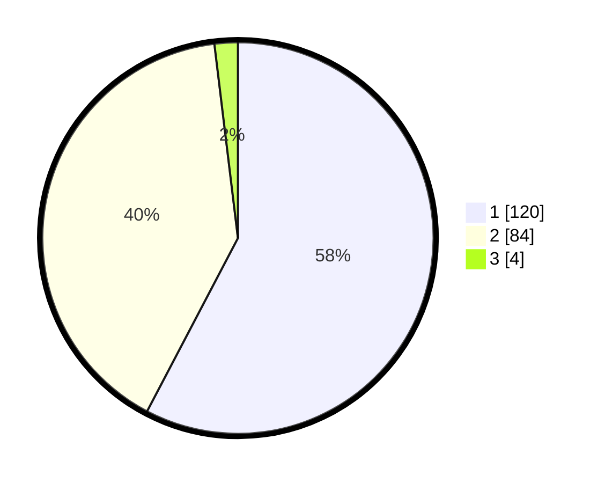

# Hasil

## Grafik

## Tabel

| No. | Nama Paslon    | Suara | Suara (raw) | Persentase |
|:--- |:-------------- | -----:| -----------:| ----------:|
| 1   | ANIES MUHAIMIN | 120   | [120][p-1]  | 57,69      |
| 2   | PRABOWO GIBRAN | 84    | [84][p-2]   | 40,38      |
| 3   | GANJAR MAHFUD  | 4     | [4][p-3]    | 1,92       |

[p-1]: https://github.com/gigit-pemilu/pemilu-2024-51-bali/blob/main/pilpres/hitung-suara/sub/51-bali/sub/08-buleleng/sub/05-sukasada/sub/2005-pegayaman/sub/010-tps/sub/paslon-1.txt
[p-2]: https://github.com/gigit-pemilu/pemilu-2024-51-bali/blob/main/pilpres/hitung-suara/sub/51-bali/sub/08-buleleng/sub/05-sukasada/sub/2005-pegayaman/sub/010-tps/sub/paslon-2.txt
[p-3]: https://github.com/gigit-pemilu/pemilu-2024-51-bali/blob/main/pilpres/hitung-suara/sub/51-bali/sub/08-buleleng/sub/05-sukasada/sub/2005-pegayaman/sub/010-tps/sub/paslon-3.txt

## Foto C Plano

https://sirekap-obj-formc.kpu.go.id/a069/pemilu/ppwp/51/08/05/20/05/5108052005010-20240214-230017--4c35b043-f5df-4965-84e3-72897547aba4.jpg

https://sirekap-obj-formc.kpu.go.id/a069/pemilu/ppwp/51/08/05/20/05/5108052005010-20240214-220210--a4057176-31fa-4db5-881d-44e6fa7771f7.jpg

https://sirekap-obj-formc.kpu.go.id/a069/pemilu/ppwp/51/08/05/20/05/5108052005010-20240214-220330--f742ac8a-efab-4353-bcfd-0012c1447117.jpg

## Metadata

| Key        | Value               |
| ---------- | ------------------- |
| Time Stamp | 2024-02-24 22:31:28 |

