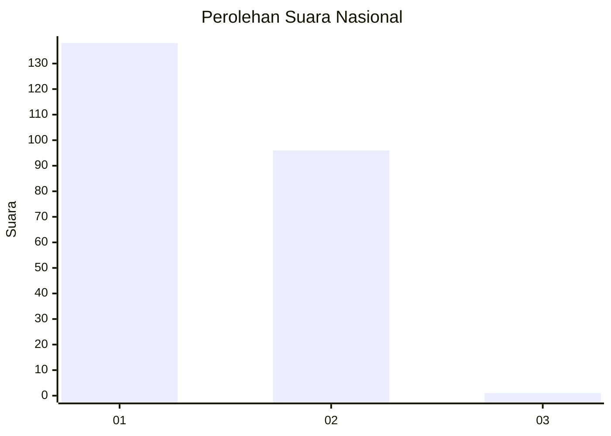
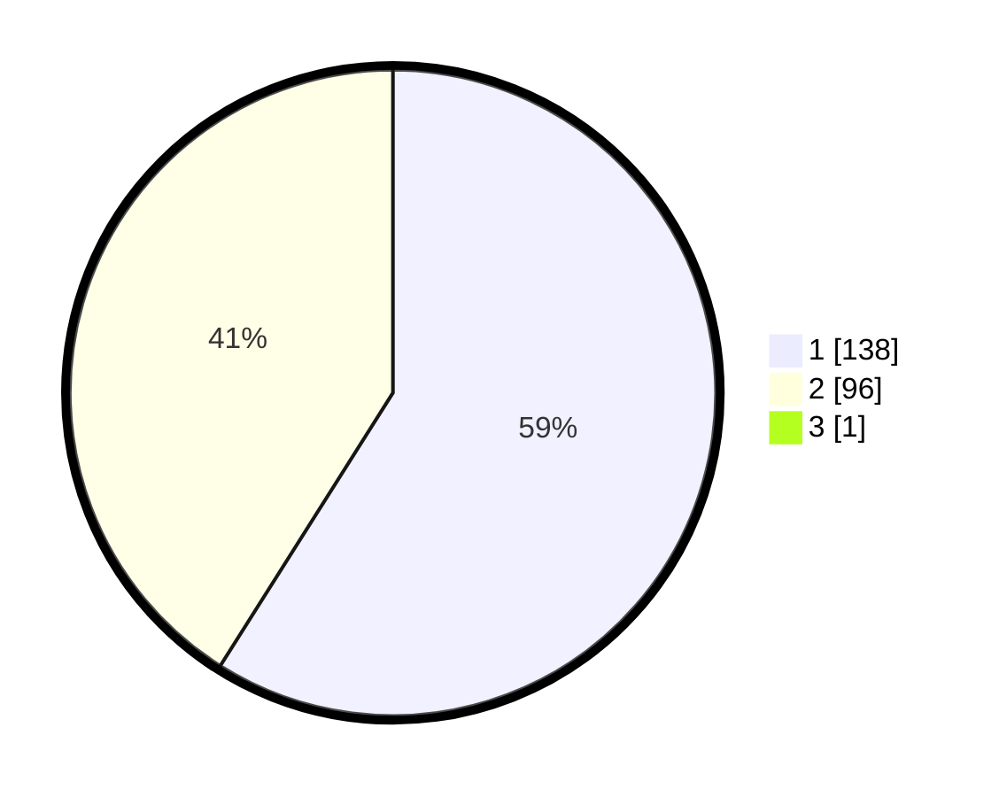

# Hasil

## Grafik

## Tabel

| No. | Nama Paslon    | Suara | Suara (raw) | Persentase |
|:--- |:-------------- | -----:| -----------:| ----------:|
| 1   | ANIES MUHAIMIN | 138   | [138][p-1]  | 58,72      |
| 2   | PRABOWO GIBRAN | 96    | [96][p-2]   | 40,85      |
| 3   | GANJAR MAHFUD  | 1     | [1][p-3]    | 0,43       |

[p-1]: https://github.com/gigit-pemilu/pemilu-2024/blob/main/pilpres/hitung-suara/sub/51-bali/sub/08-buleleng/sub/05-sukasada/sub/2005-pegayaman/sub/011-tps/sub/paslon-1.txt
[p-2]: https://github.com/gigit-pemilu/pemilu-2024/blob/main/pilpres/hitung-suara/sub/51-bali/sub/08-buleleng/sub/05-sukasada/sub/2005-pegayaman/sub/011-tps/sub/paslon-2.txt
[p-3]: https://github.com/gigit-pemilu/pemilu-2024/blob/main/pilpres/hitung-suara/sub/51-bali/sub/08-buleleng/sub/05-sukasada/sub/2005-pegayaman/sub/011-tps/sub/paslon-3.txt

## Foto C Plano

https://sirekap-obj-formc.kpu.go.id/7b4a/pemilu/ppwp/51/08/05/20/05/5108052005011-20240214-235911--52e62afc-8cb5-4da3-8227-93a6333880f9.jpg

https://sirekap-obj-formc.kpu.go.id/7b4a/pemilu/ppwp/51/08/05/20/05/5108052005011-20240215-000402--3374d315-cb4c-4f4c-bc0a-184eb6c82dfc.jpg

https://sirekap-obj-formc.kpu.go.id/7b4a/pemilu/ppwp/51/08/05/20/05/5108052005011-20240215-000755--1cb8d61e-24ab-4440-9402-327f6efa77eb.jpg

## Metadata

| Key        | Value               |
| ---------- | ------------------- |
| Time Stamp | 2024-02-24 22:31:28 |

