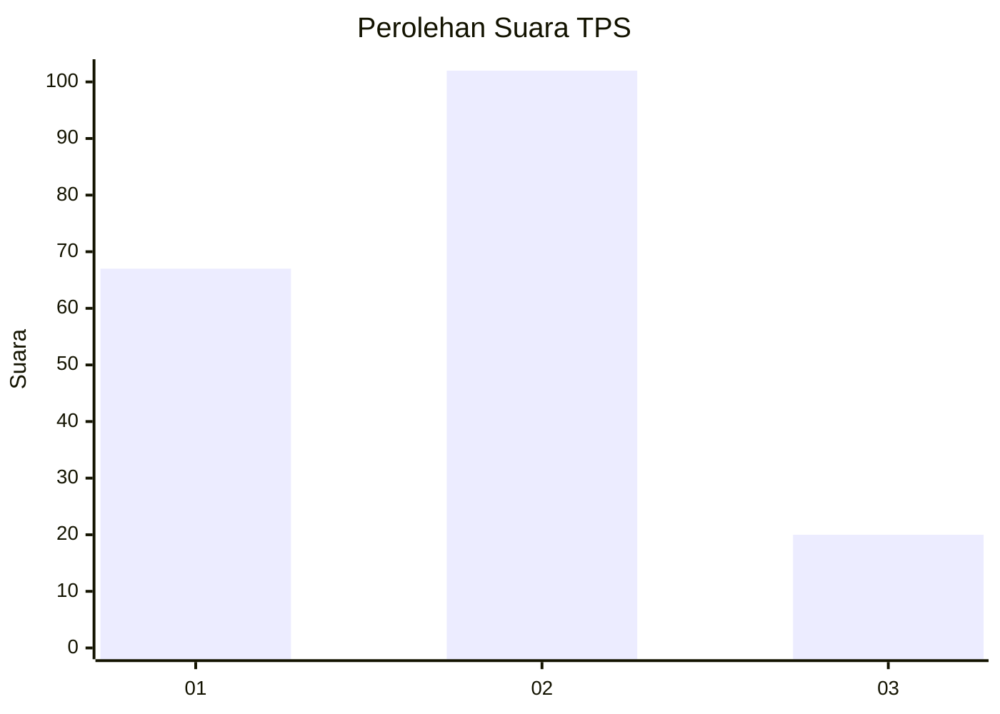
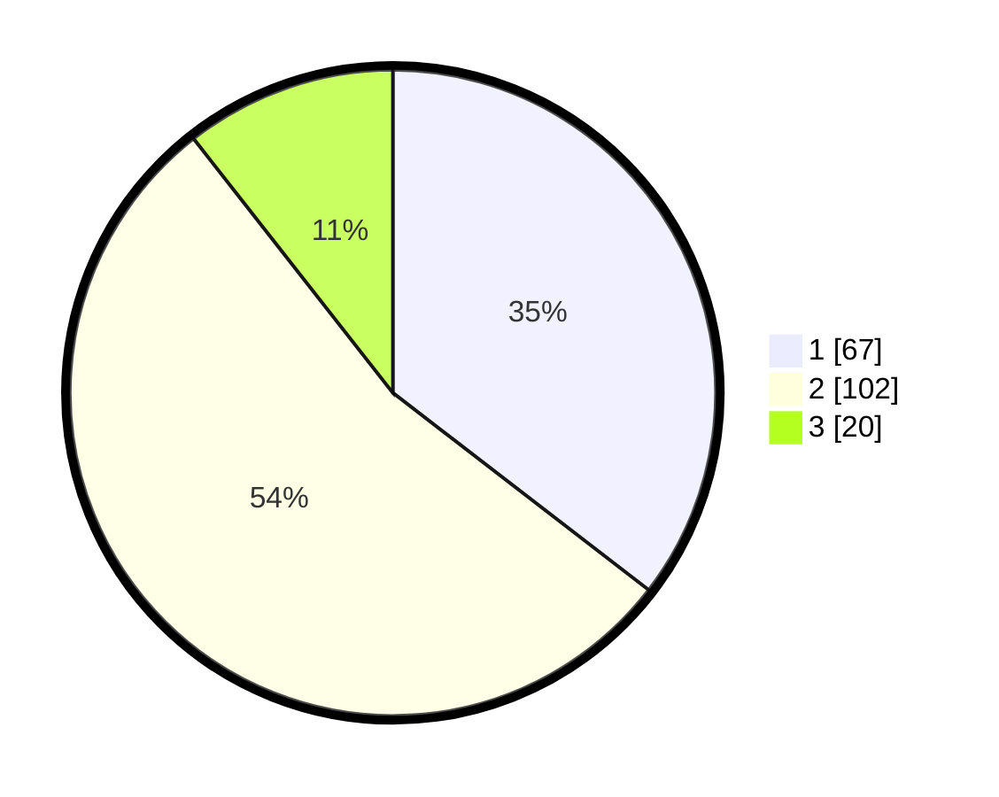

# Hasil

## Grafik

## Tabel

| No. | Nama Paslon    | Suara | Suara (raw) | Persentase |
|:--- |:-------------- | -----:| -----------:| ----------:|
| 1   | ANIES MUHAIMIN | 67    | [67][p-1]   | 35,45      |
| 2   | PRABOWO GIBRAN | 102   | [102][p-2]  | 53,97      |
| 3   | GANJAR MAHFUD  | 20    | [20][p-3]   | 10,58      |

[p-1]: https://github.com/gigit-pemilu/pemilu-2024-51-bali/blob/main/pilpres/hitung-suara/sub/51-bali/sub/08-buleleng/sub/05-sukasada/sub/2005-pegayaman/sub/014-tps/sub/paslon-1.txt
[p-2]: https://github.com/gigit-pemilu/pemilu-2024-51-bali/blob/main/pilpres/hitung-suara/sub/51-bali/sub/08-buleleng/sub/05-sukasada/sub/2005-pegayaman/sub/014-tps/sub/paslon-2.txt
[p-3]: https://github.com/gigit-pemilu/pemilu-2024-51-bali/blob/main/pilpres/hitung-suara/sub/51-bali/sub/08-buleleng/sub/05-sukasada/sub/2005-pegayaman/sub/014-tps/sub/paslon-3.txt

## Foto C Plano

https://sirekap-obj-formc.kpu.go.id/d79f/pemilu/ppwp/51/08/05/20/05/5108052005014-20240214-232013--ab4e6b4f-0eb2-453b-ba4e-ed8479d6cb78.jpg

https://sirekap-obj-formc.kpu.go.id/d79f/pemilu/ppwp/51/08/05/20/05/5108052005014-20240214-213743--faaad948-59e1-4959-9bc0-337873fddc1b.jpg

https://sirekap-obj-formc.kpu.go.id/d79f/pemilu/ppwp/51/08/05/20/05/5108052005014-20240214-213950--2c5748c0-e466-4c59-bcba-6fc3bf279cdb.jpg

## Metadata

| Key        | Value               |
| ---------- | ------------------- |
| Time Stamp | 2024-02-24 22:31:28 |

