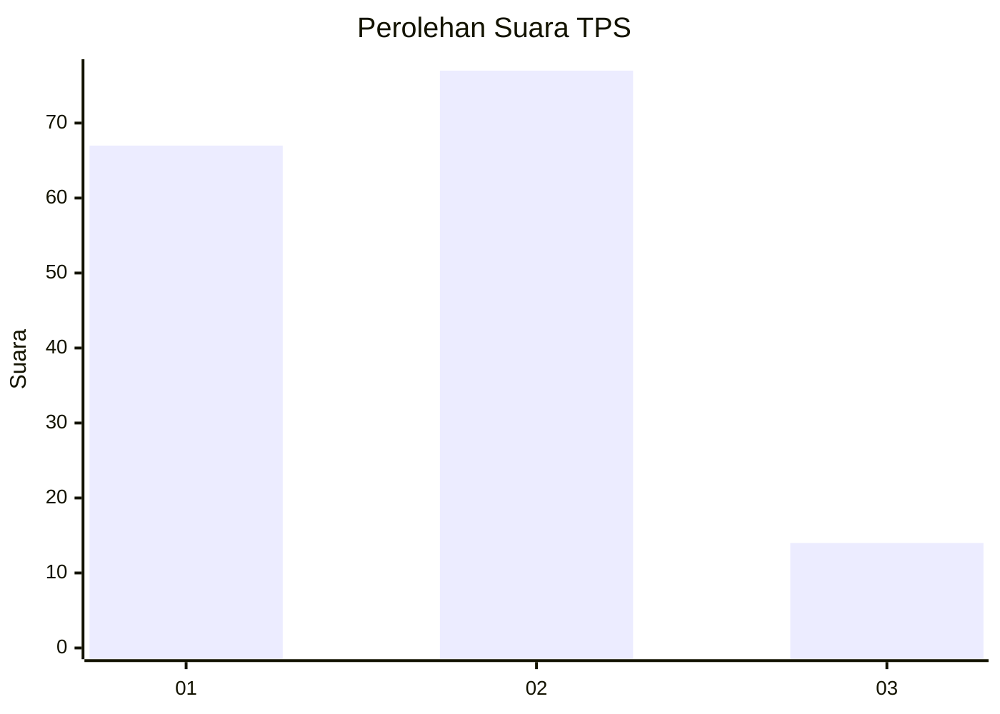
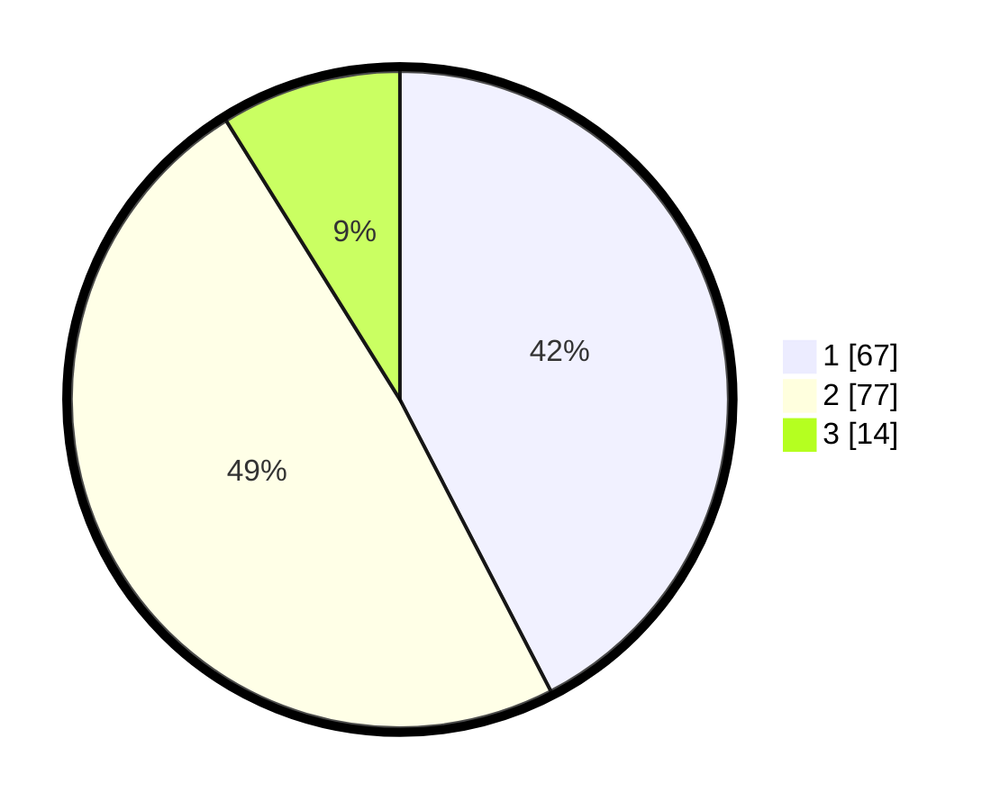

# Hasil

## Grafik

## Tabel

| No. | Nama Paslon    | Suara | Suara (raw) | Persentase |
|:--- |:-------------- | -----:| -----------:| ----------:|
| 1   | ANIES MUHAIMIN | 67    | [67][p-1]   | 42,41      |
| 2   | PRABOWO GIBRAN | 77    | [77][p-2]   | 48,73      |
| 3   | GANJAR MAHFUD  | 14    | [14][p-3]   | 8,86       |

[p-1]: https://github.com/gigit-pemilu/pemilu-2024-51-bali/blob/main/pilpres/hitung-suara/sub/51-bali/sub/08-buleleng/sub/05-sukasada/sub/2005-pegayaman/sub/017-tps/sub/paslon-1.txt
[p-2]: https://github.com/gigit-pemilu/pemilu-2024-51-bali/blob/main/pilpres/hitung-suara/sub/51-bali/sub/08-buleleng/sub/05-sukasada/sub/2005-pegayaman/sub/017-tps/sub/paslon-2.txt
[p-3]: https://github.com/gigit-pemilu/pemilu-2024-51-bali/blob/main/pilpres/hitung-suara/sub/51-bali/sub/08-buleleng/sub/05-sukasada/sub/2005-pegayaman/sub/017-tps/sub/paslon-3.txt

## Foto C Plano

https://sirekap-obj-formc.kpu.go.id/be78/pemilu/ppwp/51/08/05/20/05/5108052005017-20240214-204706--1d78c42f-9693-4d0a-8f26-d0ceededb989.jpg

https://sirekap-obj-formc.kpu.go.id/be78/pemilu/ppwp/51/08/05/20/05/5108052005017-20240214-204817--09a1660a-19d2-4204-ba77-b0e324dab28e.jpg

https://sirekap-obj-formc.kpu.go.id/be78/pemilu/ppwp/51/08/05/20/05/5108052005017-20240216-002317--f81fd439-037d-4ad2-8c9a-ac04bd9db12e.jpg

## Metadata

| Key        | Value               |
| ---------- | ------------------- |
| Time Stamp | 2024-02-16 00:30:27 |

## DATA PEMILIH TETAP

Jumlah pemilih dalam DPT: **236**.
 * L: **120**.
 * P: **116**.

## DATA PENGGUNA HAK PILIH

Jumlah pengguna hak pilih dalam DPT: **165**.
 * L: **84**.
 * P: **81**.

Jumlah pengguna hak pilih dalam DPTb: **0**.
 * L: **0**.
 * P: **0**.

Jumlah pengguna hak pilih dalam DPK: **0**.
 * L: **0**.
 * P: **0**.

Jumlah pengguna hak pilih: **165**.
 * L: **84**.
 * P: **81**.

## JUMLAH SUARA SAH DAN TIDAK SAH

JUMLAH SELURUH SUARA SAH: **158**.

JUMLAH SUARA TIDAK SAH: **7**.

JUMLAH SELURUH SUARA SAH DAN SUARA TIDAK SAH: **165**.

