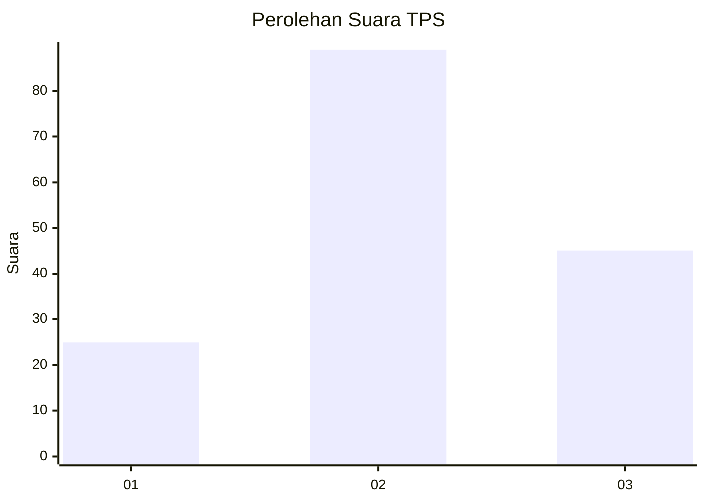
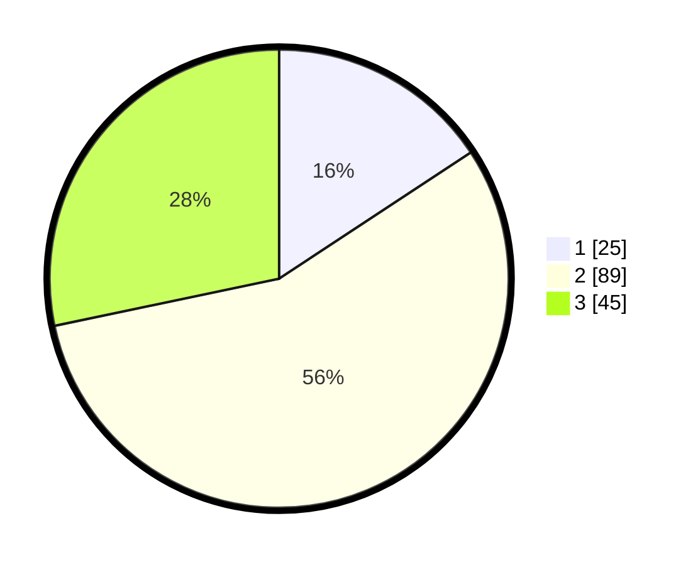

# Hasil

## Grafik

## Tabel

| No. | Nama Paslon    | Suara | Suara (raw) | Persentase |
|:--- |:-------------- | -----:| -----------:| ----------:|
| 1   | ANIES MUHAIMIN | 25    | [25][p-1]   | 15,72      |
| 2   | PRABOWO GIBRAN | 89    | [89][p-2]   | 55,97      |
| 3   | GANJAR MAHFUD  | 45    | [45][p-3]   | 28,30      |

[p-1]: https://github.com/gigit-pemilu/pemilu-2024-51-bali/blob/main/pilpres/hitung-suara/sub/51-bali/sub/08-buleleng/sub/05-sukasada/sub/2005-pegayaman/sub/020-tps/sub/paslon-1.txt
[p-2]: https://github.com/gigit-pemilu/pemilu-2024-51-bali/blob/main/pilpres/hitung-suara/sub/51-bali/sub/08-buleleng/sub/05-sukasada/sub/2005-pegayaman/sub/020-tps/sub/paslon-2.txt
[p-3]: https://github.com/gigit-pemilu/pemilu-2024-51-bali/blob/main/pilpres/hitung-suara/sub/51-bali/sub/08-buleleng/sub/05-sukasada/sub/2005-pegayaman/sub/020-tps/sub/paslon-3.txt

## Foto C Plano

https://sirekap-obj-formc.kpu.go.id/b7ac/pemilu/ppwp/51/08/05/20/05/5108052005020-20240216-024054--e8752819-d5e3-4fb5-ac0e-c8fa9d64c646.jpg

https://sirekap-obj-formc.kpu.go.id/b7ac/pemilu/ppwp/51/08/05/20/05/5108052005020-20240216-024058--f43d5120-3755-4f37-95a2-386fc4c21c41.jpg

https://sirekap-obj-formc.kpu.go.id/b7ac/pemilu/ppwp/51/08/05/20/05/5108052005020-20240216-024057--749da263-484a-473b-b4be-41837b42e221.jpg

## Metadata

| Key        | Value               |
| ---------- | ------------------- |
| Time Stamp | 2024-02-16 21:01:00 |

## DATA PEMILIH TETAP

Jumlah pemilih dalam DPT: **193**.
 * L: **99**.
 * P: **94**.

## DATA PENGGUNA HAK PILIH

Jumlah pengguna hak pilih dalam DPT: **150**.
 * L: **83**.
 * P: **67**.

Jumlah pengguna hak pilih dalam DPTb: **7**.
 * L: **7**.
 * P: **0**.

Jumlah pengguna hak pilih dalam DPK: **5**.
 * L: **3**.
 * P: **2**.

Jumlah pengguna hak pilih: **162**.
 * L: **93**.
 * P: **69**.

## JUMLAH SUARA SAH DAN TIDAK SAH

JUMLAH SELURUH SUARA SAH: **159**.

JUMLAH SUARA TIDAK SAH: **3**.

JUMLAH SELURUH SUARA SAH DAN SUARA TIDAK SAH: **162**.

