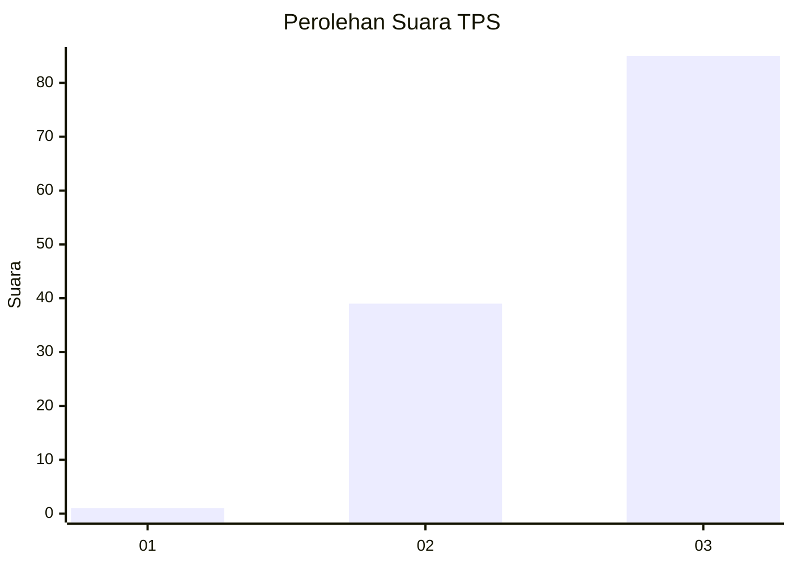
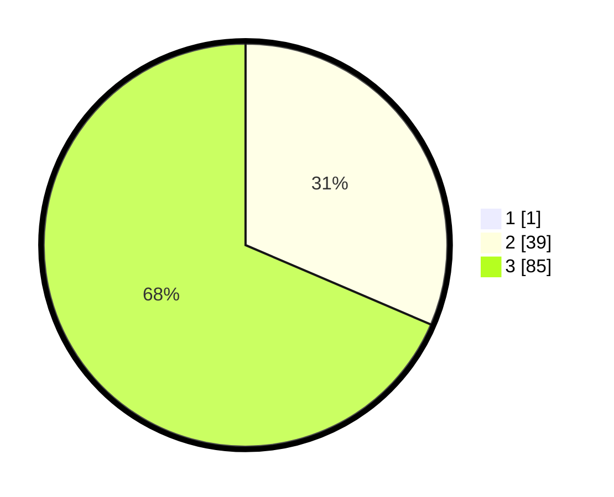

# Hasil

## Grafik

## Tabel

| No. | Nama Paslon    | Suara | Suara (raw) | Persentase |
|:--- |:-------------- | -----:| -----------:| ----------:|
| 1   | ANIES MUHAIMIN | 1     | [1][p-1]    | 0,80       |
| 2   | PRABOWO GIBRAN | 39    | [39][p-2]   | 31,20      |
| 3   | GANJAR MAHFUD  | 85    | [85][p-3]   | 68,00      |

[p-1]: https://github.com/gigit-pemilu/pemilu-2024-51-bali/blob/main/pilpres/hitung-suara/sub/51-bali/sub/08-buleleng/sub/05-sukasada/sub/2007-pegadungan/sub/004-tps/sub/paslon-1.txt
[p-2]: https://github.com/gigit-pemilu/pemilu-2024-51-bali/blob/main/pilpres/hitung-suara/sub/51-bali/sub/08-buleleng/sub/05-sukasada/sub/2007-pegadungan/sub/004-tps/sub/paslon-2.txt
[p-3]: https://github.com/gigit-pemilu/pemilu-2024-51-bali/blob/main/pilpres/hitung-suara/sub/51-bali/sub/08-buleleng/sub/05-sukasada/sub/2007-pegadungan/sub/004-tps/sub/paslon-3.txt

## Foto C Plano

https://sirekap-obj-formc.kpu.go.id/789d/pemilu/ppwp/51/08/05/20/07/5108052007004-20240214-133354--e128dcb7-d933-4fd4-8670-042a5fbac354.jpg

https://sirekap-obj-formc.kpu.go.id/789d/pemilu/ppwp/51/08/05/20/07/5108052007004-20240214-232423--549d01c5-330c-44b9-80c4-314ffcd804c3.jpg

https://sirekap-obj-formc.kpu.go.id/789d/pemilu/ppwp/51/08/05/20/07/5108052007004-20240214-232441--d157106c-779f-4f2b-8ed6-8ead674c43b8.jpg

## Metadata

| Key        | Value               |
| ---------- | ------------------- |
| Time Stamp | 2024-02-24 22:31:28 |

## DATA PEMILIH TETAP

Jumlah pemilih dalam DPT: **144**.
 * L: **73**.
 * P: **71**.

## DATA PENGGUNA HAK PILIH

Jumlah pengguna hak pilih dalam DPT: **125**.
 * L: **67**.
 * P: **58**.

Jumlah pengguna hak pilih dalam DPTb: **0**.
 * L: **0**.
 * P: **0**.

Jumlah pengguna hak pilih dalam DPK: **1**.
 * L: **0**.
 * P: **1**.

Jumlah pengguna hak pilih: **126**.
 * L: **67**.
 * P: **59**.

## JUMLAH SUARA SAH DAN TIDAK SAH

JUMLAH SELURUH SUARA SAH: **125**.

JUMLAH SUARA TIDAK SAH: **1**.

JUMLAH SELURUH SUARA SAH DAN SUARA TIDAK SAH: **126**.

