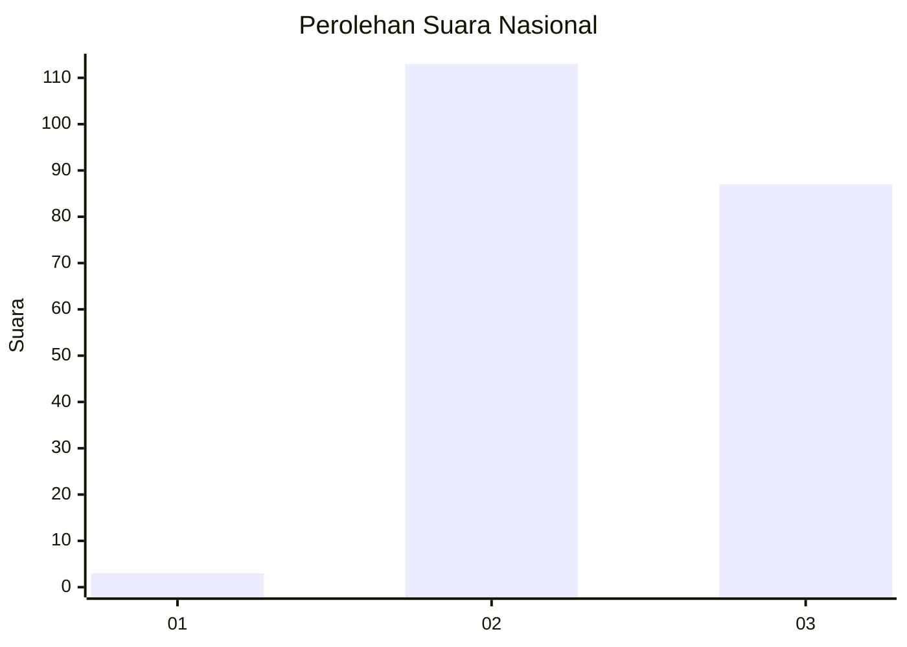
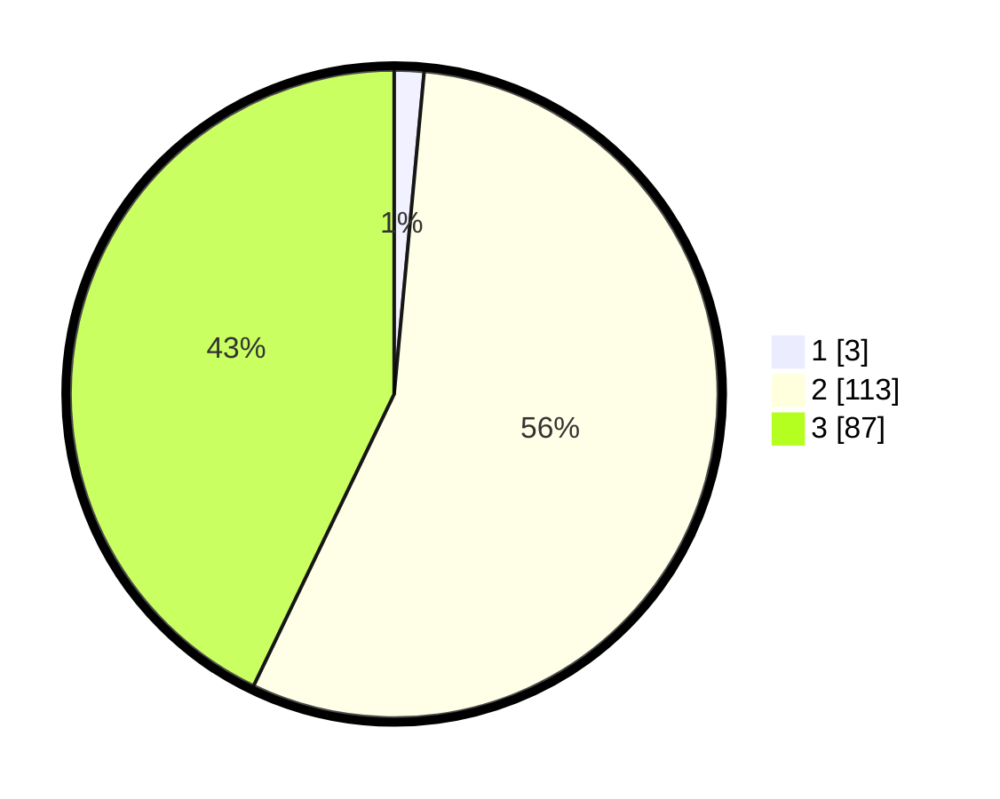

# Hasil

## Grafik

## Tabel

| No. | Nama Paslon    | Suara | Suara (raw) | Persentase |
|:--- |:-------------- | -----:| -----------:| ----------:|
| 1   | ANIES MUHAIMIN | 3     | [3][p-1]    | 1,48       |
| 2   | PRABOWO GIBRAN | 113   | [113][p-2]  | 55,67      |
| 3   | GANJAR MAHFUD  | 87    | [87][p-3]   | 42,86      |

[p-1]: https://github.com/gigit-pemilu/pemilu-2024/blob/main/pilpres/hitung-suara/sub/51-bali/sub/08-buleleng/sub/05-sukasada/sub/2007-pegadungan/sub/006-tps/sub/paslon-1.txt
[p-2]: https://github.com/gigit-pemilu/pemilu-2024/blob/main/pilpres/hitung-suara/sub/51-bali/sub/08-buleleng/sub/05-sukasada/sub/2007-pegadungan/sub/006-tps/sub/paslon-2.txt
[p-3]: https://github.com/gigit-pemilu/pemilu-2024/blob/main/pilpres/hitung-suara/sub/51-bali/sub/08-buleleng/sub/05-sukasada/sub/2007-pegadungan/sub/006-tps/sub/paslon-3.txt

## Foto C Plano

https://sirekap-obj-formc.kpu.go.id/0230/pemilu/ppwp/51/08/05/20/07/5108052007006-20240214-235803--122f35d2-bfd5-40fc-8a5e-be7a0ec9cef5.jpg

https://sirekap-obj-formc.kpu.go.id/0230/pemilu/ppwp/51/08/05/20/07/5108052007006-20240214-235928--4f852510-c7dd-4c30-aba9-e21f1d5b372c.jpg

https://sirekap-obj-formc.kpu.go.id/0230/pemilu/ppwp/51/08/05/20/07/5108052007006-20240215-000027--6f8d5055-110f-41c6-b7ed-73757e0d45b8.jpg

## Metadata

| Key        | Value               |
| ---------- | ------------------- |
| Time Stamp | 2024-02-24 22:31:28 |

