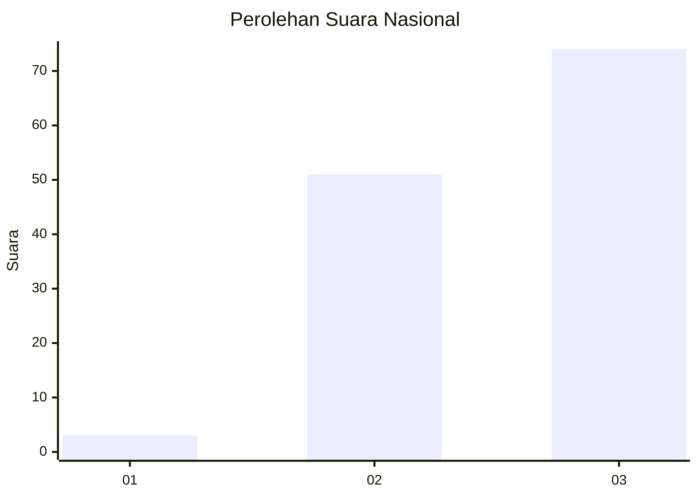
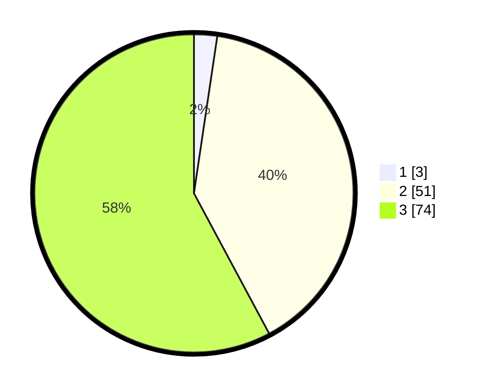

# Hasil

## Grafik

## Tabel

| No. | Nama Paslon    | Suara | Suara (raw) | Persentase |
|:--- |:-------------- | -----:| -----------:| ----------:|
| 1   | ANIES MUHAIMIN | 3     | [3][p-1]    | 2,34       |
| 2   | PRABOWO GIBRAN | 51    | [51][p-2]   | 39,84      |
| 3   | GANJAR MAHFUD  | 74    | [74][p-3]   | 57,81      |

[p-1]: https://github.com/gigit-pemilu/pemilu-2024/blob/main/pilpres/hitung-suara/sub/51-bali/sub/08-buleleng/sub/05-sukasada/sub/2007-pegadungan/sub/007-tps/sub/paslon-1.txt
[p-2]: https://github.com/gigit-pemilu/pemilu-2024/blob/main/pilpres/hitung-suara/sub/51-bali/sub/08-buleleng/sub/05-sukasada/sub/2007-pegadungan/sub/007-tps/sub/paslon-2.txt
[p-3]: https://github.com/gigit-pemilu/pemilu-2024/blob/main/pilpres/hitung-suara/sub/51-bali/sub/08-buleleng/sub/05-sukasada/sub/2007-pegadungan/sub/007-tps/sub/paslon-3.txt

## Foto C Plano

https://sirekap-obj-formc.kpu.go.id/1461/pemilu/ppwp/51/08/05/20/07/5108052007007-20240214-231831--3a312f6b-ee40-40d9-9ebe-a5ec1077187f.jpg

https://sirekap-obj-formc.kpu.go.id/1461/pemilu/ppwp/51/08/05/20/07/5108052007007-20240214-232002--2f1834d6-a7a2-429a-9f26-712e8d96d2b4.jpg

## Metadata

| Key        | Value               |
| ---------- | ------------------- |
| Time Stamp | 2024-02-24 22:31:28 |

