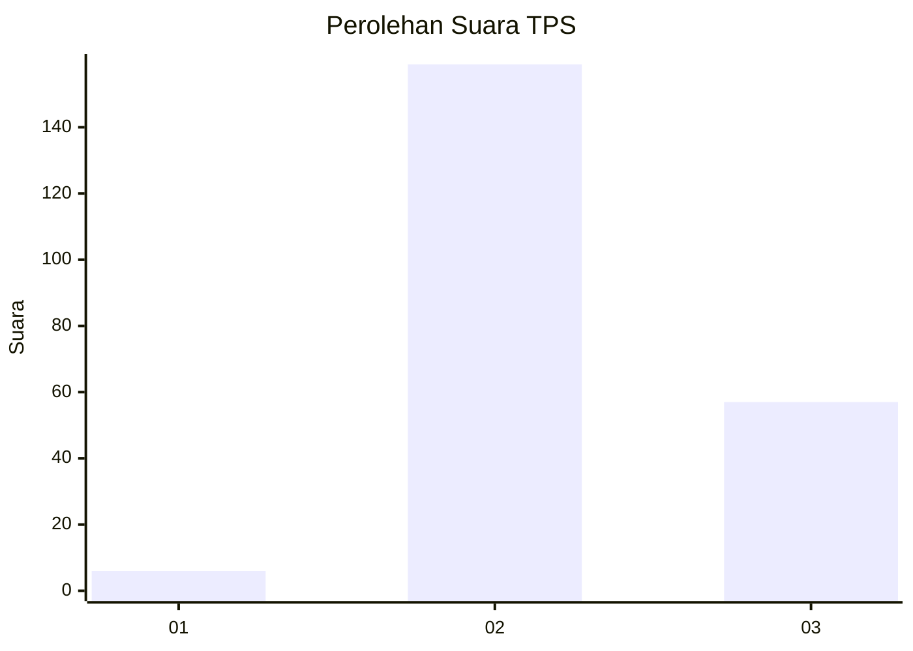
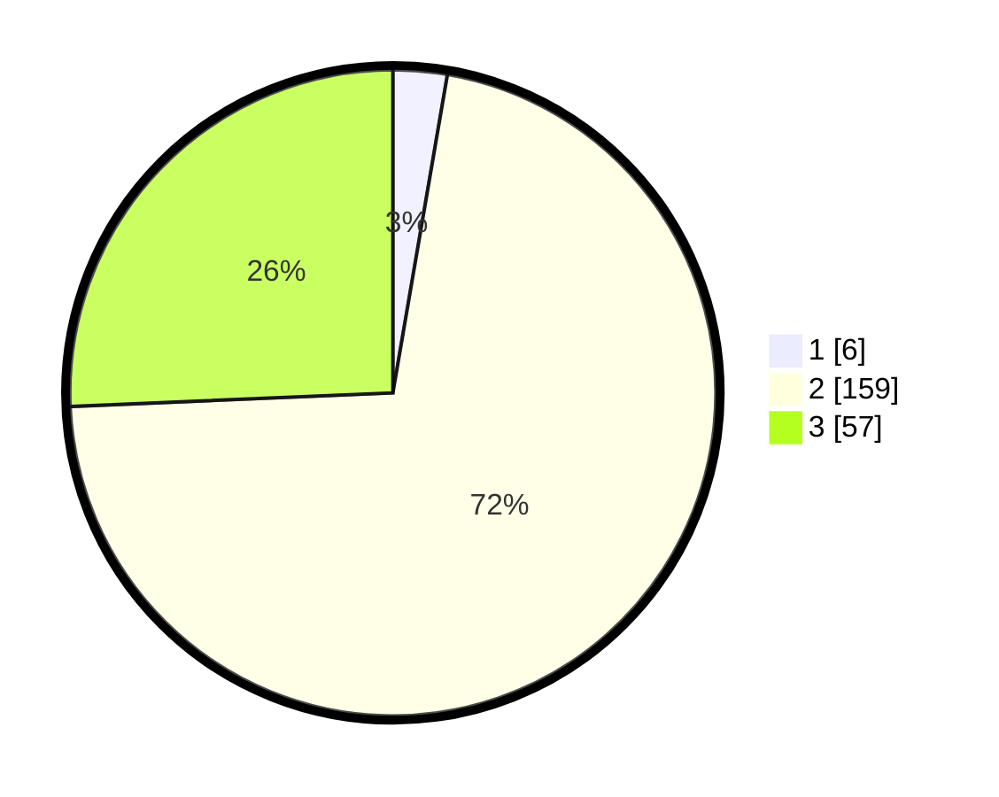

# Hasil

## Grafik

## Tabel

| No. | Nama Paslon    | Suara | Suara (raw) | Persentase |
|:--- |:-------------- | -----:| -----------:| ----------:|
| 1   | ANIES MUHAIMIN | 6     | [6][p-1]    | 2,70       |
| 2   | PRABOWO GIBRAN | 159   | [159][p-2]  | 71,62      |
| 3   | GANJAR MAHFUD  | 57    | [57][p-3]   | 25,68      |

[p-1]: https://github.com/gigit-pemilu/pemilu-2024-51-bali/blob/main/pilpres/hitung-suara/sub/51-bali/sub/08-buleleng/sub/05-sukasada/sub/2008-padangbulia/sub/002-tps/sub/paslon-1.txt
[p-2]: https://github.com/gigit-pemilu/pemilu-2024-51-bali/blob/main/pilpres/hitung-suara/sub/51-bali/sub/08-buleleng/sub/05-sukasada/sub/2008-padangbulia/sub/002-tps/sub/paslon-2.txt
[p-3]: https://github.com/gigit-pemilu/pemilu-2024-51-bali/blob/main/pilpres/hitung-suara/sub/51-bali/sub/08-buleleng/sub/05-sukasada/sub/2008-padangbulia/sub/002-tps/sub/paslon-3.txt

## Foto C Plano

https://sirekap-obj-formc.kpu.go.id/e23a/pemilu/ppwp/51/08/05/20/08/5108052008002-20240214-214745--0cd73d15-e355-4268-a2c5-983a83723552.jpg

https://sirekap-obj-formc.kpu.go.id/e23a/pemilu/ppwp/51/08/05/20/08/5108052008002-20240214-214944--b916c9df-ca43-40b8-9e6e-cfcdbf44ff24.jpg

https://sirekap-obj-formc.kpu.go.id/e23a/pemilu/ppwp/51/08/05/20/08/5108052008002-20240214-203939--c413b04b-0674-47b0-be5a-536c187e7594.jpg

## Metadata

| Key        | Value               |
| ---------- | ------------------- |
| Time Stamp | 2024-02-24 22:31:28 |

