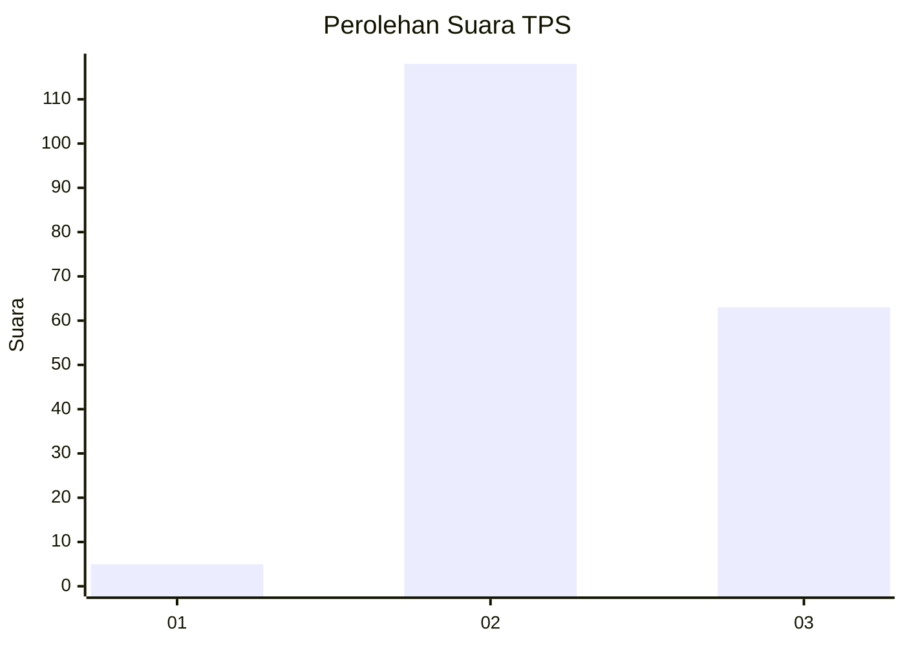
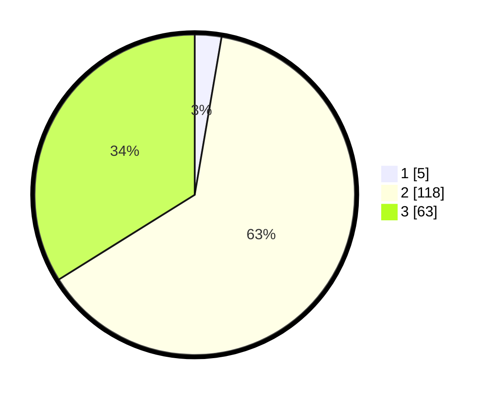

# Hasil

## Grafik

## Tabel

| No. | Nama Paslon    | Suara | Suara (raw) | Persentase |
|:--- |:-------------- | -----:| -----------:| ----------:|
| 1   | ANIES MUHAIMIN | 5     | [5][p-1]    | 2,69       |
| 2   | PRABOWO GIBRAN | 118   | [118][p-2]  | 63,44      |
| 3   | GANJAR MAHFUD  | 63    | [63][p-3]   | 33,87      |

[p-1]: https://github.com/gigit-pemilu/pemilu-2024-51-bali/blob/main/pilpres/hitung-suara/sub/51-bali/sub/08-buleleng/sub/05-sukasada/sub/2008-padangbulia/sub/006-tps/sub/paslon-1.txt
[p-2]: https://github.com/gigit-pemilu/pemilu-2024-51-bali/blob/main/pilpres/hitung-suara/sub/51-bali/sub/08-buleleng/sub/05-sukasada/sub/2008-padangbulia/sub/006-tps/sub/paslon-2.txt
[p-3]: https://github.com/gigit-pemilu/pemilu-2024-51-bali/blob/main/pilpres/hitung-suara/sub/51-bali/sub/08-buleleng/sub/05-sukasada/sub/2008-padangbulia/sub/006-tps/sub/paslon-3.txt

## Foto C Plano

https://sirekap-obj-formc.kpu.go.id/0b2c/pemilu/ppwp/51/08/05/20/08/5108052008006-20240214-220508--2942c0cf-a63b-48d2-aa6d-db9e04cca4ba.jpg

https://sirekap-obj-formc.kpu.go.id/0b2c/pemilu/ppwp/51/08/05/20/08/5108052008006-20240214-220546--6472faab-03f9-44b3-9fd4-5156a6205cca.jpg

https://sirekap-obj-formc.kpu.go.id/0b2c/pemilu/ppwp/51/08/05/20/08/5108052008006-20240214-220613--f8ab58bd-f0ab-4c27-9334-2233abfa7e50.jpg

## Metadata

| Key        | Value               |
| ---------- | ------------------- |
| Time Stamp | 2024-02-24 22:31:28 |

