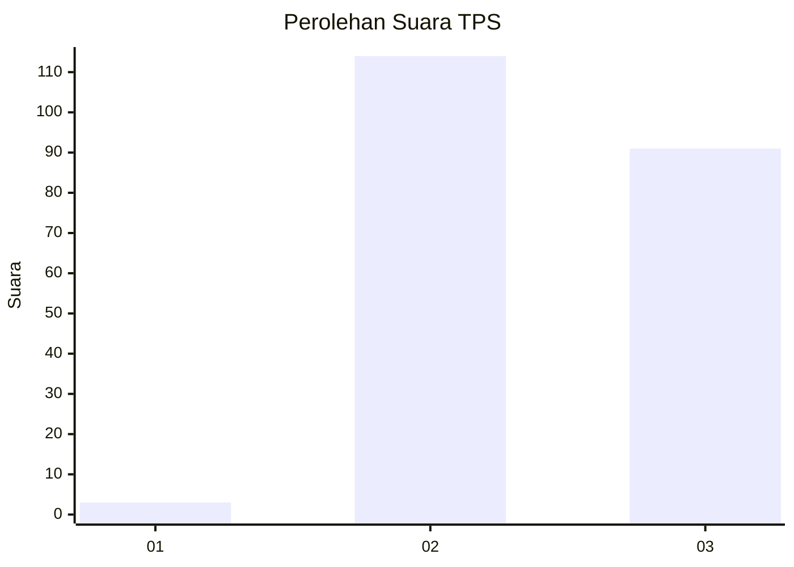
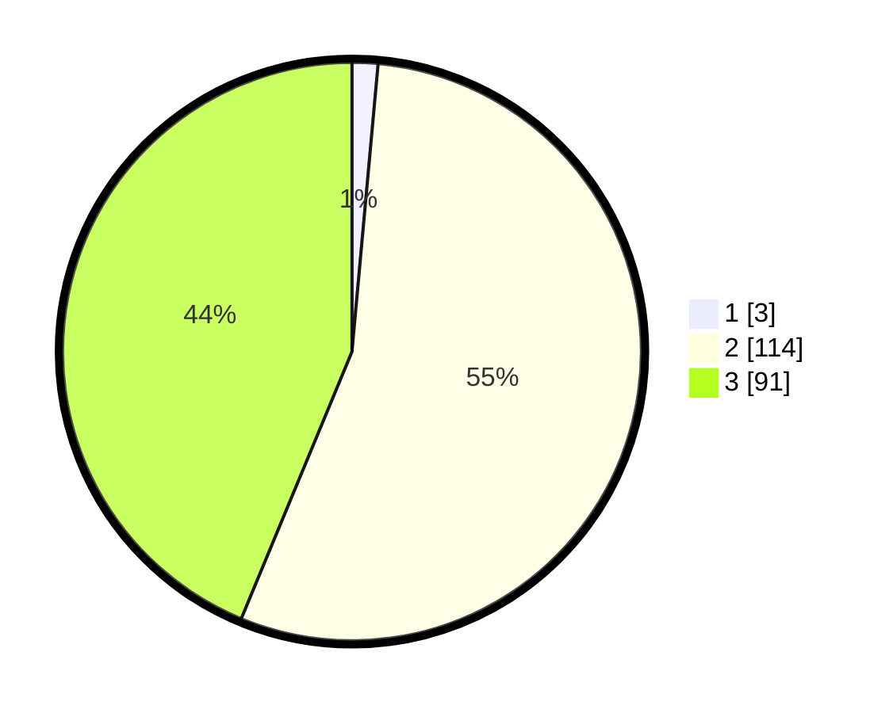

# Hasil

## Grafik

## Tabel

| No. | Nama Paslon    | Suara | Suara (raw) | Persentase |
|:--- |:-------------- | -----:| -----------:| ----------:|
| 1   | ANIES MUHAIMIN | 3     | [3][p-1]    | 1,44       |
| 2   | PRABOWO GIBRAN | 114   | [114][p-2]  | 54,81      |
| 3   | GANJAR MAHFUD  | 91    | [91][p-3]   | 43,75      |

[p-1]: https://github.com/gigit-pemilu/pemilu-2024-51-bali/blob/main/pilpres/hitung-suara/sub/51-bali/sub/08-buleleng/sub/05-sukasada/sub/2008-padangbulia/sub/008-tps/sub/paslon-1.txt
[p-2]: https://github.com/gigit-pemilu/pemilu-2024-51-bali/blob/main/pilpres/hitung-suara/sub/51-bali/sub/08-buleleng/sub/05-sukasada/sub/2008-padangbulia/sub/008-tps/sub/paslon-2.txt
[p-3]: https://github.com/gigit-pemilu/pemilu-2024-51-bali/blob/main/pilpres/hitung-suara/sub/51-bali/sub/08-buleleng/sub/05-sukasada/sub/2008-padangbulia/sub/008-tps/sub/paslon-3.txt

## Foto C Plano

https://sirekap-obj-formc.kpu.go.id/b40f/pemilu/ppwp/51/08/05/20/08/5108052008008-20240214-155318--83790d46-3552-44c3-8be0-91be7ab9282e.jpg

https://sirekap-obj-formc.kpu.go.id/b40f/pemilu/ppwp/51/08/05/20/08/5108052008008-20240214-141225--043882d0-81d2-4229-beb1-c6d7ea1066e4.jpg

https://sirekap-obj-formc.kpu.go.id/b40f/pemilu/ppwp/51/08/05/20/08/5108052008008-20240214-141120--6a3d87bd-2670-4195-9575-7a72bd0fc2a5.jpg

## Metadata

| Key        | Value               |
| ---------- | ------------------- |
| Time Stamp | 2024-02-24 22:31:28 |

