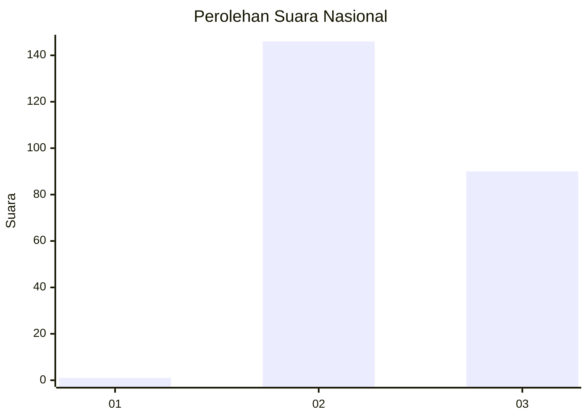
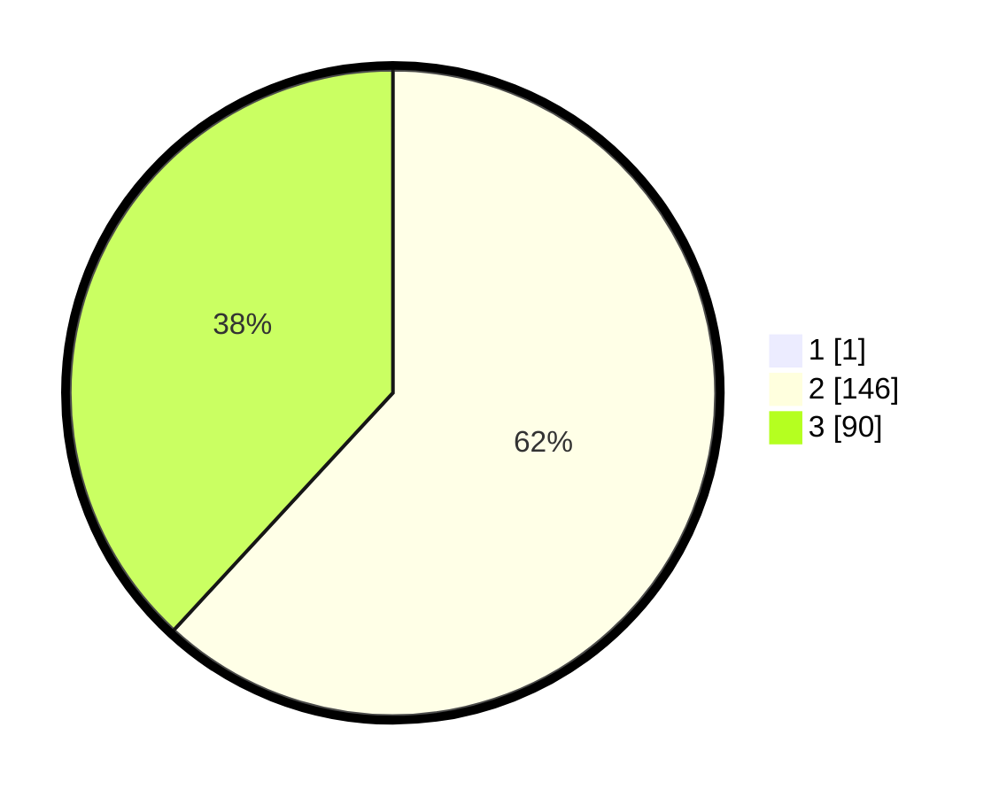

# Hasil

## Grafik

## Tabel

| No. | Nama Paslon    | Suara | Suara (raw) | Persentase |
|:--- |:-------------- | -----:| -----------:| ----------:|
| 1   | ANIES MUHAIMIN | 1     | [1][p-1]    | 0,42       |
| 2   | PRABOWO GIBRAN | 146   | [146][p-2]  | 61,60      |
| 3   | GANJAR MAHFUD  | 90    | [90][p-3]   | 37,97      |

[p-1]: https://github.com/gigit-pemilu/pemilu-2024/blob/main/pilpres/hitung-suara/sub/51-bali/sub/08-buleleng/sub/05-sukasada/sub/2008-padangbulia/sub/011-tps/sub/paslon-1.txt
[p-2]: https://github.com/gigit-pemilu/pemilu-2024/blob/main/pilpres/hitung-suara/sub/51-bali/sub/08-buleleng/sub/05-sukasada/sub/2008-padangbulia/sub/011-tps/sub/paslon-2.txt
[p-3]: https://github.com/gigit-pemilu/pemilu-2024/blob/main/pilpres/hitung-suara/sub/51-bali/sub/08-buleleng/sub/05-sukasada/sub/2008-padangbulia/sub/011-tps/sub/paslon-3.txt

## Foto C Plano

https://sirekap-obj-formc.kpu.go.id/75af/pemilu/ppwp/51/08/05/20/08/5108052008011-20240214-214657--60ca1264-a433-446f-b901-81943c888554.jpg

https://sirekap-obj-formc.kpu.go.id/75af/pemilu/ppwp/51/08/05/20/08/5108052008011-20240214-221009--693ad574-2c10-4920-beaf-580c2b5092b4.jpg

https://sirekap-obj-formc.kpu.go.id/75af/pemilu/ppwp/51/08/05/20/08/5108052008011-20240214-221228--7cbc23fe-3c6b-4eb8-8daa-fa6a361f9c3b.jpg

## Metadata

| Key        | Value               |
| ---------- | ------------------- |
| Time Stamp | 2024-02-24 22:31:28 |

