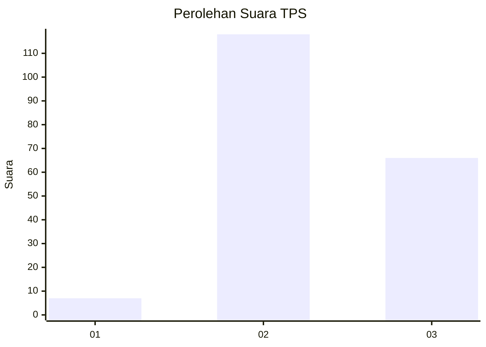
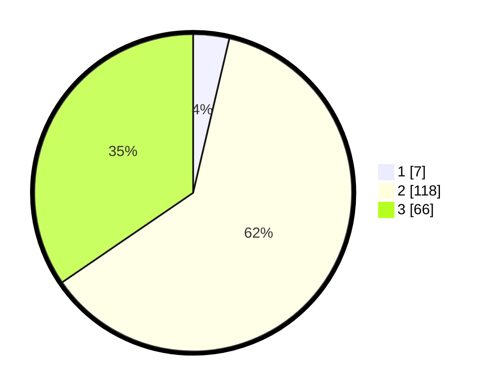

# Hasil

## Grafik

## Tabel

| No. | Nama Paslon    | Suara | Suara (raw) | Persentase |
|:--- |:-------------- | -----:| -----------:| ----------:|
| 1   | ANIES MUHAIMIN | 7     | [7][p-1]    | 3,66       |
| 2   | PRABOWO GIBRAN | 118   | [118][p-2]  | 61,78      |
| 3   | GANJAR MAHFUD  | 66    | [66][p-3]   | 34,55      |

[p-1]: https://github.com/gigit-pemilu/pemilu-2024-51-bali/blob/main/pilpres/hitung-suara/sub/51-bali/sub/08-buleleng/sub/05-sukasada/sub/2010-sambangan/sub/001-tps/sub/paslon-1.txt
[p-2]: https://github.com/gigit-pemilu/pemilu-2024-51-bali/blob/main/pilpres/hitung-suara/sub/51-bali/sub/08-buleleng/sub/05-sukasada/sub/2010-sambangan/sub/001-tps/sub/paslon-2.txt
[p-3]: https://github.com/gigit-pemilu/pemilu-2024-51-bali/blob/main/pilpres/hitung-suara/sub/51-bali/sub/08-buleleng/sub/05-sukasada/sub/2010-sambangan/sub/001-tps/sub/paslon-3.txt

## Foto C Plano

https://sirekap-obj-formc.kpu.go.id/80b2/pemilu/ppwp/51/08/05/20/10/5108052010001-20240214-232439--c7e2e3ed-f5be-45bf-9965-323937dde33b.jpg

https://sirekap-obj-formc.kpu.go.id/80b2/pemilu/ppwp/51/08/05/20/10/5108052010001-20240214-234451--88223fc2-28f6-44b6-b757-4fc9a8e1b231.jpg

https://sirekap-obj-formc.kpu.go.id/80b2/pemilu/ppwp/51/08/05/20/10/5108052010001-20240214-234612--eea4cf60-021a-4633-9204-f2e792bbda53.jpg

## Metadata

| Key        | Value               |
| ---------- | ------------------- |
| Time Stamp | 2024-02-24 22:31:28 |

