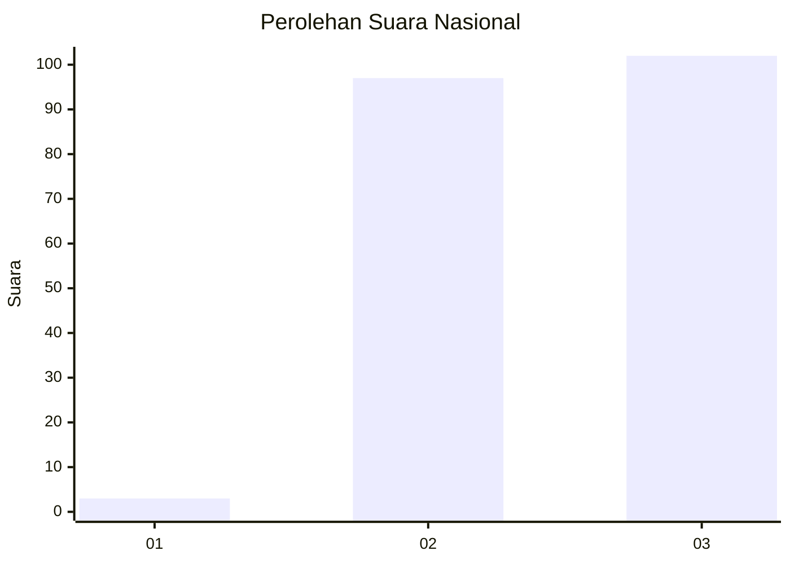
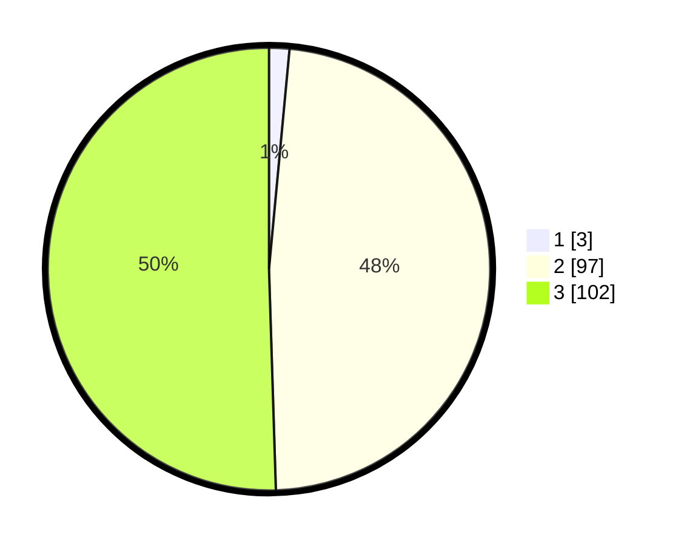

# Hasil

## Grafik

## Tabel

| No. | Nama Paslon    | Suara | Suara (raw) | Persentase |
|:--- |:-------------- | -----:| -----------:| ----------:|
| 1   | ANIES MUHAIMIN | 3     | [3][p-1]    | 1,49       |
| 2   | PRABOWO GIBRAN | 97    | [97][p-2]   | 48,02      |
| 3   | GANJAR MAHFUD  | 102   | [102][p-3]  | 50,50      |

[p-1]: https://github.com/gigit-pemilu/pemilu-2024/blob/main/pilpres/hitung-suara/sub/51-bali/sub/08-buleleng/sub/05-sukasada/sub/2010-sambangan/sub/005-tps/sub/paslon-1.txt
[p-2]: https://github.com/gigit-pemilu/pemilu-2024/blob/main/pilpres/hitung-suara/sub/51-bali/sub/08-buleleng/sub/05-sukasada/sub/2010-sambangan/sub/005-tps/sub/paslon-2.txt
[p-3]: https://github.com/gigit-pemilu/pemilu-2024/blob/main/pilpres/hitung-suara/sub/51-bali/sub/08-buleleng/sub/05-sukasada/sub/2010-sambangan/sub/005-tps/sub/paslon-3.txt

## Foto C Plano

https://sirekap-obj-formc.kpu.go.id/4236/pemilu/ppwp/51/08/05/20/10/5108052010005-20240214-214000--fa54d805-ed57-41a5-b8d6-822b00b615e8.jpg

https://sirekap-obj-formc.kpu.go.id/4236/pemilu/ppwp/51/08/05/20/10/5108052010005-20240214-214224--b2eb984f-42a3-48c5-a816-62441951f32f.jpg

https://sirekap-obj-formc.kpu.go.id/4236/pemilu/ppwp/51/08/05/20/10/5108052010005-20240214-214432--561869f8-ae39-4e96-b38a-0c60fb446602.jpg

## Metadata

| Key        | Value               |
| ---------- | ------------------- |
| Time Stamp | 2024-02-24 22:31:28 |

