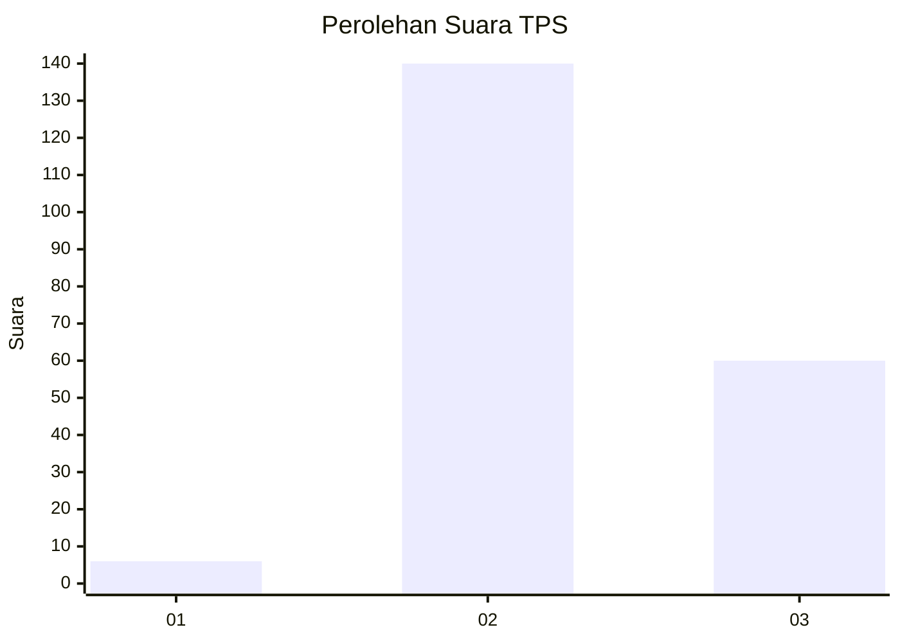

# Hasil

## Grafik

## Tabel

| No. | Nama Paslon    | Suara | Suara (raw) | Persentase |
|:--- |:-------------- | -----:| -----------:| ----------:|
| 1   | ANIES MUHAIMIN | 6     | [6][p-1]    | 2,91       |
| 2   | PRABOWO GIBRAN | 140   | [140][p-2]  | 67,96      |
| 3   | GANJAR MAHFUD  | 60    | [60][p-3]   | 29,13      |

[p-1]: https://github.com/gigit-pemilu/pemilu-2024-51-bali/blob/main/pilpres/hitung-suara/sub/51-bali/sub/08-buleleng/sub/05-sukasada/sub/2010-sambangan/sub/016-tps/sub/paslon-1.txt
[p-2]: https://github.com/gigit-pemilu/pemilu-2024-51-bali/blob/main/pilpres/hitung-suara/sub/51-bali/sub/08-buleleng/sub/05-sukasada/sub/2010-sambangan/sub/016-tps/sub/paslon-2.txt
[p-3]: https://github.com/gigit-pemilu/pemilu-2024-51-bali/blob/main/pilpres/hitung-suara/sub/51-bali/sub/08-buleleng/sub/05-sukasada/sub/2010-sambangan/sub/016-tps/sub/paslon-3.txt

## Foto C Plano

https://sirekap-obj-formc.kpu.go.id/53d8/pemilu/ppwp/51/08/05/20/10/5108052010016-20240215-002938--edf7b175-a7e8-4e72-b6b5-2ef0d38461c4.jpg

https://sirekap-obj-formc.kpu.go.id/53d8/pemilu/ppwp/51/08/05/20/10/5108052010016-20240215-003008--582da7b5-0aef-4a29-874a-e15bf891a5fb.jpg

https://sirekap-obj-formc.kpu.go.id/53d8/pemilu/ppwp/51/08/05/20/10/5108052010016-20240215-003022--f09a6b1c-4926-4d11-b535-f1c1172fd78c.jpg

## Metadata

| Key        | Value               |
| ---------- | ------------------- |
| Time Stamp | 2024-02-24 22:31:28 |

