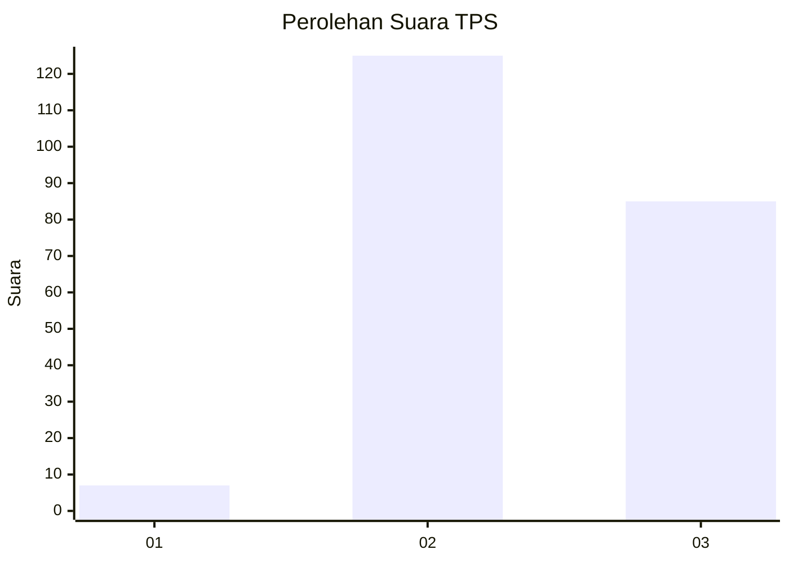
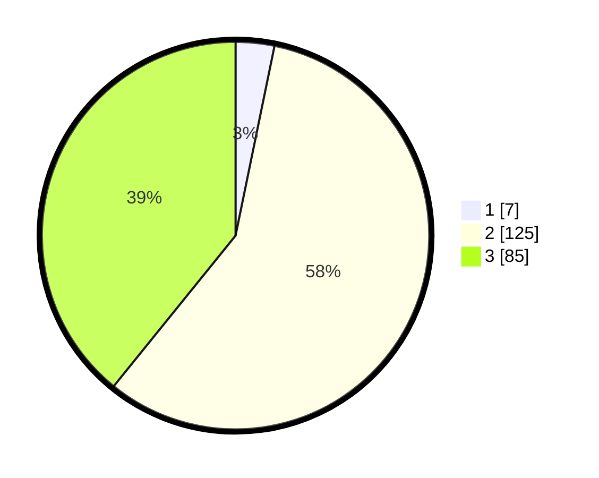

# Hasil

## Grafik

## Tabel

| No. | Nama Paslon    | Suara | Suara (raw) | Persentase |
|:--- |:-------------- | -----:| -----------:| ----------:|
| 1   | ANIES MUHAIMIN | 7     | [7][p-1]    | 3,23       |
| 2   | PRABOWO GIBRAN | 125   | [125][p-2]  | 57,60      |
| 3   | GANJAR MAHFUD  | 85    | [85][p-3]   | 39,17      |

[p-1]: https://github.com/gigit-pemilu/pemilu-2024-51-bali/blob/main/pilpres/hitung-suara/sub/51-bali/sub/08-buleleng/sub/05-sukasada/sub/2010-sambangan/sub/018-tps/sub/paslon-1.txt
[p-2]: https://github.com/gigit-pemilu/pemilu-2024-51-bali/blob/main/pilpres/hitung-suara/sub/51-bali/sub/08-buleleng/sub/05-sukasada/sub/2010-sambangan/sub/018-tps/sub/paslon-2.txt
[p-3]: https://github.com/gigit-pemilu/pemilu-2024-51-bali/blob/main/pilpres/hitung-suara/sub/51-bali/sub/08-buleleng/sub/05-sukasada/sub/2010-sambangan/sub/018-tps/sub/paslon-3.txt

## Foto C Plano

https://sirekap-obj-formc.kpu.go.id/0c46/pemilu/ppwp/51/08/05/20/10/5108052010018-20240215-013735--8934630c-164f-4f64-aec8-e735cbe90f2c.jpg

https://sirekap-obj-formc.kpu.go.id/0c46/pemilu/ppwp/51/08/05/20/10/5108052010018-20240215-013756--4eeb84b7-6629-401a-ae98-d91ebc73b49b.jpg

https://sirekap-obj-formc.kpu.go.id/0c46/pemilu/ppwp/51/08/05/20/10/5108052010018-20240215-013800--73c14286-ce47-480a-a71c-4ba3a366f332.jpg

## Metadata

| Key        | Value               |
| ---------- | ------------------- |
| Time Stamp | 2024-02-25 22:00:00 |

