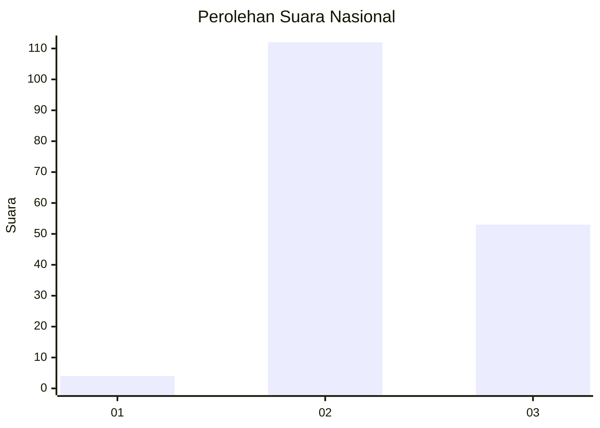
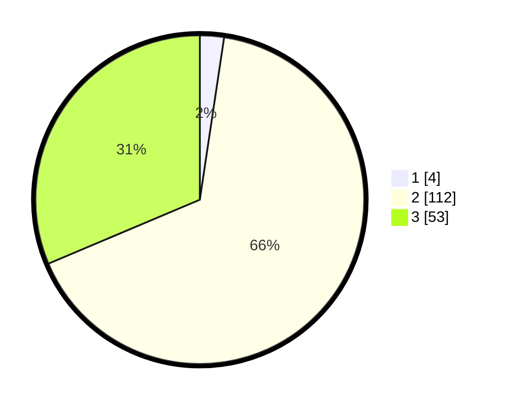

# Hasil

## Grafik

## Tabel

| No. | Nama Paslon    | Suara | Suara (raw) | Persentase |
|:--- |:-------------- | -----:| -----------:| ----------:|
| 1   | ANIES MUHAIMIN | 4     | [4][p-1]    | 2,37       |
| 2   | PRABOWO GIBRAN | 112   | [112][p-2]  | 66,27      |
| 3   | GANJAR MAHFUD  | 53    | [53][p-3]   | 31,36      |

[p-1]: https://github.com/gigit-pemilu/pemilu-2024/blob/main/pilpres/hitung-suara/sub/51-bali/sub/08-buleleng/sub/05-sukasada/sub/2011-panji/sub/002-tps/sub/paslon-1.txt
[p-2]: https://github.com/gigit-pemilu/pemilu-2024/blob/main/pilpres/hitung-suara/sub/51-bali/sub/08-buleleng/sub/05-sukasada/sub/2011-panji/sub/002-tps/sub/paslon-2.txt
[p-3]: https://github.com/gigit-pemilu/pemilu-2024/blob/main/pilpres/hitung-suara/sub/51-bali/sub/08-buleleng/sub/05-sukasada/sub/2011-panji/sub/002-tps/sub/paslon-3.txt

## Foto C Plano

https://sirekap-obj-formc.kpu.go.id/d34e/pemilu/ppwp/51/08/05/20/11/5108052011002-20240214-221956--b3cc7778-96f9-421e-a4d0-a32978b89a39.jpg

https://sirekap-obj-formc.kpu.go.id/d34e/pemilu/ppwp/51/08/05/20/11/5108052011002-20240214-222010--81c0b77a-773c-4773-877a-d333494646d1.jpg

https://sirekap-obj-formc.kpu.go.id/d34e/pemilu/ppwp/51/08/05/20/11/5108052011002-20240214-222028--6eba3d70-9c83-4bd5-a843-d1d724c83c83.jpg

## Metadata

| Key        | Value               |
| ---------- | ------------------- |
| Time Stamp | 2024-02-25 12:00:00 |

