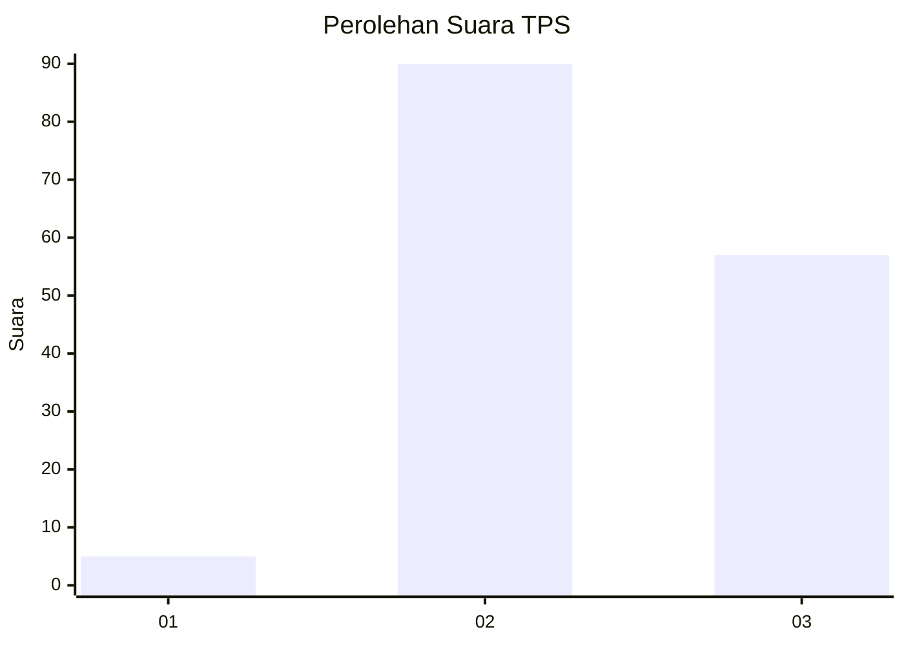
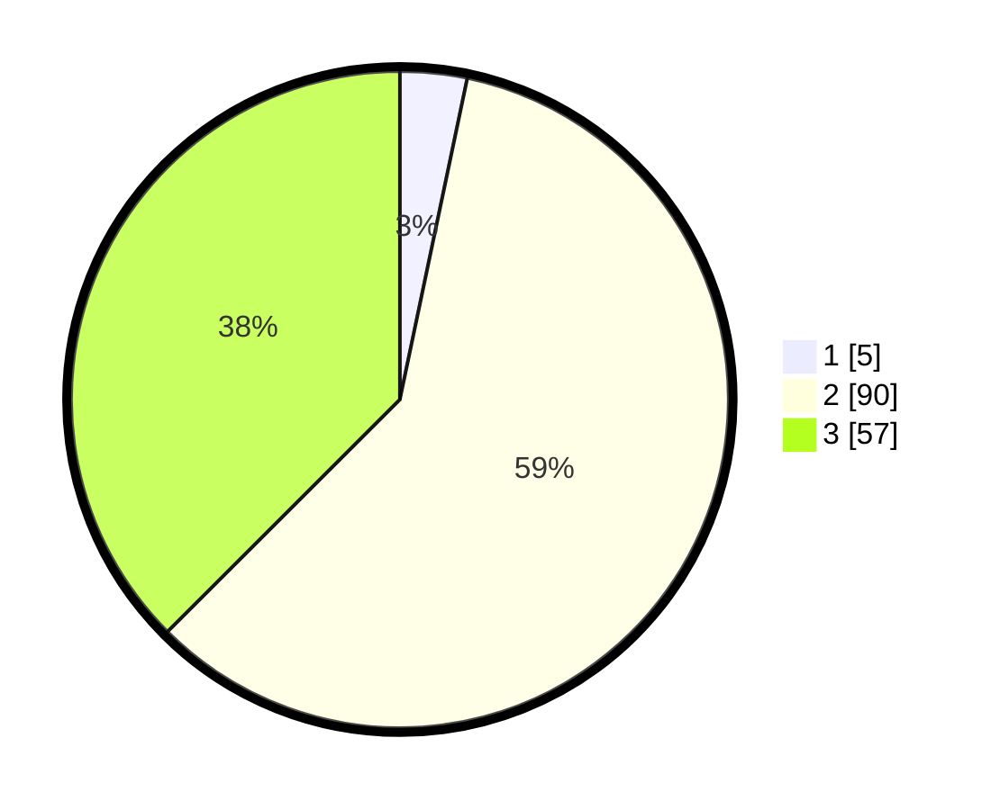

# Hasil

## Grafik

## Tabel

| No. | Nama Paslon    | Suara | Suara (raw) | Persentase |
|:--- |:-------------- | -----:| -----------:| ----------:|
| 1   | ANIES MUHAIMIN | 5     | [5][p-1]    | 3,29       |
| 2   | PRABOWO GIBRAN | 90    | [90][p-2]   | 59,21      |
| 3   | GANJAR MAHFUD  | 57    | [57][p-3]   | 37,50      |

[p-1]: https://github.com/gigit-pemilu/pemilu-2024-51-bali/blob/main/pilpres/hitung-suara/sub/51-bali/sub/08-buleleng/sub/05-sukasada/sub/2011-panji/sub/007-tps/sub/paslon-1.txt
[p-2]: https://github.com/gigit-pemilu/pemilu-2024-51-bali/blob/main/pilpres/hitung-suara/sub/51-bali/sub/08-buleleng/sub/05-sukasada/sub/2011-panji/sub/007-tps/sub/paslon-2.txt
[p-3]: https://github.com/gigit-pemilu/pemilu-2024-51-bali/blob/main/pilpres/hitung-suara/sub/51-bali/sub/08-buleleng/sub/05-sukasada/sub/2011-panji/sub/007-tps/sub/paslon-3.txt

## Foto C Plano

https://sirekap-obj-formc.kpu.go.id/bdf7/pemilu/ppwp/51/08/05/20/11/5108052011007-20240214-215249--f0d01d81-c237-4b1f-bbc3-61146df199ec.jpg

https://sirekap-obj-formc.kpu.go.id/bdf7/pemilu/ppwp/51/08/05/20/11/5108052011007-20240214-215450--b4ccea00-263e-4f2f-9c99-6b9cc89db3a2.jpg

https://sirekap-obj-formc.kpu.go.id/bdf7/pemilu/ppwp/51/08/05/20/11/5108052011007-20240214-215707--a18aea03-edc3-4ea9-be07-890c7a3966db.jpg

## Metadata

| Key        | Value               |
| ---------- | ------------------- |
| Time Stamp | 2024-02-25 18:00:00 |

