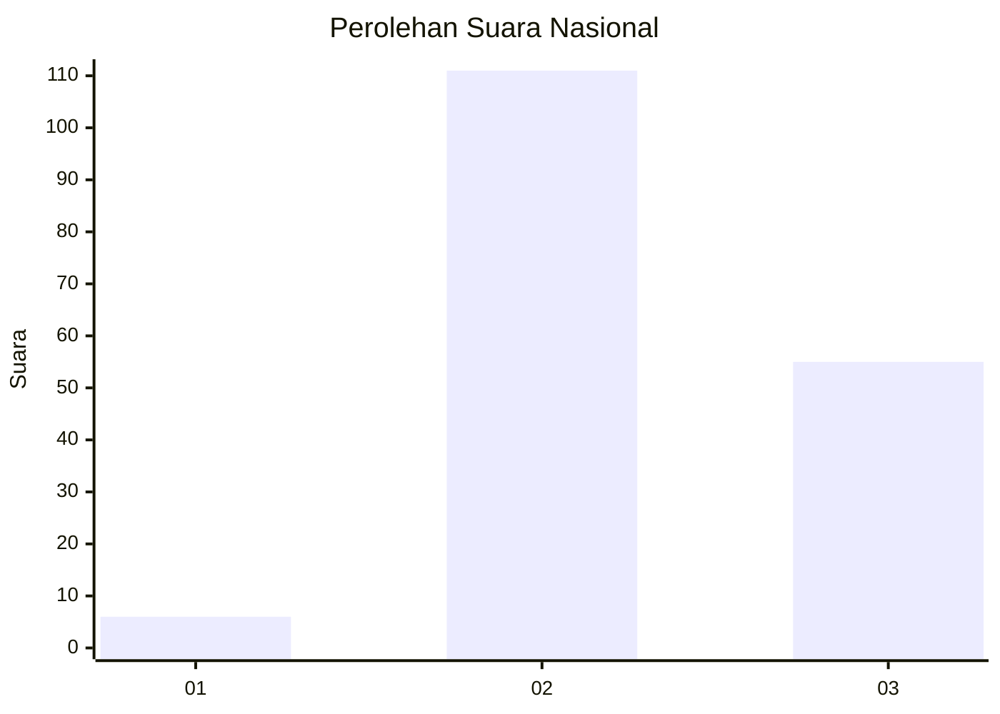
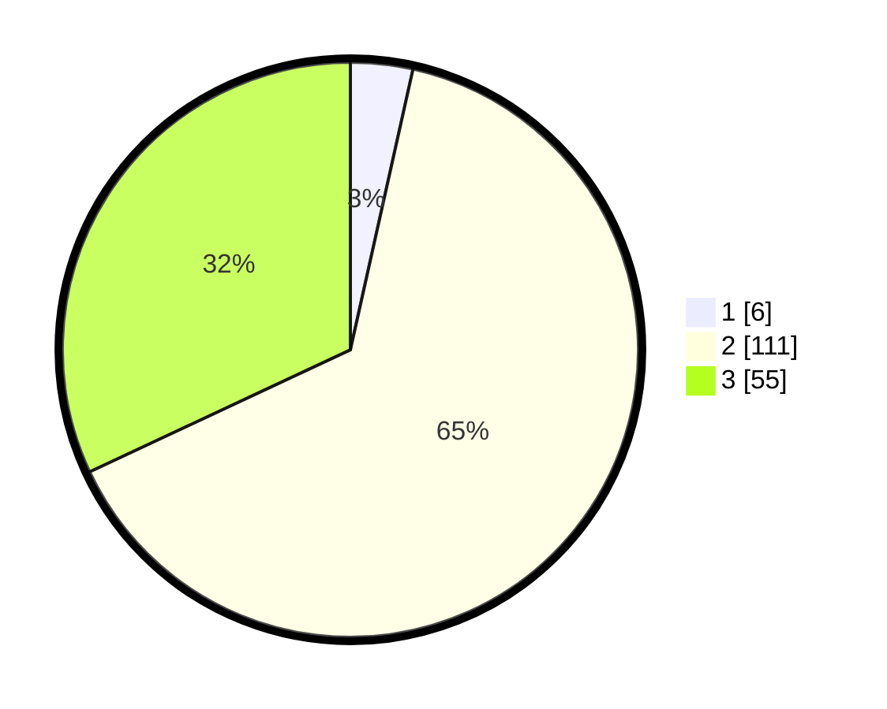

# Hasil

## Grafik

## Tabel

| No. | Nama Paslon    | Suara | Suara (raw) | Persentase |
|:--- |:-------------- | -----:| -----------:| ----------:|
| 1   | ANIES MUHAIMIN | 6     | [6][p-1]    | 3,49       |
| 2   | PRABOWO GIBRAN | 111   | [111][p-2]  | 64,53      |
| 3   | GANJAR MAHFUD  | 55    | [55][p-3]   | 31,98      |

[p-1]: https://github.com/gigit-pemilu/pemilu-2024/blob/main/pilpres/hitung-suara/sub/51-bali/sub/08-buleleng/sub/05-sukasada/sub/2011-panji/sub/018-tps/sub/paslon-1.txt
[p-2]: https://github.com/gigit-pemilu/pemilu-2024/blob/main/pilpres/hitung-suara/sub/51-bali/sub/08-buleleng/sub/05-sukasada/sub/2011-panji/sub/018-tps/sub/paslon-2.txt
[p-3]: https://github.com/gigit-pemilu/pemilu-2024/blob/main/pilpres/hitung-suara/sub/51-bali/sub/08-buleleng/sub/05-sukasada/sub/2011-panji/sub/018-tps/sub/paslon-3.txt

## Foto C Plano

https://sirekap-obj-formc.kpu.go.id/e9d5/pemilu/ppwp/51/08/05/20/11/5108052011018-20240214-223204--a627f547-050a-439a-b2b4-7410bb67d310.jpg

https://sirekap-obj-formc.kpu.go.id/e9d5/pemilu/ppwp/51/08/05/20/11/5108052011018-20240214-222646--fa5a0309-f3b7-49ec-a746-dccedf856326.jpg

https://sirekap-obj-formc.kpu.go.id/e9d5/pemilu/ppwp/51/08/05/20/11/5108052011018-20240214-222942--798d7ec3-2198-4882-be08-463bd32b565c.jpg

## Metadata

| Key        | Value               |
| ---------- | ------------------- |
| Time Stamp | 2024-02-24 22:31:28 |

