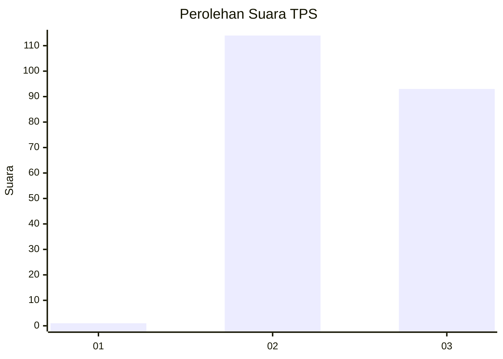
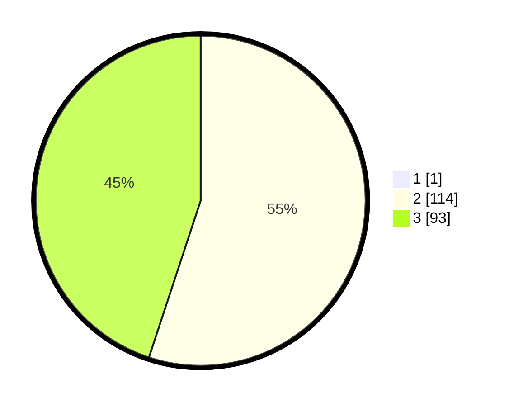

# Hasil

## Grafik

## Tabel

| No. | Nama Paslon    | Suara | Suara (raw) | Persentase |
|:--- |:-------------- | -----:| -----------:| ----------:|
| 1   | ANIES MUHAIMIN | 1     | [1][p-1]    | 0,48       |
| 2   | PRABOWO GIBRAN | 114   | [114][p-2]  | 54,81      |
| 3   | GANJAR MAHFUD  | 93    | [93][p-3]   | 44,71      |

[p-1]: https://github.com/gigit-pemilu/pemilu-2024-51-bali/blob/main/pilpres/hitung-suara/sub/51-bali/sub/08-buleleng/sub/05-sukasada/sub/2011-panji/sub/020-tps/sub/paslon-1.txt
[p-2]: https://github.com/gigit-pemilu/pemilu-2024-51-bali/blob/main/pilpres/hitung-suara/sub/51-bali/sub/08-buleleng/sub/05-sukasada/sub/2011-panji/sub/020-tps/sub/paslon-2.txt
[p-3]: https://github.com/gigit-pemilu/pemilu-2024-51-bali/blob/main/pilpres/hitung-suara/sub/51-bali/sub/08-buleleng/sub/05-sukasada/sub/2011-panji/sub/020-tps/sub/paslon-3.txt

## Foto C Plano

https://sirekap-obj-formc.kpu.go.id/05b4/pemilu/ppwp/51/08/05/20/11/5108052011020-20240214-220009--15b39d4d-7e70-4b04-ab63-2978fc32f36f.jpg

https://sirekap-obj-formc.kpu.go.id/05b4/pemilu/ppwp/51/08/05/20/11/5108052011020-20240214-220429--c7e19ad5-8e8e-403a-8969-a04ba4abe523.jpg

https://sirekap-obj-formc.kpu.go.id/05b4/pemilu/ppwp/51/08/05/20/11/5108052011020-20240214-220705--2bc20283-c06d-4b1e-b62e-63dd103d5be4.jpg

## Metadata

| Key        | Value               |
| ---------- | ------------------- |
| Time Stamp | 2024-02-24 22:31:28 |

