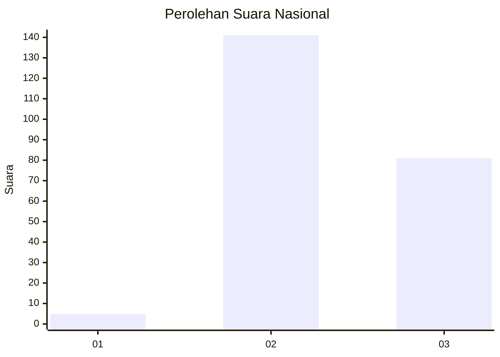
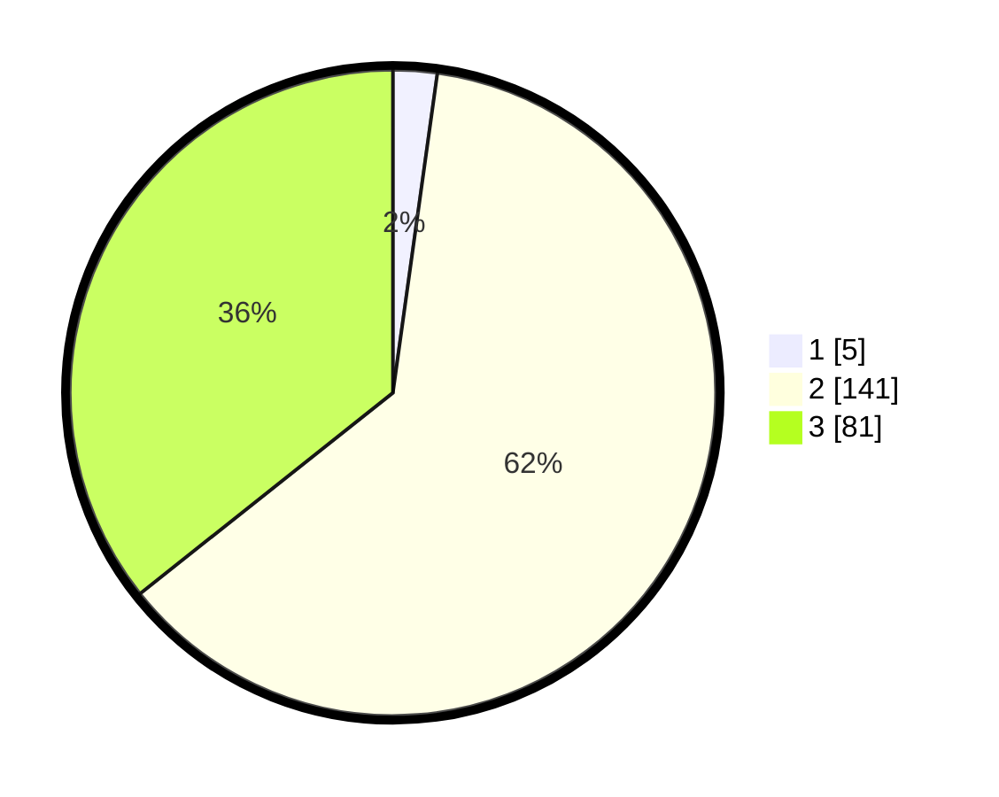

# Hasil

## Grafik

## Tabel

| No. | Nama Paslon    | Suara | Suara (raw) | Persentase |
|:--- |:-------------- | -----:| -----------:| ----------:|
| 1   | ANIES MUHAIMIN | 5     | [5][p-1]    | 2,20       |
| 2   | PRABOWO GIBRAN | 141   | [141][p-2]  | 62,11      |
| 3   | GANJAR MAHFUD  | 81    | [81][p-3]   | 35,68      |

[p-1]: https://github.com/gigit-pemilu/pemilu-2024/blob/main/pilpres/hitung-suara/sub/51-bali/sub/08-buleleng/sub/05-sukasada/sub/2011-panji/sub/023-tps/sub/paslon-1.txt
[p-2]: https://github.com/gigit-pemilu/pemilu-2024/blob/main/pilpres/hitung-suara/sub/51-bali/sub/08-buleleng/sub/05-sukasada/sub/2011-panji/sub/023-tps/sub/paslon-2.txt
[p-3]: https://github.com/gigit-pemilu/pemilu-2024/blob/main/pilpres/hitung-suara/sub/51-bali/sub/08-buleleng/sub/05-sukasada/sub/2011-panji/sub/023-tps/sub/paslon-3.txt

## Foto C Plano

https://sirekap-obj-formc.kpu.go.id/25f6/pemilu/ppwp/51/08/05/20/11/5108052011023-20240214-211450--869f5257-1502-472b-a9c3-a3d26ae48f2a.jpg

https://sirekap-obj-formc.kpu.go.id/25f6/pemilu/ppwp/51/08/05/20/11/5108052011023-20240214-211920--002063f3-3d2e-4f5e-972c-fca2026347b4.jpg

https://sirekap-obj-formc.kpu.go.id/25f6/pemilu/ppwp/51/08/05/20/11/5108052011023-20240214-212613--67862e28-3ba1-4849-be7b-f46a57a68a9f.jpg

## Metadata

| Key        | Value               |
| ---------- | ------------------- |
| Time Stamp | 2024-02-24 22:31:28 |

