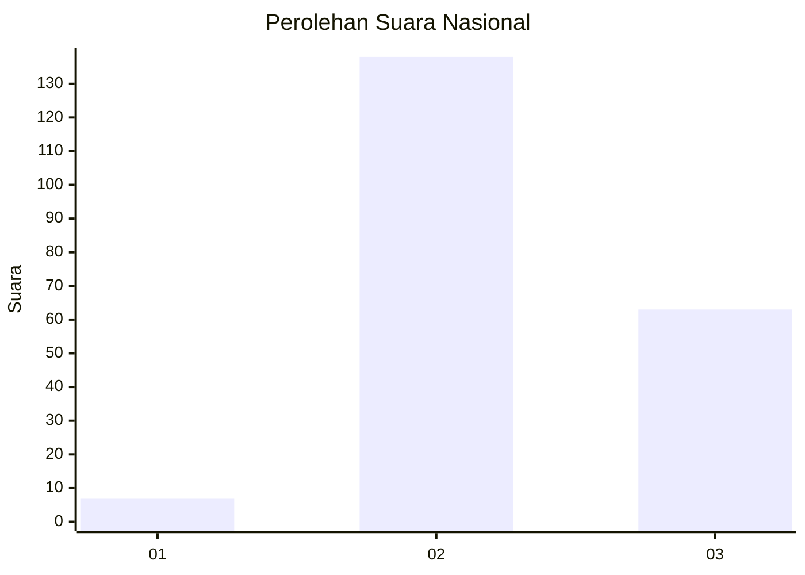

# Hasil

## Grafik

## Tabel

| No. | Nama Paslon    | Suara | Suara (raw) | Persentase |
|:--- |:-------------- | -----:| -----------:| ----------:|
| 1   | ANIES MUHAIMIN | 7     | [7][p-1]    | 3,37       |
| 2   | PRABOWO GIBRAN | 138   | [138][p-2]  | 66,35      |
| 3   | GANJAR MAHFUD  | 63    | [63][p-3]   | 30,29      |

[p-1]: https://github.com/gigit-pemilu/pemilu-2024/blob/main/pilpres/hitung-suara/sub/51-bali/sub/08-buleleng/sub/05-sukasada/sub/2012-panji-anom/sub/008-tps/sub/paslon-1.txt
[p-2]: https://github.com/gigit-pemilu/pemilu-2024/blob/main/pilpres/hitung-suara/sub/51-bali/sub/08-buleleng/sub/05-sukasada/sub/2012-panji-anom/sub/008-tps/sub/paslon-2.txt
[p-3]: https://github.com/gigit-pemilu/pemilu-2024/blob/main/pilpres/hitung-suara/sub/51-bali/sub/08-buleleng/sub/05-sukasada/sub/2012-panji-anom/sub/008-tps/sub/paslon-3.txt

## Foto C Plano

https://sirekap-obj-formc.kpu.go.id/679b/pemilu/ppwp/51/08/05/20/12/5108052012008-20240214-230147--db680051-702b-46aa-abe2-1559475405d7.jpg

https://sirekap-obj-formc.kpu.go.id/679b/pemilu/ppwp/51/08/05/20/12/5108052012008-20240214-230314--114f2e5d-1c64-4b9a-9f67-16ceb6b5b1be.jpg

https://sirekap-obj-formc.kpu.go.id/679b/pemilu/ppwp/51/08/05/20/12/5108052012008-20240214-230429--b5cd4e19-a9fb-4849-988a-ada930d42a77.jpg

## Metadata

| Key        | Value               |
| ---------- | ------------------- |
| Time Stamp | 2024-02-24 22:31:28 |

