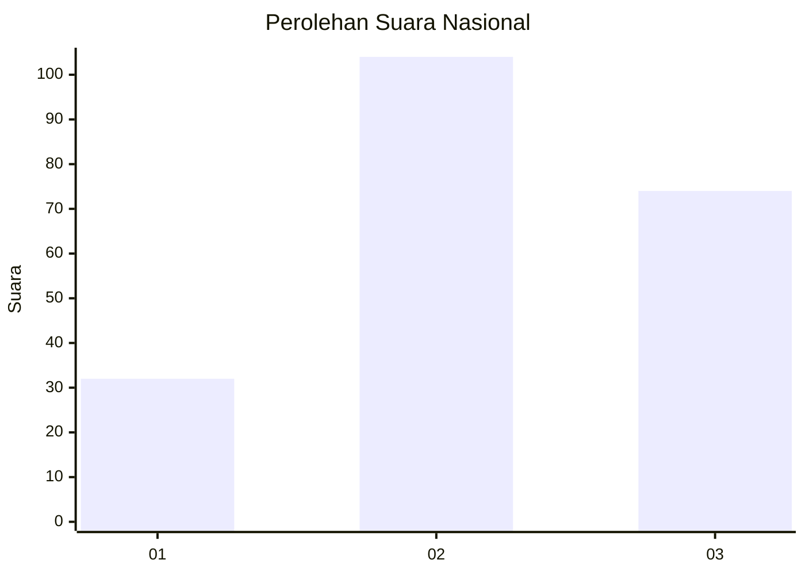
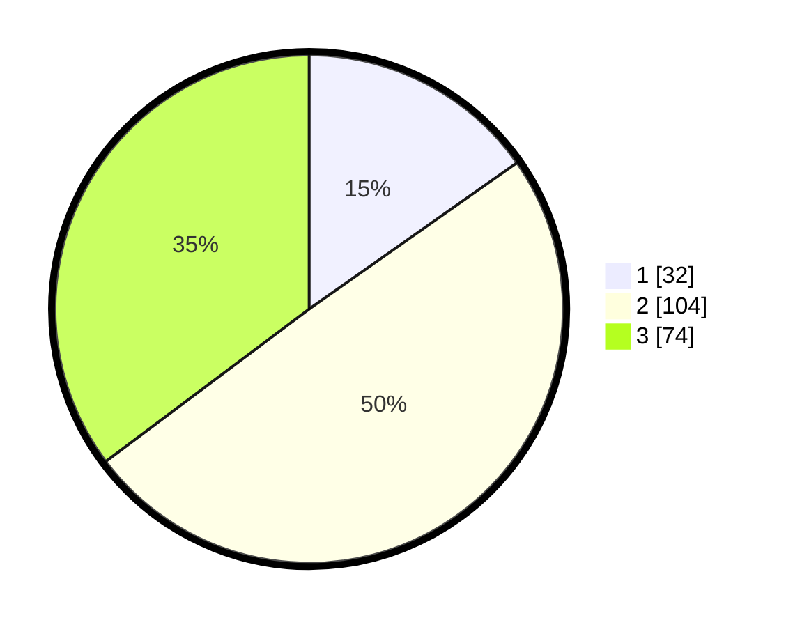

# Hasil

## Grafik

## Tabel

| No. | Nama Paslon    | Suara | Suara (raw) | Persentase |
|:--- |:-------------- | -----:| -----------:| ----------:|
| 1   | ANIES MUHAIMIN | 32    | [32][p-1]   | 15,24      |
| 2   | PRABOWO GIBRAN | 104   | [104][p-2]  | 49,52      |
| 3   | GANJAR MAHFUD  | 74    | [74][p-3]   | 35,24      |

[p-1]: https://github.com/gigit-pemilu/pemilu-2024/blob/main/pilpres/hitung-suara/sub/51-bali/sub/08-buleleng/sub/05-sukasada/sub/2012-panji-anom/sub/011-tps/sub/paslon-1.txt
[p-2]: https://github.com/gigit-pemilu/pemilu-2024/blob/main/pilpres/hitung-suara/sub/51-bali/sub/08-buleleng/sub/05-sukasada/sub/2012-panji-anom/sub/011-tps/sub/paslon-2.txt
[p-3]: https://github.com/gigit-pemilu/pemilu-2024/blob/main/pilpres/hitung-suara/sub/51-bali/sub/08-buleleng/sub/05-sukasada/sub/2012-panji-anom/sub/011-tps/sub/paslon-3.txt

## Foto C Plano

https://sirekap-obj-formc.kpu.go.id/46f0/pemilu/ppwp/51/08/05/20/12/5108052012011-20240214-232213--905f3f34-3f79-4f45-a286-7af2cd316e3e.jpg

https://sirekap-obj-formc.kpu.go.id/46f0/pemilu/ppwp/51/08/05/20/12/5108052012011-20240214-232241--b02d081c-a735-4b08-afe4-df4363596263.jpg

https://sirekap-obj-formc.kpu.go.id/46f0/pemilu/ppwp/51/08/05/20/12/5108052012011-20240214-232259--eac82557-77c8-43b3-8565-efc7894269a8.jpg

## Metadata

| Key        | Value               |
| ---------- | ------------------- |
| Time Stamp | 2024-02-24 22:31:28 |

