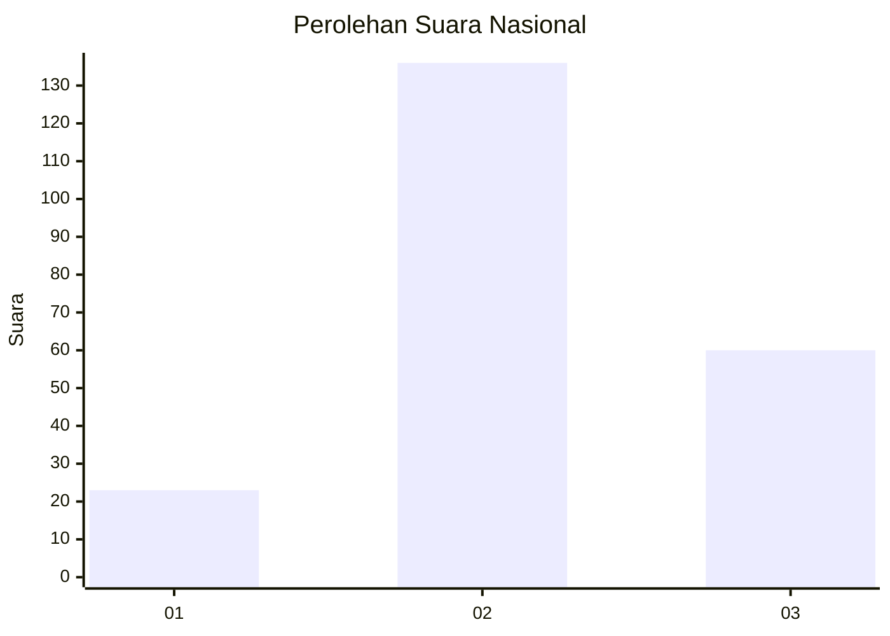
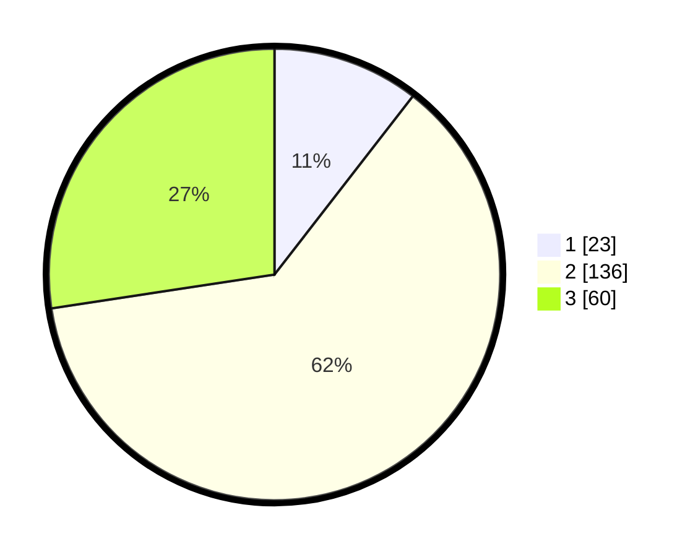

# Hasil

## Grafik

## Tabel

| No. | Nama Paslon    | Suara | Suara (raw) | Persentase |
|:--- |:-------------- | -----:| -----------:| ----------:|
| 1   | ANIES MUHAIMIN | 23    | [23][p-1]   | 10,50      |
| 2   | PRABOWO GIBRAN | 136   | [136][p-2]  | 62,10      |
| 3   | GANJAR MAHFUD  | 60    | [60][p-3]   | 27,40      |

[p-1]: https://github.com/gigit-pemilu/pemilu-2024/blob/main/pilpres/hitung-suara/sub/51-bali/sub/08-buleleng/sub/05-sukasada/sub/2012-panji-anom/sub/012-tps/sub/paslon-1.txt
[p-2]: https://github.com/gigit-pemilu/pemilu-2024/blob/main/pilpres/hitung-suara/sub/51-bali/sub/08-buleleng/sub/05-sukasada/sub/2012-panji-anom/sub/012-tps/sub/paslon-2.txt
[p-3]: https://github.com/gigit-pemilu/pemilu-2024/blob/main/pilpres/hitung-suara/sub/51-bali/sub/08-buleleng/sub/05-sukasada/sub/2012-panji-anom/sub/012-tps/sub/paslon-3.txt

## Foto C Plano

https://sirekap-obj-formc.kpu.go.id/650f/pemilu/ppwp/51/08/05/20/12/5108052012012-20240215-003553--f3c9429f-0820-4aa2-af17-8e86570e6a8e.jpg

https://sirekap-obj-formc.kpu.go.id/650f/pemilu/ppwp/51/08/05/20/12/5108052012012-20240215-004048--5cfedd63-5eee-4cef-840b-5048f6915d63.jpg

https://sirekap-obj-formc.kpu.go.id/650f/pemilu/ppwp/51/08/05/20/12/5108052012012-20240215-003138--8fa4f4c0-8189-4256-a874-50d16b4f7a3e.jpg

## Metadata

| Key        | Value               |
| ---------- | ------------------- |
| Time Stamp | 2024-02-25 13:00:00 |

